# CASP17 Protein-Ligand Pipeline

## Overview

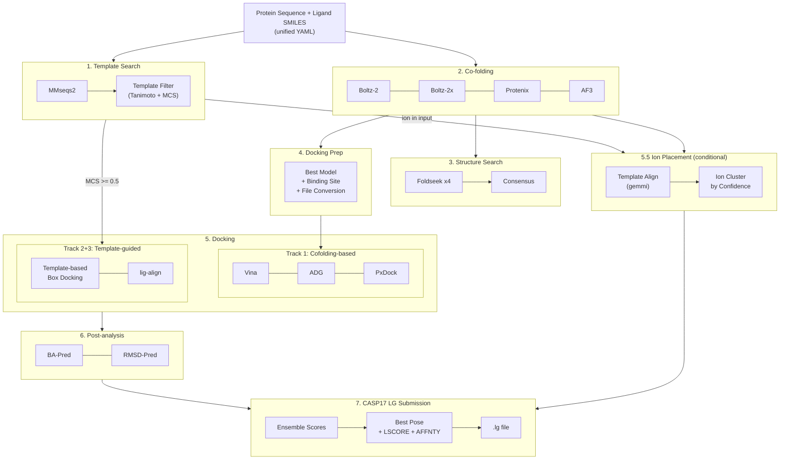

---

## Stage 1: Template Search (Sequence)

단백질 서열로 RCSB PDB에서 유사 구조를 찾고, 리간드 정보를 매칭한다.

### Step 1-1: MMseqs2 Sequence Search

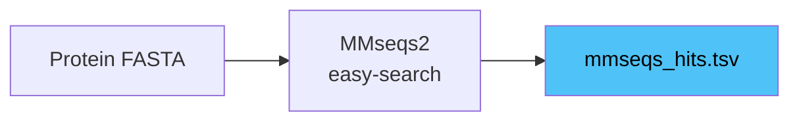

- **Tool**: `mmseqs easy-search` (488k RCSB 서열 DB, preindexed)
- **Parameter**: `min_seq_identity=0.3`, `min_coverage=0.7`, `sensitivity=7.5`, `max_hits=200`
- **Output**: `outputs/template_search_sequence/mmseqs_hits.tsv`
- **소요 시간**: ~3초

### Step 1-2: Template Filter (Ligand + MCS)

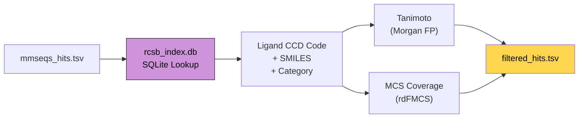

- **Script**: `scripts/run_template_filter.py` (wrapper에서 자동 삽입)
- **Module**: `src/casp17/template_filter.py`
- **Input**: mmseqs_hits.tsv + target ligand SMILES + rcsb_index.db
- **Logic**:
  1. 각 PDB hit에 대해 `rcsb_index.db`에서 리간드 조회 (candidate 리간드만: small_molecule, cofactor, metabolite 등)
  2. Target SMILES와 template 리간드 간 **Tanimoto similarity** 계산 (Morgan FP, radius=2, 2048 bits)
  3. **MCS coverage** 계산 (`rdFMCS.FindMCS`, timeout=5s, `MCS_atoms / min(target, template) heavy atoms`)
  4. 결과를 `best_mcs_coverage → best_tanimoto → pident` 순으로 정렬
- **Output**: `outputs/template_search_sequence/filtered_hits.tsv`
- **핵심 결정**: `best_mcs_coverage >= 0.5`이면 Stage 5에서 Track 2+3 활성화
- CCD 분류 기반으로 drug-like 리간드만 필터링 (ion, 결정화 보조제, 당류 등 제외)

---

## Stage 2: Co-folding

4개 모델이 순차 실행. 동일한 unified YAML 입력을 각 모델 포맷으로 변환 후 GPU 추론.
**Multi-seed**: 각 모델을 5개 seed × 5 diffusion samples = **25개 구조/모델** 생성 (총 100개).

### Multi-seed 전략

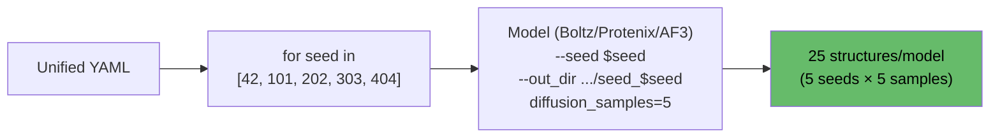

- **Boltz-2/2x**: bash loop으로 `--seed` + `--out_dir` 변경하며 5회 반복
- **Protenix**: 동일 방식 (`--seeds` 변경)
- **AF3**: native `num_seeds=5` + `num_diffusion_samples=5` (loop 불필요)
- **Config**: `cofolding_seeds: [42, 101, 202, 303, 404]`

### Step 2-1: Input Adaptation

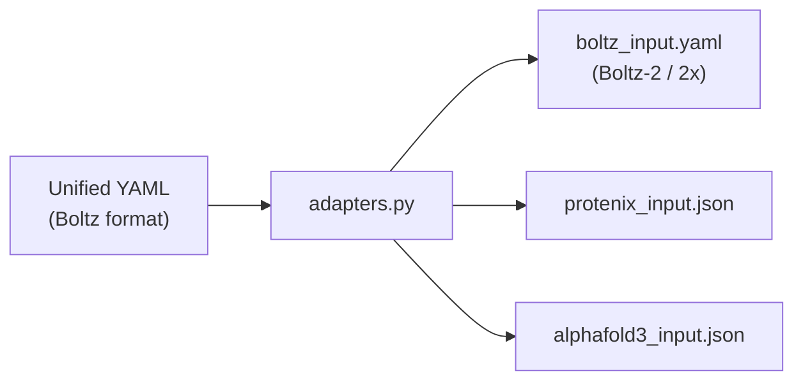

- **Module**: `src/casp17/adapters.py`
- 리간드가 있으면 `properties.affinity` 자동 추가 (Boltz 전용)
- Boltz-2: `use_potentials=false`, Boltz-2x: `use_potentials=true` (별도 run)
- `prepare_boltz()` → `[boltz2, boltz2x]` 리스트 반환

### Step 2-2: Model Inference

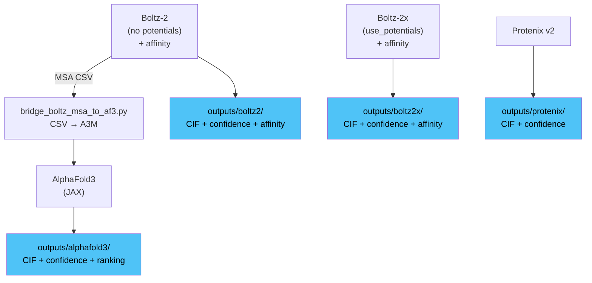

| Model | venv | 소요 시간 (5 seeds × 5 samples = 25 structs) | 특징 |
|-------|------|----------|------|
| Boltz-2 | `.venvs/boltz` | ~10 min (600-620s) | 구조 + confidence + MSA + affinity |
| Boltz-2x | `.venvs/boltz` | ~12 min (680-740s) | 위와 동일 + potentials (constraint) |
| Protenix v2 | `.venvs/protenix` | ~8 min (484-492s) | 구조 + confidence |
| AlphaFold3 | `.venvs/alphafold3` | ~6 min (353-393s) | 구조 + confidence + ranking (JAX) |

> RTX 6000 Ada 단일 GPU, CASP16 L2001/L2002 기준. `cofolding_seeds=[42,101,202,303,404]`, `diffusion_samples=5`.

**Bridge: Boltz MSA -> AF3**
- Boltz가 생성한 MSA CSV를 AF3 A3M 포맷으로 변환
- AF3 JSON에 `pairedMsa=""`, `templates=[]` 패치
- Script: `scripts/bridge_boltz_msa_to_af3.py`

**Boltz Affinity Output:**
```json
{
  "affinity_pred_value": 2.62,        // log10(IC50) uM — lower = stronger
  "affinity_probability_binary": 0.41  // binder probability [0-1]
}
```

---

## Stage 3: Structure Search (Foldseek Consensus)

각 cofolding 모델의 출력 구조를 RCSB 구조 DB에서 검색하고, 교차 모델 합의로 순위 매김.

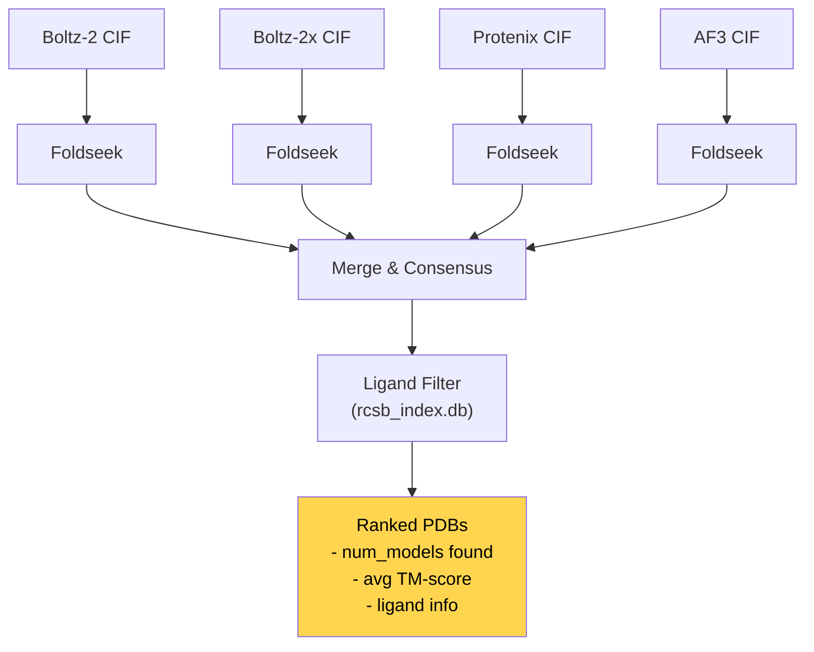

- **Script**: `scripts/run_structure_search.py`
- **Tool**: `foldseek easy-search` (251k RCSB 구조 DB)
- **Logic**:
  1. 4개 모델 각각에서 best CIF 추출
  2. Foldseek으로 RCSB 구조 DB 검색
  3. 교차 모델 합의: 여러 모델에서 공통 발견된 PDB 우선 순위
  4. `rcsb_index.db`로 리간드 보유 여부 필터링
- **Output**: `outputs/structure_search/consensus_summary.json`

---

## Stage 4: Docking Preparation

Cofolding 출력에서 docking 입력 파일을 자동 생성. Wrapper pipeline에서 cofolding → docking 사이에 자동 삽입.

### Step 4-1: Best Model Selection

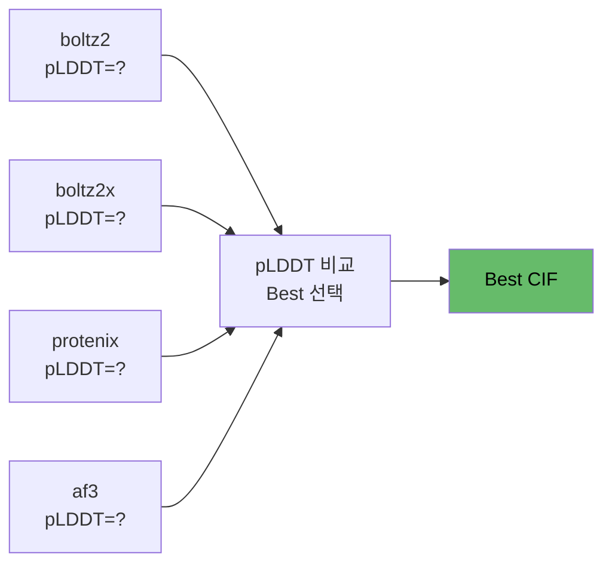

- 각 모델의 confidence score (pLDDT) 비교 → 최고 점수 모델 자동 선택
- Function: `select_best_model()` in `prepare_docking_inputs.py`

### Step 4-2: Receptor Preparation

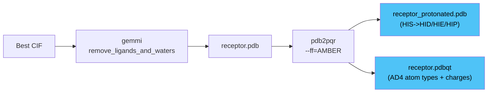

| Step | Tool | Output | 용도 |
|------|------|--------|------|
| CIF -> PDB | gemmi | `receptor.pdb` | 기본 구조 |
| PDB -> PQR | pdb2pqr (AMBER) | 중간 파일 | 수소 추가 + 전하 |
| PQR -> protonated PDB | 자체 변환 | `receptor_protonated.pdb` | Protenix-Dock |
| PQR -> PDBQT | AD4 type mapping | `receptor.pdbqt` | Vina + AutoDock-GPU |

### Step 4-3: Ligand Preparation

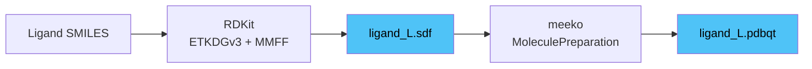

- SMILES -> 3D conformer: `AllChem.EmbedMolecule(mol, ETKDGv3())`
- Force field optimization: `MMFFOptimizeMolecule(mol, maxIters=500)`
- SDF -> PDBQT: meeko `MoleculePreparation`

### Step 4-4: Binding Site Prediction

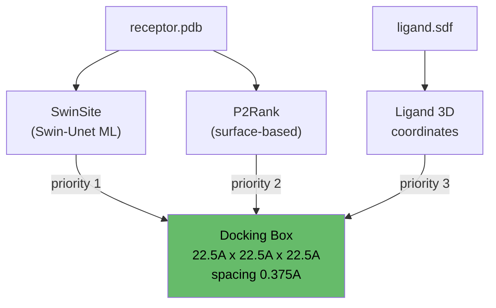

- **우선순위**: SwinSite (ML) > P2Rank (surface) > Ligand coordinates (fallback)
- **Unified box**: 22.5A x 22.5A x 22.5A, grid spacing 0.375A (모든 docking tool 공통)
- **Script**: `scripts/prepare_docking_inputs.py`
- **Output**: `inputs/docking/docking_prep_summary.json` (모든 docking tool이 runtime에 읽음)

---

## Stage 5: Docking (Multi-track)

3개 트랙으로 구성. Track 1은 항상 실행, Track 2+3은 MCS >= threshold일 때 자동 활성화.

### Track 1: Cofolding-based Docking (항상 실행)

Cofolding best model의 구조를 receptor로, SwinSite/P2Rank 예측 위치를 docking box로 사용.
**Multi-seed**: Vina/ADG는 5개 seed 반복, PxDock은 비용 때문에 1회만 실행.

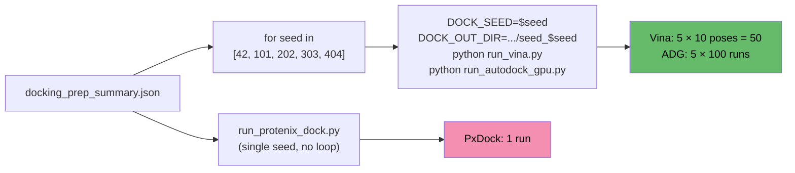

- Runner scripts read `DOCK_SEED` / `DOCK_OUT_DIR` env vars (set by wrapper)
- Each seed outputs to separate `seed_N/` subdirectory
- **Config**: `docking_seeds: [42, 101, 202, 303, 404]`

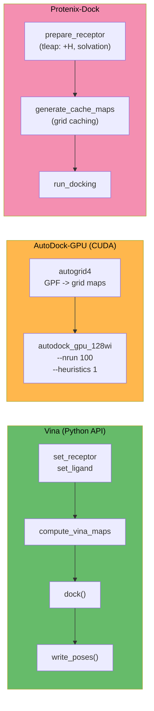

| Tool | Type | 소요 시간 | venv | Output (per docking seed) |
|------|------|----------|------|--------|
| Vina | Python API | ~3s | `.venvs/protenix-dock` | `outputs/vina/seed_<seed>/docked.pdbqt` |
| AutoDock-GPU | CUDA binary | ~10s | `.local/bin/` | `outputs/autodock_gpu/seed_<seed>/docking.dlg` |
| Protenix-Dock | CPU force field | ~5-30min | `.venvs/protenix-dock` | `outputs/protenix_dock/*_out.json` (single run, no seed loop) |

- 모든 tool은 `docking_prep_summary.json`에서 receptor/ligand/box를 runtime에 읽음
- AutoDock-GPU 래퍼는 추가로 **런타임에 ligand pdbqt를 파싱**해서 `ligand_types`와 grid map을 동적으로 구성 — F/Cl/Br/P/I/Si 등 비표준 원자 타입도 자동 대응 (adapter 시점에는 하드코딩된 기본값을 쓰지 않음)
- Protenix-Dock이 전체 시간의 ~77% 차지 (병목)

### Track 2: Template-based Box Docking (MCS >= 0.5)

Template search에서 MCS coverage가 높은 hit의 실험 구조를 receptor로, template 리간드 위치를 docking box로 사용.

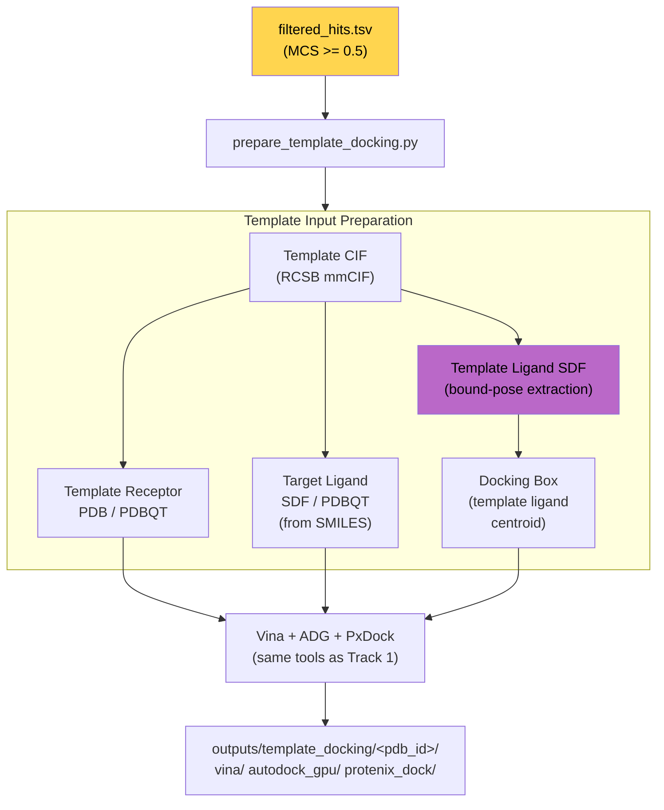

- **Script**: `scripts/prepare_template_docking.py`
- **Logic**:
  1. `filtered_hits.tsv`에서 MCS >= threshold인 상위 3개 template 선택
  2. RCSB CIF 파일에서 receptor PDB/PDBQT 생성 (`gemmi` + `pdb2pqr`)
  3. Template 리간드의 **bound-pose SDF 추출** (`extract_template_ligand_sdf()`)
  4. Template 리간드 좌표 centroid -> docking box center
  5. Target SMILES -> SDF/PDBQT (RDKit + meeko)
  6. 각 template에 대해 Vina + ADG + PxDock 실행
- **장점**: 실험적으로 검증된 리간드 결합 위치를 docking box로 사용 -> 정확도 향상

### Track 3: lig-align (MCS-guided Pose Generation, MCS >= 0.5)

Template 리간드의 결합 포즈를 MCS anchor로 활용해, target 리간드의 3D 포즈를 직접 생성.

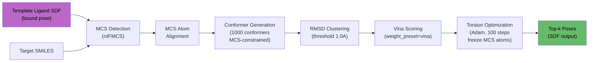

- **Library**: `lig_align.run_pipeline()` (hub venv에 설치됨)
- **Parameters**:
  - `num_confs=1000`: MCS-constrained conformer 수
  - `mcs_mode="auto"`: single/multi/cross MCS 자동 선택
  - `optimize=True`: gradient-based torsion optimization
  - `weight_preset="vina"`: Vina scoring function weights
  - `top_k=10`: 최종 출력 포즈 수
- **Input**: template receptor PDB + template ligand SDF (bound pose) + target SMILES
- **Output**: `outputs/template_docking/<pdb_id>/lig_align/` (ranked SDF poses)
- **장점**: Docking과 달리 scoring function만 사용, MCS anchor 덕분에 정확한 초기 배치

### Multi-track Decision Logic

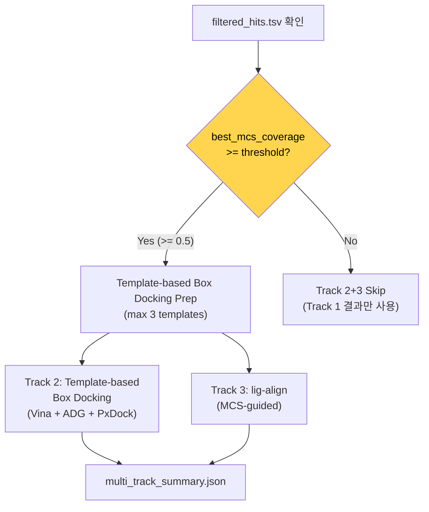

- **Orchestrator**: `scripts/run_multi_track_docking.py`
- **Config**: `template_search_sequence.mcs_threshold` (default: `0.5`)
- Wrapper script에서 Track 1 docking 이후 자동 실행

| Track | Receptor | Box Source | Method | 조건 |
|-------|----------|-----------|--------|------|
| Track 1 | Cofolding best model | SwinSite > P2Rank | Vina + ADG + PxDock | 항상 |
| Track 2 | Template PDB (RCSB) | Template ligand centroid | Vina + ADG + PxDock | MCS >= 0.5 |
| Track 3 | Template PDB (RCSB) | MCS anchor alignment | lig-align | MCS >= 0.5 |

---

## Stage 5.5: Ion/Metal Placement (conditional)

Input YAML에 ion/metal CCD 엔티티 (ZN, MG, CA, FE 등)가 있으면 자동 실행. Cofolding은 metal 위치를 정확히 예측하기 어려우므로, template alignment 기반으로 가능한 위치를 수집.

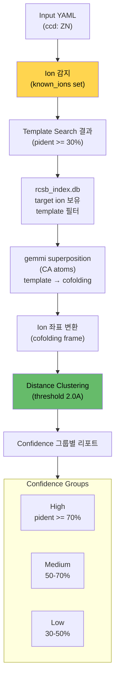

- **Script**: `scripts/collect_template_ions.py`
- **Input**: cofolding best CIF + template search hits + target ion CCD codes
- **Logic**:
  1. Input YAML에서 ion CCD 코드 추출 (ZN, MG, CA, FE 등)
  2. Template search hits 중 해당 ion을 보유한 PDB 필터링 (rcsb_index.db)
  3. 각 template을 cofolding best model에 gemmi CA superposition
  4. Rotation/translation을 ion 좌표에 적용 → cofolding 좌표계로 변환
  5. 거리 기반 클러스터링 (default 2.0A)
  6. Confidence 그룹별 (pident 70%+/50-70%/30-50%) 결과 리포트
- **Output**: `outputs/ion_placement/ion_placement_summary.json`
- **자동 skip**: input에 ion이 없으면 실행하지 않음

**Output example:**
```json
{
  "ions": {
    "ZN": {
      "total_positions": 12,
      "total_templates": 10,
      "clusters": [
        {"centroid": [12.3, 45.6, 78.9], "num_templates": 8, "spread_angstrom": 0.8}
      ],
      "by_confidence": {
        "high": {"pident_range": ">=70%", "num_templates": 3, "clusters": [...]},
        "medium": {"pident_range": "50-70%", "num_templates": 5, "clusters": [...]},
        "low": {"pident_range": "30-50%", "num_templates": 2, "clusters": [...]}
      }
    }
  }
}
```

---

## Stage 6: Post-analysis

모든 docking 결과에 대해 binding affinity와 pose RMSD를 GNN으로 예측.

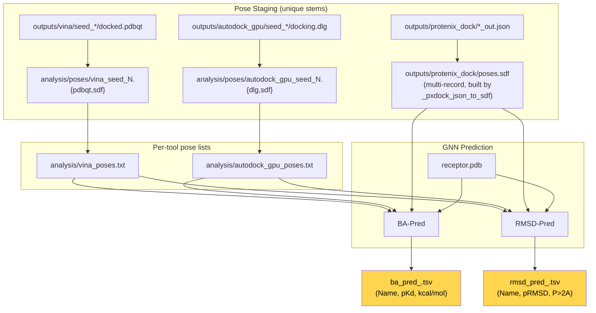

- **Script**: `scripts/run_post_analysis.py` (GPU node에서 실행)
- **venv**: `.venvs/pred` (torch 2.4 + dgl 2.4 + openbabel + rdkit)
- **Pose 수집 규칙**:
  - multi-seed docking 결과(`vina`, `autodock_gpu`)는 각 seed 파일을 `outputs/analysis/poses/{tool}_seed_{N}.{ext}`로 유니크 stem으로 복사. BA-Pred/RMSD-Pred의 `{basename}_{idx}` pose 명명 규칙 때문에 stem이 유니크해야 TSV row가 seed별로 분리됨
  - 각 staged 파일에 대해 meeko `mk_export.py`로 `.sdf` 복제본도 생성 → downstream `make_casp_submission.py`가 pose를 레코드 인덱스로 정확히 꺼낼 수 있음
  - **Protenix-Dock**은 포즈를 `.sdf`로 내보내지 않고 `*_out.json`(atom-mapped SMILES + `ligand.xyz`)에만 담음 → `_pxdock_json_to_sdf`로 RDKit 멀티레코드 SDF 생성 후 BA/RMSD-Pred에 전달
  - **입력 ligand SDF (`inputs/docking/ligand_*.sdf`)는 post-analysis에서 제외**. RDKit embedding 좌표는 receptor와 정렬되지 않아 BA-Pred의 "8 Å 이내 단백질 원자만 추출" 로직이 빈 `MolFromPDBBlock` → `None`을 반환하고 `mol_to_graph` 단계에서 `AttributeError: 'NoneType' object has no attribute 'GetNumAtoms'`로 죽음. Docking 결과 pose만 대상으로 함
- **Output**:
  - `outputs/analysis/poses/` — staged pose 파일들 (pdbqt/dlg + sdf 쌍)
  - `outputs/analysis/{vina,autodock_gpu}_poses.txt` — BA/RMSD-Pred 입력용 리스트 파일
  - `outputs/protenix_dock/poses.sdf` — PxDock json에서 변환된 멀티포즈 SDF
  - `outputs/analysis/ba_pred_<tool>.tsv` — per-pose pKd per docking tool
  - `outputs/analysis/rmsd_pred_<tool>.tsv` — per-pose pRMSD per docking tool
  - `outputs/analysis/summary.json` — 최적 조합 선택

---

## Stage 7: CASP17 LG Submission

모든 파이프라인 출력을 aggregate해서 CASP17 LG-format 제출 파일 생성.

### Step 7-1: Score Aggregation

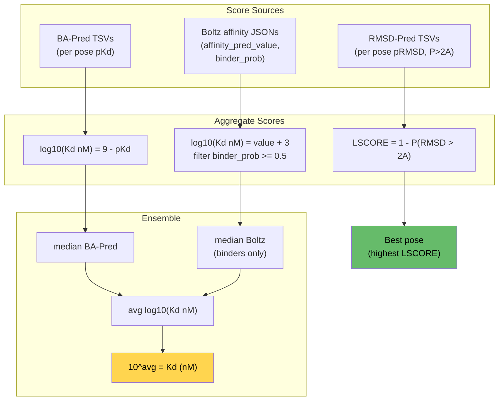

- **Script**: `scripts/compute_submission_scores.py`
- **LSCORE** (per pose): `1 - P(RMSD > 2Å)` from RMSD-Pred (higher = more confident)
- **Best pose**: picked by highest LSCORE. Pose는 `pose_name`(`{stem}_{record_idx}`)에서 역산해 `outputs/analysis/poses/{stem}.sdf`의 정확한 레코드로 해상(`_resolve_pose_file` + `_split_pose_name`). Protenix-Dock best pose는 `outputs/protenix_dock/poses.sdf` 내부의 record index로 해상됨
- **AFFNTY** (per complex): log-space ensemble of BA-Pred median + Boltz median (filtered by binder_prob ≥ 0.5)

### Step 7-2: LG Format Assembly

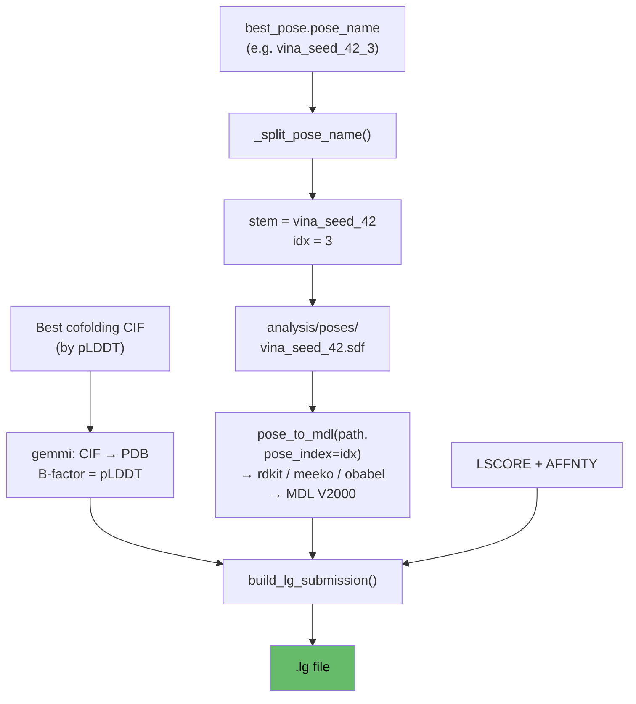

- **Script**: `scripts/make_casp_submission.py`
- **Format**:
  ```
  PFRMAT LG
  TARGET L2001
  AUTHOR <casp-code>
  METHOD <description>
  MODEL 1
  PARENT <template_pdb_or_N/A>
  ATOM ... (receptor, B-factor = pLDDT)
  TER
  LIGAND 001 <name>
  LSCORE 0.850          # from RMSD-Pred (per-ligand)
  <MDL V2000 block>
  M  END
  AFFNTY 12.345 aa      # optional, Kd in nM (per-complex)
  END
  ```

### Usage

```bash
python scripts/make_casp_submission.py \
    --run-dir experiments/runs/L2001_input \
    --target-id L2001 \
    --ligand-name 761 \
    --author <casp-code> \
    --method "Boltz-2x + Multi-track ensemble" \
    --include-affinity \
    --output experiments/submissions/L2001.lg
```

- `--pose-source auto` (default): best pose by LSCORE
- `--pose-source vina/autodock_gpu/protenix_dock/template/lig_align`: force source
- `--include-affinity`: auto-compute AFFNTY from ensemble (omit for P-only tasks)
- `--lscore N`, `--affinity-nM N`: manual override

### Wrapper Integration

Post-analysis and CASP submission are fully integrated into the wrapper script, so running `prepare-wrapper` + `sbatch` auto-executes **all 8 stages** end-to-end.

Config knobs:
```yaml
post_analysis:
  enabled: true              # default on
  device: cuda

submission:
  enabled: true              # default off; set true to auto-generate .lg files
  author: "XXXX-XXXX-XXXX"   # CASP registration code
  method: "Boltz-2x + ensemble ..."
  include_affinity: false    # true for A/PA tasks
  parent: "N/A"              # template PDB ID or N/A
  ligand_number: 1
```

**Wrapper execution order**:

```
template-search-sequence
  → BRIDGE: template filter (Tanimoto + MCS)
cofolding (5 seeds × 5 samples)
  → BRIDGE: docking prep (auto-select + binding site + file conversion)
docking (Track 1: Vina/ADG 5 seeds, PxDock 1x)
  → MULTI-TRACK DOCKING (Track 2+3 if MCS ≥ 0.5)
  → ION/METAL PLACEMENT (if ion in input)
  → POST-ANALYSIS (BA-Pred + RMSD-Pred)
  → CASP17 LG SUBMISSION (if submission.enabled)
```

Output: `experiments/submissions/<target>.lg`

---

## Timing (RTX 6000 Ada, single GPU)

CASP16 L2001/L2002 실측 (job 23941, 23942, partition `6000ada`, `casp_submission` config — 5 cofolding seeds × 5 samples + 5 docking seeds). 아래 gantt는 L2001 기준 시작 0초부터의 누적 시각입니다.

```mermaid
gantt
    title Pipeline Execution Timeline (L2001, 53:26 total)
    dateFormat X
    axisFormat %Mm

    section Search
    MMseqs2 + template filter    :0, 13

    section Co-folding
    Boltz-2 (5×5)                 :13, 635
    Boltz-2x (5×5)                :635, 1375
    Protenix v2 (5×5)             :1375, 1867
    Boltz MSA -> AF3 bridge       :1867, 1870
    AlphaFold3 (25 structs)       :1870, 2223

    section Docking Prep
    docking_prep_summary.json     :2223, 2228

    section Track 1 Docking
    Vina (5 seeds)                :2228, 2482
    AutoDock-GPU (5 seeds)        :2482, 2524
    Protenix-Dock (1 run)         :2524, 2983

    section Track 2+3 (skipped)
    Multi-track docking           :2983, 2985

    section Ion placement (skipped)
    collect_template_ions         :2985, 2987

    section Post-analysis + submit
    BA-Pred + RMSD-Pred           :2987, 3150
    compute_submission_scores     :3150, 3155
    make_casp_submission          :3155, 3206
```

| Stage | L2001 | L2002 | 비고 |
|-------|------:|------:|------|
| Template search (MMseqs2 + ligand filter) | 13s | 3s | sequence search + Tanimoto/MCS scoring |
| Boltz-2 (5 seeds × 5 samples, 25 structs) | 622s | 600s | + Boltz affinity |
| Boltz-2x (5 seeds × 5 samples, 25 structs) | 740s | 680s | + affinity + potentials |
| Protenix v2 (5 seeds × 5 samples, 25 structs) | 492s | 484s | |
| Bridge: Boltz MSA -> AF3 | <1s | <1s | CSV → A3M + JSON 패치 |
| AlphaFold3 (25 structures) | 353s | 393s | |
| Bridge: Docking prep | <5s | <5s | auto-select + SwinSite/P2Rank + SMILES→SDF/PDBQT + CIF→PDB→PDBQT |
| Vina (5 seeds) | 254s | 130s | |
| AutoDock-GPU (5 seeds) | 42s | 42s | per-seed 동적 GPF (ligand atom type + box center 런타임 재로드) |
| Protenix-Dock (1 run) | 459s | 513s | multi-seed 불가 (너무 느려서) |
| Multi-track docking (Track 2 + 3) | skipped | skipped | MCS < 0.5 |
| Ion/metal placement | skipped | skipped | 입력에 ion entity 없음 |
| Post-analysis (BA-Pred + RMSD-Pred) | ~1-2 min | ~1-2 min | 158 pose × 2 predictor (L2001 기준 vina 50 + ADG 100 + pxdock 8) |
| compute_submission_scores | <5s | <5s | TSV → PoseScore aggregate, ensemble log-Kd |
| make_casp_submission | <5s | <5s | best pose → MDL + LG file |
| **Total wall-clock (`sacct`)** | **00:53:26** | **00:52:08** | Track 2/3 + Ion + 포스트 모두 활성일 때 +8~20분 정도 추가 예상 |

> Boltz-2x + Protenix v2 + Boltz-2 + AF3 가 cofolding 합산 36분, 전체 파이프라인의 ~67% 차지. Track 1 docking (Vina+ADG+PxDock) 은 ~13분 (~25%).

**Track 2/3 활성화 조건 (관측 못 한 비용)**:
- MCS ≥ 0.5 템플릿이 존재하면 `run_multi_track_docking.py`가 각 적합 템플릿에 대해 Vina/ADG/PxDock를 다시 돌림. 1-2개 템플릿 기준 추가 ~8-20분 예상.
- Ion entity 가 input YAML에 있으면 template 정렬 + clustering stage가 추가됨 (~30초 - 1분).

---

## Bridge Scripts

Wrapper pipeline에서 stage 사이에 자동 삽입되는 bridge step 목록.

| Bridge | 삽입 위치 | Script | 역할 |
|--------|----------|--------|------|
| Boltz MSA -> AF3 | Boltz -> AF3 (cofolding 내부) | `bridge_boltz_msa_to_af3.py` | MSA CSV -> A3M + AF3 JSON 패치 |
| Template Filter | template-search-sequence 직후 | `run_template_filter.py` | Tanimoto + MCS scoring |
| Docking Prep | cofolding -> docking 사이 | `prepare_docking_inputs.py` | 자동 모델 선택 + binding site + 파일 변환 |
| Multi-track Docking | docking 직후 (조건부) | `run_multi_track_docking.py` | Track 2 + Track 3 실행 |
| Ion Placement | multi-track 직후 (조건부) | `collect_template_ions.py` | template alignment → ion 위치 수집 |
| Score Aggregation | post-analysis 후 | `compute_submission_scores.py` | BA/RMSD/Boltz 집계, best pose + ensemble Kd |
| CASP Submission | 최종 | `make_casp_submission.py` | LG format .lg 파일 생성 |

---

## Tool Ecosystem

```mermaid
graph TB
    subgraph VENVS[".venvs/ (isolated environments)"]
        BOLTZ["boltz\nPy3.12, torch 2.11\nCUDA 13.0"]
        PROTENIX["protenix\nPy3.12, torch 2.7\nCUDA 12.6"]
        AF3["alphafold3\nPy3.12, JAX"]
        PXDOCK["protenix-dock\nmicromamba, Py3.11\nambertools + tleap"]
        PRED["pred\nPy3.12, torch 2.4\ndgl 2.4 + openbabel"]
    end

    subgraph BINS[".local/bin/"]
        MMSEQS["mmseqs"]
        FOLDSEEK["foldseek"]
        AUTOGRID["autogrid4"]
        ADGPU["autodock_gpu_128wi"]
        PRANK["prank (JDK 21)"]
    end

    subgraph DBS["Search Databases"]
        SEQDB["sequence/rcsb_seqDB\n488k seqs, 2.0GB"]
        STRUCTDB["structure/rcsb_structDB\n251k structs, 7.7GB"]
        RCSBDB["rcsb_index.db\n251k PDBs, 2.5M ligands"]
    end

    BOLTZ ---|"Boltz-2/2x"| COFOLDING["Co-folding"]
    PROTENIX --- COFOLDING
    AF3 --- COFOLDING
    PXDOCK ---|"PxDock + Vina"| DOCKING["Docking"]
    PRED ---|"BA-Pred + RMSD-Pred + SwinSite"| ANALYSIS["Analysis"]
    MMSEQS --- SEARCH["Search"]
    FOLDSEEK --- SEARCH
    ADGPU --- DOCKING
    PRANK --- BINDING["Binding Site"]

    style VENVS fill:#42a5f5,color:#000
    style BINS fill:#ab47bc,color:#000
    style DBS fill:#66bb6a,color:#000
```

---

## Output Structure

```
experiments/runs/<target>/
├── inputs/
│   ├── boltz_input.yaml                    # Boltz unified YAML (+ affinity)
│   ├── protenix_input.json                 # Protenix JSON
│   ├── alphafold3_input.json               # AF3 JSON (+ MSA from Boltz bridge)
│   ├── docking/                            # Track 1 docking inputs
│   │   ├── docking_prep_summary.json         # receptor/ligand/box paths
│   │   ├── receptor.pdb / .pdbqt
│   │   ├── receptor_protonated.pdb
│   │   ├── ligand_L.sdf / .pdbqt
│   │   ├── p2rank/                           # P2Rank pocket predictions
│   │   └── swinsite/                         # SwinSite pocket predictions
│   └── template_docking/                   # Track 2+3 inputs (if MCS >= 0.5)
│       ├── template_docking_summary.json
│       └── template_<pdb_id>/
│           ├── <pdb_id>.cif                  # extracted template CIF
│           ├── receptor.pdb / .pdbqt         # template receptor
│           ├── template_ligand_<CCD>.sdf     # bound-pose ligand (for lig-align)
│           ├── ligand_L.sdf / .pdbqt         # target ligand (from SMILES)
│           └── docking_prep_summary.json
├── outputs/
│   ├── template_search_sequence/           # Stage 1
│   │   ├── mmseqs_hits.tsv                   # raw hits
│   │   └── filtered_hits.tsv                 # scored + ranked
│   ├── boltz2/                             # Stage 2: 5 seeds × 5 samples = 25 structures
│   │   └── seed_42/ seed_101/ ...            # per-seed subdirectories
│   ├── boltz2x/                            # Stage 2: 25 structures (with potentials)
│   │   └── seed_42/ seed_101/ ...
│   ├── protenix/                           # Stage 2: 25 structures
│   │   └── seed_42/ seed_101/ ...
│   ├── alphafold3/                         # Stage 2: native multi-seed output
│   ├── structure_search/                   # Stage 3: Foldseek consensus
│   ├── vina/                               # Stage 5 Track 1: 5 seeds
│   │   └── seed_42/ seed_101/ ...
│   ├── autodock_gpu/                       # Stage 5 Track 1: 5 seeds
│   │   └── seed_42/ seed_101/ ...
│   ├── protenix_dock/                      # Stage 5 Track 1: single seed
│   ├── template_docking/                   # Stage 5 Track 2+3
│   │   ├── multi_track_summary.json
│   │   └── <pdb_id>/
│   │       ├── vina/
│   │       ├── autodock_gpu/
│   │       ├── protenix_dock/
│   │       └── lig_align/
│   ├── ion_placement/                      # Stage 5.5 (if ion in input)
│   │   └── ion_placement_summary.json        # clustered positions by confidence
│   ├── analysis/                           # Stage 6
│   │   ├── ba_pred_<tool>.tsv                 # per-pose pKd
│   │   ├── rmsd_pred_<tool>.tsv               # per-pose pRMSD, P(>2A)
│   │   └── summary.json
│   └── submission_scores.json              # Stage 7: aggregated scores + ensemble
├── scripts/                                # generated runner scripts
├── run_manifest.json
└── wrapper_manifest.json

experiments/submissions/                    # Stage 7 output (separate dir)
├── L2001.lg                                 # CASP17 LG format
└── L2002.lg
```
