# CASP17 Protein-Ligand Pipeline

## Overview

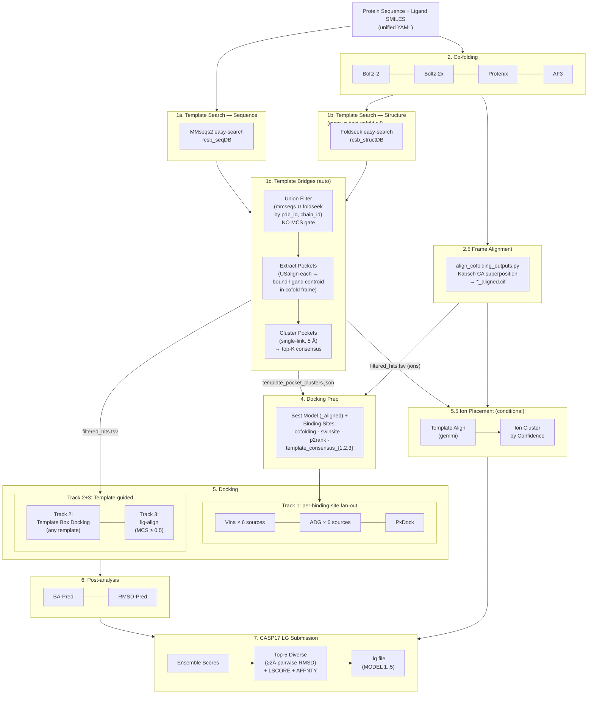

---

## Stage 1: Template Search (Union: Sequence + Structure)

서열 (mmseqs2) 과 구조 (foldseek) 두 검색을 **둘 다 돌리고**, hit 을 `(pdb_id, chain_id)` 키로 union-merge 한다. 가능한 한 많은 template 을 모은 다음, 각 template 의 bound ligand 위치를 cofold frame 으로 align 해서 **consensus pocket** 을 만든다. Tanimoto/MCS 는 metadata only — gating 은 lig-MCS-align (Track 3) 에서만.

### Step 1-1: MMseqs2 Sequence Search

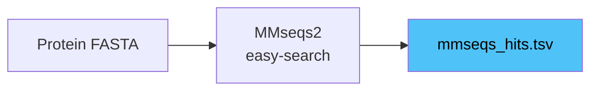

- **Tool**: `mmseqs easy-search` (488k RCSB 서열 DB, preindexed at `data/search_dbs/sequence/rcsb_seqDB`)
- **Parameter**: `min_seq_identity=0.3`, `min_coverage=0.7`, `sensitivity=7.5`, `max_hits=200`
- **Output**: `outputs/template_search_sequence/mmseqs_hits.tsv` (14-col MMseqs2 default format)
- **소요 시간**: ~3초

### Step 1-2: Foldseek Structure Search (query = best cofolding cif)

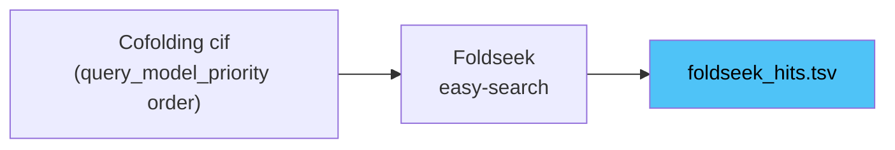

- **Tool**: `foldseek easy-search` against `data/search_dbs/structure/rcsb_structDB`
- **Query 자동 선택**: `template_search_structure.query_from_cofolding=true` + `query_model_priority=[alphafold3, boltz, protenix]` — 첫 번째로 발견되는 cif 사용. Stage 의존성 검증 (`_validate_stage_dependencies`) 이 cofold 보다 먼저 도는 순서를 차단함.
- **Parameter**: `--alignment-type 1` (3Di+AA), `-s 9.5`, `--max-seqs 500`, `--format-output query,target,evalue,bits,alntmscore,qtmscore,ttmscore,prob` (8-col)
- **명시적 quality cut 없음** (mmseqs 의 `min-seq-id 0.3` / `-c 0.7` 같은 게이트가 foldseek 에는 native 로 없음) → recall 우선. 후단 (Step 1-3 union filter) 에서 `qtmscore_min` floor 적용.
- **Output**: `outputs/template_search_structure/foldseek_hits.tsv`
- **소요 시간**: ~30 s ~ 2 min/타겟 (DB 크기에 따라)

### Step 1-3: Union Filter (mmseqs ∪ foldseek, 리간드 annotation)

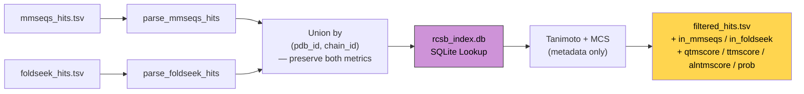

- **Script**: `scripts/run_template_filter.py` — `--hits-tsv` (mmseqs) 와 `--foldseek-tsv` 둘 중 하나 또는 둘 다. wrapper 에서 두 search stage 가 끝난 직후 자동 삽입.
- **Module**: `src/casp17/template_filter.py` (`parse_mmseqs_hits`, `parse_foldseek_hits`, `filter_hits_with_ligands`)
- **Logic**:
  1. 두 TSV 를 파싱해 source 태깅 (`source: mmseqs` / `source: foldseek`)
  2. **Foldseek-only floor** (선택): foldseek hit 에 한해 `max(qtmscore, ttmscore) >= foldseek_qtmscore_min` 통과한 것만 union 에 들어감. default 0.5 = Zhang/Skolnick "same fold" 임계. mmseqs hit 은 이미 `≥30% id + ≥70% cov` 통과했으므로 우회 (qtm=0 이어도 OK).
  3. `(pdb_id, chain_id)` 키로 dedup → 한 row 가 mmseqs+foldseek 모두에 등장하면 두 metric 다 보존 (`in_mmseqs=1, in_foldseek=1`). dual-source hit 은 floor 와 무관하게 통과 (mmseqs 가 이미 통과시켰으므로).
  4. 각 PDB 에서 `rcsb_index.db` candidate ligand (`is_candidate=1`, `ligand_type ∈ {small_molecule, cofactor, metabolite, nucleotide_like, peptide_like}`) 조회
  5. Target SMILES vs template ligand: **Tanimoto** (Morgan FP, r=2, 2048 bits) + **MCS coverage** (`rdFMCS`, timeout=5s) — **저장만 하고 필터링에 쓰지 않음**
  6. Sort key: `(in_mmseqs+in_foldseek 합계 ↓, qtmscore ↓, pident ↓, n_ligands ↓, tanimoto ↓, mcs ↓)` — both-source + 높은 구조/서열 유사도가 상위
- **Output**: `outputs/template_search_sequence/filtered_hits.tsv` (기존 14 컬럼 + `in_mmseqs, in_foldseek, qtmscore, ttmscore, alntmscore, prob` 6 컬럼 append; 옛 consumer 들도 그대로 동작)
- **MCS 게이트는 여기서 발동하지 않음**. Track 3 (lig-MCS-align) 만 `mcs ≥ template_search_sequence.mcs_threshold` (default 0.5) 검사.
- **Time-split 필터링** (옵션): `template_search_sequence.max_deposition_date: "YYYY-MM-DD"` — held-out 벤치(예: `experiments/novel2025_test`)에서 template leakage 차단. CLI: `scripts/run_template_filter.py --max-deposition-date 2025-01-01`

### Step 1-4: Template Pocket Extraction

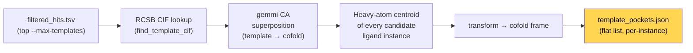

- **Script**: `scripts/extract_template_pockets.py`
- **Reuses**: `collect_template_ions.py` 의 `find_template_cif`, `extract_cif`, `align_template_to_reference`, `transform_position`, `find_best_cofolding_structure` — 한 align 경로를 ion placement + pocket extraction 양쪽이 공유.
- **Per-record 출력 필드** (`PocketPoint`): `template_pdb_id`, `template_chain`, `ligand_ccd`, `ligand_chain`, `ligand_n_heavy`, `centroid_(x|y|z)` (cofold frame), `alignment_rmsd`, `aligned_residues`, `in_mmseqs`, `in_foldseek`, `pident`, `qtmscore`, `best_tanimoto`, `best_mcs_coverage`.
- **`--max-templates 50`** (default): hits>200 케이스에서 wall time 보호. filter 의 evidence sort 덕분에 both-source / 높은 TM-score / 높은 pident 가 우선 align 됨.
- **Output**: `outputs/template_pockets/template_pockets.json`. 각 row 는 한 ligand-instance pocket point (homotetramer 라면 4개 binding site → 4 record).

### Step 1-5: Pocket Clustering (Top-K Consensus)

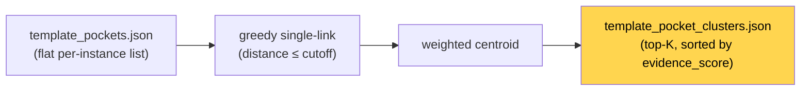

- **Script**: `scripts/cluster_template_pockets.py`
- **Cutoff** (`--cutoff`, default **5.0 Å**) — druglike binding pocket 직경 ~10-15 Å 이라 잘 align 된 template 들이 ~5 Å 안에 모임
- **Per-pocket 가중치**: `weight = (in_mmseqs + in_foldseek) + max(qtmscore, pident/100)` — 범위 ≈ [0, 3]. both-source + 높은 유사도 = 큰 weight
- **Cluster centroid**: weighted mean (가중치 합 = 0 인 fallback 케이스에선 unweighted mean)
- **Cluster evidence_score**: `Σ weight`. 정렬 후 top-K (`--top-k 5`, default) 보존
- **Per-cluster metadata**: `n_members`, `n_unique_pdb`, `evidence_score`, `spread_angstrom`, `in_both_sources`, `in_mmseqs_only`, `in_foldseek_only`, `unique_ccds`, `best_qtmscore`, `best_pident`, `best_tanimoto`
- **Output**: `outputs/template_pockets/template_pocket_clusters.json`
- 이 JSON 은 다음 단계 (`prepare_docking_inputs.py`) 가 읽어 `template_consensus_{1..3}` binding-site source 를 등록

---

## Stage 2: Co-folding

4개 모델이 순차 실행. 동일한 unified YAML 입력을 각 모델 포맷으로 변환 후 GPU 추론.
**Multi-seed**: 각 모델을 5개 seed × 5 diffusion samples = **25개 구조/모델** 생성 (총 100개).

### Multi-seed 전략

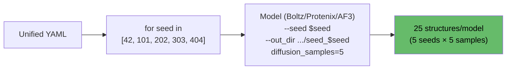

- **Boltz-2/2x**: bash loop으로 `--seed` + `--out_dir` 변경하며 5회 반복
- **Protenix**: 동일 방식 (`--seeds` 변경)
- **AF3**: native `num_seeds=5` + `num_diffusion_samples=5` (loop 불필요)
- **Config**: `cofolding_seeds: [42, 101, 202, 303, 404]`

### Step 2-1: Input Adaptation

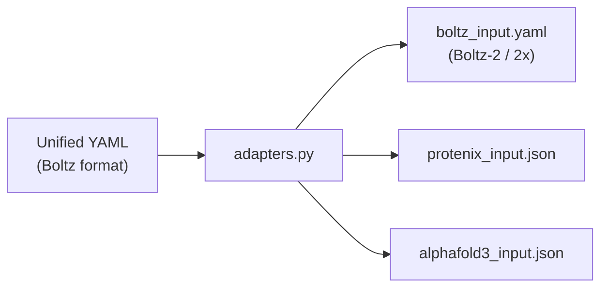

- **Module**: `src/casp17/adapters.py`
- 리간드가 있으면 `properties.affinity` 자동 추가 (Boltz 전용)
- Boltz-2: `use_potentials=false`, Boltz-2x: `use_potentials=true` (별도 run)
- `prepare_boltz()` → `[boltz2, boltz2x]` 리스트 반환
- **AF3 chain id remap**: AF3 스키마가 `^[A-Z]+$`만 허용해서 `L2`/`X2`/`L3` 같은 숫자 포함 id는 validate에서 `ValueError: IDs must be upper case letters`로 거절됨. `prepare_alphafold3`는 단일 letter id는 유지, 그 외는 미사용 letter (A..Z → AA..ZZ 순)로 배정하고 `bondedAtomPairs`의 chain 참조도 동일 remap 적용. Boltz/Protenix는 YAML id 그대로 사용 (downstream 비교 시 주 binder `L`만 전 툴 공통)

### Step 2-2: Model Inference

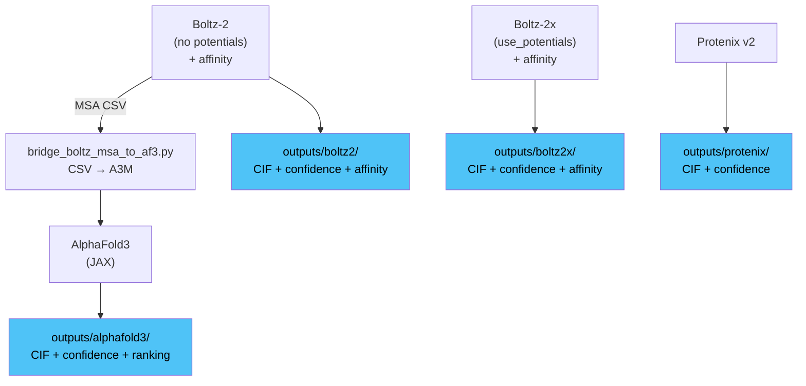

| Model | venv | 소요 시간 (5 seeds × 5 samples = 25 structs) | 특징 |
|-------|------|----------|------|
| Boltz-2 | `.venvs/boltz` | ~10 min (600-620s) | 구조 + confidence + MSA + affinity |
| Boltz-2x | `.venvs/boltz` | ~12 min (680-740s) | 위와 동일 + potentials (constraint) |
| Protenix v2 | `.venvs/protenix` | ~8 min (484-492s) | 구조 + confidence |
| AlphaFold3 | `.venvs/alphafold3` | ~6 min (353-393s) | 구조 + confidence + ranking (JAX) |

> RTX 6000 Ada 단일 GPU, CASP16 L2001/L2002 기준. `cofolding_seeds=[42,101,202,303,404]`, `diffusion_samples=5`.

**MSA 재사용 (cross-seed + cross-model)**
- Boltz 첫 seed만 MSA 서버 fetch. 이후 seed들과 Boltz2x는 생성된 `boltz_results_*/msa/` 디렉토리를 재사용하도록 wrapper가 `_boltz_msa_cache` 쉘 변수에 경로를 보관하고 다음 seed의 출력 경로로 `cp -r`
- MSA는 서열-결정적 (diffusion seed와 무관)이므로 한 번의 fetch가 모든 seed × Boltz2 + Boltz2x를 커버
- Script: `src/casp17/script_builder.py` (인라인 생성)

**Bridge: Boltz MSA -> AF3**
- Boltz가 생성한 MSA CSV를 AF3 A3M 포맷으로 변환
- AF3 JSON에 `pairedMsa=""`, `templates=[]` 패치
- Script: `scripts/bridge_boltz_msa_to_af3.py`

**Bridge: Boltz MSA -> Protenix**
- Boltz MSA 캐시에서 `uniref.a3m`을 찾아 Protenix JSON의 각 `proteinChain`에 `unpairedMsaPath` 주입 + `pairedMsa=""` 패치
- Protenix가 자체 MSA 서버 fetch를 건너뛰어 동일 서열에서 중복 fetch 방지
- Cache miss 시엔 Protenix의 기본 MSA 경로로 graceful fallback
- Script: `src/casp17/script_builder.py` (인라인 heredoc)

**Boltz Affinity Output:**
```json
{
  "affinity_pred_value": 2.62,        // log10(IC50) uM — lower = stronger
  "affinity_probability_binary": 0.41  // binder probability [0-1]
}
```

---

## Stage 2.5: Frame Alignment (cofolding → common coordinate frame)

각 cofolding 모델(Boltz2/2x, Protenix, AF3)은 자체 좌표계에서 구조를 출력한다. 이 bridge는 모든 CIF를 단일 reference frame으로 Kabsch 정렬해서 downstream 전체 (docking, post-analysis, submission, reference comparison)가 동일한 좌표계에서 동작하도록 만든다.

**Script**: `scripts/align_cofolding_outputs.py`

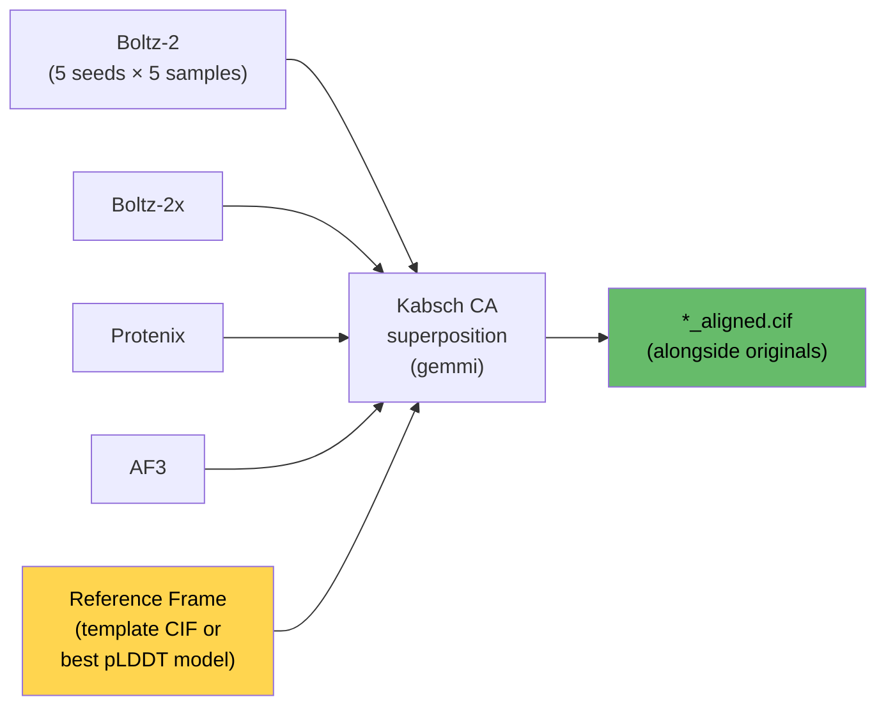

### Reference 선택 우선순위

1. **Template CIF** — template search에서 히트가 있으면 top-1 template의 RCSB mmCIF를 reference로 사용. Track 2/3 template-based docking과 자연스럽게 동일 좌표계.
2. **Best pLDDT cofolding model** — template 없으면 pLDDT 가장 높은 cofolding 모델의 첫 번째 CIF를 reference로. 나머지 모델을 여기에 정렬.

### 동작 방식

1. Reference CIF에서 CA 원자 추출 (chain별, residue name sequence)
2. 각 query CIF에서 CA 추출 → sliding offset으로 residue name 매칭 (결정학적 번호 차이 허용)
3. `gemmi.superpose_positions(ref_cas, query_cas)` → rotation + translation
4. Query CIF의 **모든 원자** (protein + ligand)에 동일 rigid transform 적용
5. `*_aligned.cif`로 원본 옆에 저장

### Downstream 참조

`find_best_cofolding_structure()` (docking prep)와 `find_best_cofolding_cif()` (submission)는 `_aligned.cif`가 존재하면 원본 대신 우선 참조.

### CASP16 L2001 실측

| Model | CIFs | Mean CA RMSD after alignment |
|---|---|---|
| Boltz-2 | 25 | 4.72 Å |
| Boltz-2x (ref) | 25 | 4.15 Å (0.00 = reference 자신) |
| Protenix | 25 | 19.32 Å (fold 자체가 다름) |
| AF3 | 26 | 20.66 Å (fold 자체가 다름) |

> Boltz끼리는 같은 fold (4-5 Å 수준)이지만 Protenix/AF3는 이 타겟에서 완전히 다른 구조를 예측. 정렬은 올바르게 동작하되, fold이 다르면 잔차 RMSD가 높은 것이 정상.

---

## Stage 3: (deprecated) Cross-model Foldseek Consensus

이전 버전은 4개 cofolding 모델 각각에 대해 Foldseek 을 돌리고 교차-모델 합의를 만들었음. **현재 파이프라인은 Stage 1-2 (Foldseek easy-search) + Stage 1-3 (mmseqs ∪ foldseek union filter) 가 그 역할을 대체**한다 — query 는 priority 순으로 결정된 한 cif 만 쓰지만, mmseqs hit 과 union 되면서 cross-model consensus 보다 넓은 후보 집합이 모인다. 이 섹션은 호환성/문서 일관성을 위해 placeholder 로만 남기고, 실제 동작은 Stage 1-2/1-3 참조.

---

## Stage 4: Docking Preparation

Cofolding 출력에서 docking 입력 파일을 자동 생성. Wrapper pipeline에서 cofolding → docking 사이에 자동 삽입.

### Step 4-1: Best Model Selection

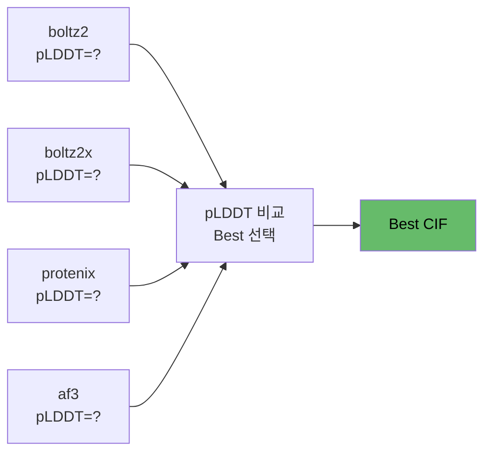

- 각 모델의 confidence score (pLDDT) 비교 → 최고 점수 모델 자동 선택
- Function: `select_best_model()` in `prepare_docking_inputs.py`

### Step 4-2: Receptor Preparation

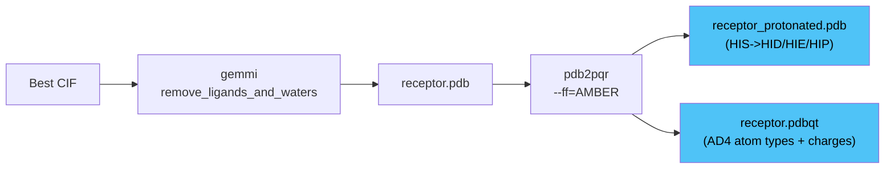

| Step | Tool | Output | 용도 |
|------|------|--------|------|
| CIF -> PDB | gemmi | `receptor.pdb` | 기본 구조 |
| PDB -> PQR | pdb2pqr (AMBER) | 중간 파일 | 수소 추가 + 전하 |
| PQR -> protonated PDB | 자체 변환 | `receptor_protonated.pdb` | Protenix-Dock |
| PQR -> PDBQT | AD4 type mapping | `receptor.pdbqt` | Vina + AutoDock-GPU |

### Step 4-3: Ligand Preparation

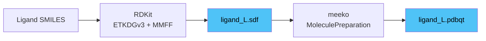

- SMILES -> 3D conformer: `AllChem.EmbedMolecule(mol, ETKDGv3())`
- Force field optimization: `MMFFOptimizeMolecule(mol, maxIters=500)`
- SDF -> PDBQT: meeko `MoleculePreparation`

### Step 4-4: Binding Site Sources (각각 독립 docking variant 로 fan-out)

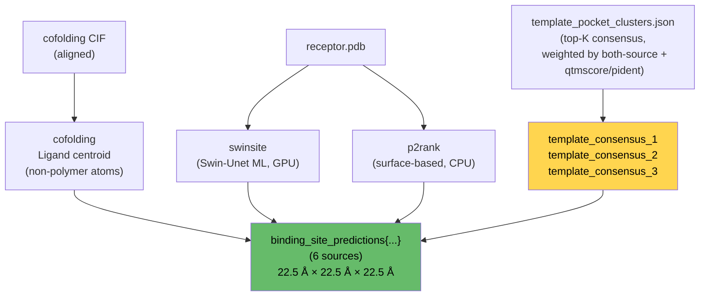

- **6 binding-site sources** 가 모두 `docking_prep_summary.binding_site_predictions` 에 저장됨. **하나가 이긴다 / 진다** 가 아니라 — vina/adg 가 각 source 마다 별도 variant 로 fan-out 해서 모두 docking. 일부 predictor 가 pocket 을 못 찾으면 (e.g. SwinSite 미검출), 해당 variant 만 `sys.exit(0)` 으로 clean skip.
- **`template_consensus_{1..3}`** — `cluster_template_pockets.py` 가 만든 top-K cluster centroid 가 `_add_template_consensus_sources()` 에서 등록됨. 각 entry 는 `center, size, n_members, n_unique_pdb, evidence_score, spread_angstrom, in_both_sources, in_mmseqs_only, in_foldseek_only, best_qtmscore, best_pident` 메타데이터 포함.
- **Cofolding centroid**: co-folding 모델이 직접 놓은 ligand 위치 — 가장 직접적인 신호.
- **Fallback box pick** (`box_method` 필드 — protenix-dock 같은 단일 box 도구가 사용): `cofolding > template_consensus_N (n_unique_pdb ≥ 2 인 cluster) > swinsite > p2rank > weak consensus`.
- **Unified box**: 22.5 Å × 22.5 Å × 22.5 Å, grid spacing 0.375 Å (모든 docking tool 공통).
- **Script**: `scripts/prepare_docking_inputs.py` (`_extract_cofolding_ligand_centroid`, `_add_template_consensus_sources`).
- **Output**: `inputs/docking/docking_prep_summary.json`.

> **CASP16 L2001 교훈**: SwinSite "no pockets", P2Rank 37 Å off, cofolding centroid 도 ~35 Å 빗나감 (모든 모델 동일 pathology). Template-consensus pocket 은 이런 케이스의 backup — 비슷한 fold 의 RCSB 구조들이 합의하는 위치를 별도 box 로 제공.

---

## Stage 5: Docking (Multi-track)

3개 트랙으로 구성. Track 1은 항상 실행, Track 2+3은 MCS >= threshold일 때 자동 활성화.

### Track 1: Cofolding-based Docking (항상 실행) — **6-variant fan-out**

Cofolding best model을 receptor로, **6 binding-site source (cofolding / swinsite / p2rank / template_consensus_{1,2,3}) 각각을 독립 docking box로** 사용해서 Vina + AutoDock-GPU 가 **6 × 2 = 12 variant** 로 병렬 실행. PxDock 은 cache-map 재생성 비용 때문에 단일 run (priority-picked source 사용).

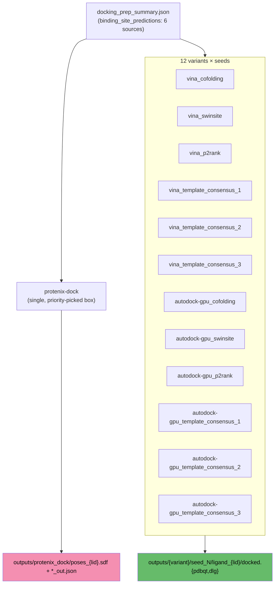

- **`_DOCKING_BOX_SOURCES`** (in `src/casp17/adapters.py`) = `("cofolding", "swinsite", "p2rank", "template_consensus_1", "template_consensus_2", "template_consensus_3")`. `prepare_vina` / `prepare_autodock_gpu` 가 이 튜플을 순회하며 하나씩 `PreparedModelRun` 을 emit.
- 각 variant 는 생성 시점에 `BOX_SOURCE = 'cofolding'|'swinsite'|'p2rank'|'template_consensus_N'` 가 runner script 에 baked-in. 런타임에 `summary['binding_site_predictions'][BOX_SOURCE]['center']` 를 읽어 box 설정. 해당 source 가 missing 이면 (e.g. template hit 없는 타겟의 `template_consensus_*`) **`sys.exit(0)` 으로 clean skip**.
- 변수 환경: runner scripts read `DOCK_SEED` / `DOCK_OUT_DIR` (wrapper 가 seed 루프에서 주입).
- **`box_method` 필드**: priority-picked fallback (cofolding → strong consensus → swinsite → p2rank → weak consensus). PxDock 같은 단일-box 도구는 이 fallback 을 사용.
- **타겟당 pose pool**: Track 1 alone 약 ~180 pose (Vina 6variant × 5seed × n_poses + ADG 6variant × ?), cofolding pose 100 + Track 2/3 추가되면 ~300+.
- **Design rationale**: 한 binding-site predictor (cofolding/swinsite/p2rank) 가 잘못된 pocket 을 잡아도 (예: 7hqq 20 Å 오차) **template-consensus** 가 RCSB 의 검증된 binding pose 좌표를 독립 backup 으로 제공. 두 cluster (n_unique_pdb ≥ 2) 이상이면 multi-template 합의라 노이즈 극복력이 좋음.
- **Config**: `docking_seeds: [42, 101, 202, 303, 404]` (variant 는 자동).

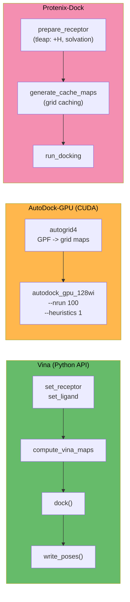

| Tool | Variants | Type | 소요 시간/seed | venv | Output |
|------|----------|------|--------|------|--------|
| Vina | `vina_{cofolding,swinsite,p2rank}` | Python API (CPU) | ~3s | `.venvs/protenix-dock` | `outputs/vina_<source>/seed_<seed>/docked.pdbqt` |
| AutoDock-GPU | `autodock-gpu_{cofolding,swinsite,p2rank}` | CUDA binary | ~10s | `.local/bin/` | `outputs/autodock_gpu_<source>/seed_<seed>/docking.dlg` |
| Protenix-Dock | (single, no fan-out) | CPU force field | ~5-30min | `.venvs/protenix-dock` | `outputs/protenix_dock/*_out.json` |

- 모든 tool은 `docking_prep_summary.json`에서 receptor/ligand/box를 runtime에 읽음
- AutoDock-GPU 래퍼는 추가로 **런타임에 ligand pdbqt를 파싱**해서 `ligand_types`와 grid map을 동적으로 구성 — F/Cl/Br/P/I/Si 등 비표준 원자 타입도 자동 대응 (adapter 시점에는 하드코딩된 기본값을 쓰지 않음)
- Protenix-Dock이 전체 시간의 ~77% 차지 (병목)

### Track 2: Template-based Box Docking (any template, **no MCS gate**)

Template search 가 찾은 hit (sequence + structure union, candidate ligand 가 하나라도 있는 모든 PDB) 의 실험 구조를 receptor 로, template 리간드 위치를 docking box 로 사용. Track 2 는 **template ligand 가 query 와 닮을 필요 없음** — pocket geometry 만 빌리므로 어떤 ligand 든 OK.

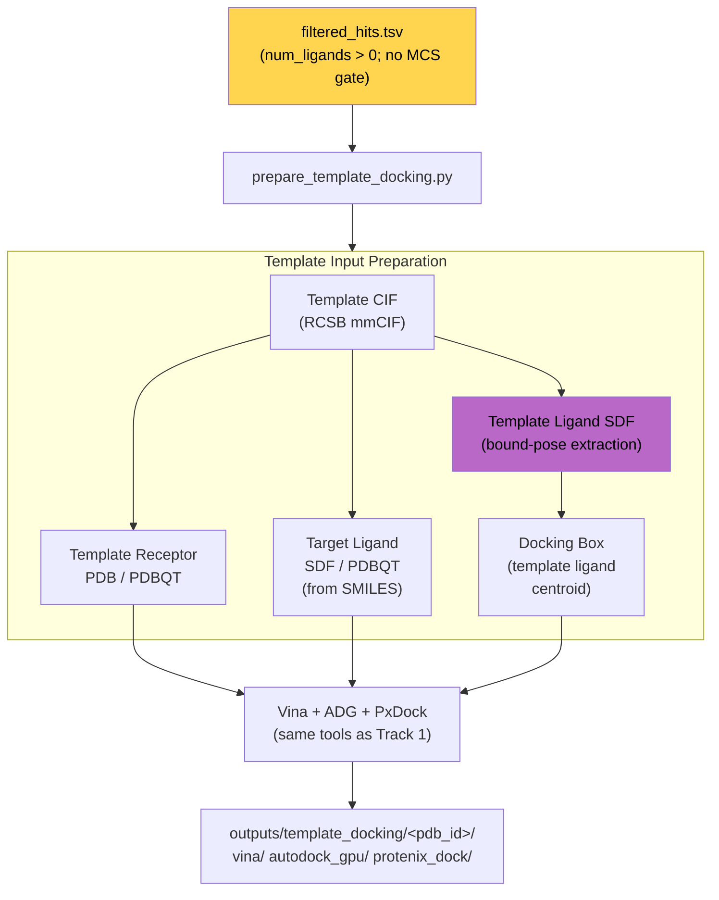

- **Script**: `scripts/prepare_template_docking.py`
- **Logic**:
  1. `filtered_hits.tsv` 에서 상위 3 개 template (`--max-templates 3`) — sort key 가 evidence_breadth × similarity 이라 both-source / 높은 qtmscore 우선
  2. RCSB CIF 파일에서 receptor PDB/PDBQT 생성 (`gemmi` + `pdb2pqr`)
  3. Template 리간드의 **bound-pose SDF 추출** (`extract_template_ligand_sdf()`)
  4. Template 리간드 좌표 centroid → docking box center
  5. Target SMILES → SDF/PDBQT (RDKit + meeko)
  6. 각 template 에 대해 Vina + ADG + PxDock 실행
- **MCS 게이트 없음**: `check_template_hits` 는 `num_ligands > 0` 만 검사. 이는 의도된 설계 — pocket geometry 는 ligand 모양과 무관.
- **장점**: 실험적으로 검증된 binding pocket 좌표를 docking box 로 사용 → 정확도 향상.

### Track 3: lig-align (MCS-guided Pose Generation, MCS >= 0.5)

Template 리간드의 결합 포즈를 MCS anchor로 활용해, target 리간드의 3D 포즈를 직접 생성.

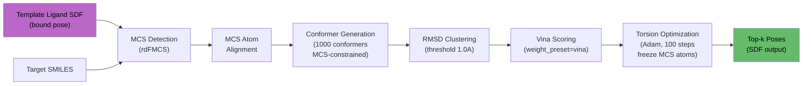

- **Library**: `lig_align.run_pipeline()` (hub venv에 설치됨)
- **Parameters**:
  - `num_confs=1000`: MCS-constrained conformer 수
  - `mcs_mode="auto"`: single/multi/cross MCS 자동 선택
  - `optimize=True`: gradient-based torsion optimization
  - `weight_preset="vina"`: Vina scoring function weights
  - `top_k=10`: 최종 출력 포즈 수
- **Input**: template receptor PDB + template ligand SDF (bound pose) + target SMILES
- **Output**: `outputs/template_docking/<pdb_id>/lig_align/` (ranked SDF poses)
- **장점**: Docking과 달리 scoring function만 사용, MCS anchor 덕분에 정확한 초기 배치

### Multi-track Decision Logic

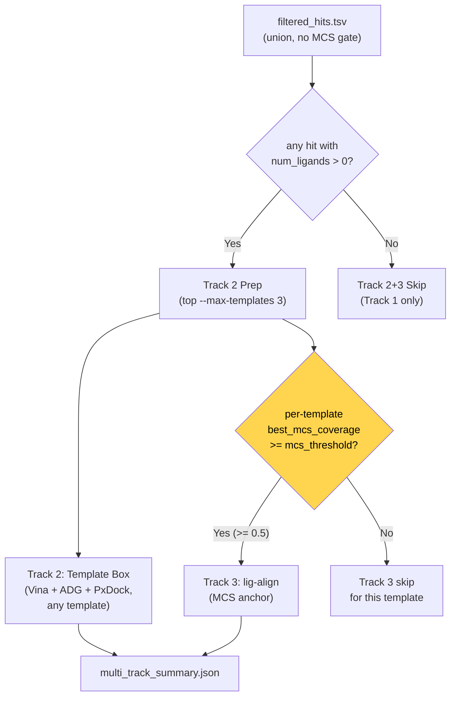

- **Orchestrator**: `scripts/run_multi_track_docking.py`
- **Config**: `template_search_sequence.mcs_threshold` (default `0.5`) — Track 3 에만 적용
- Wrapper script 에서 Track 1 docking 이후 자동 실행

| Track | Receptor | Box Source | Method | Entry condition |
|-------|----------|-----------|--------|------|
| Track 1 | Cofolding best model (_aligned) | 6 sources (cofolding / swinsite / p2rank / template_consensus_{1..3}) | Vina + ADG + PxDock | 항상 |
| Track 2 | Template PDB (RCSB) | Template ligand centroid | Vina + ADG + PxDock | template hit 존재 (`num_ligands > 0`) — **MCS 게이트 없음** |
| Track 3 | Template PDB (RCSB) | MCS anchor alignment | lig-align | per-template `best_mcs_coverage >= mcs_threshold` |

---

## Stage 5.5: Ion/Metal Placement (conditional)

Input YAML에 ion/metal CCD 엔티티 (ZN, MG, CA, FE 등)가 있으면 자동 실행. Cofolding은 metal 위치를 정확히 예측하기 어려우므로, template alignment 기반으로 가능한 위치를 수집.

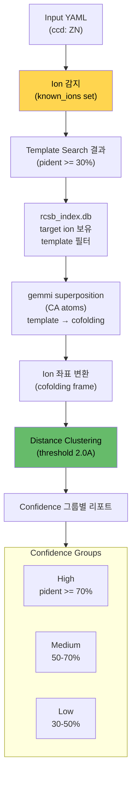

- **Script**: `scripts/collect_template_ions.py`
- **Input**: cofolding best CIF + template search hits + target ion CCD codes
- **Logic**:
  1. Input YAML에서 ion CCD 코드 추출 (ZN, MG, CA, FE 등)
  2. Template search hits 중 해당 ion을 보유한 PDB 필터링 (rcsb_index.db)
  3. 각 template을 cofolding best model에 gemmi CA superposition
  4. Rotation/translation을 ion 좌표에 적용 → cofolding 좌표계로 변환
  5. 거리 기반 클러스터링 (default 2.0A)
  6. Confidence 그룹별 (pident 70%+/50-70%/30-50%) 결과 리포트
- **Output**: `outputs/ion_placement/ion_placement_summary.json`
- **자동 skip**: input에 ion이 없으면 실행하지 않음

**Output example:**
```json
{
  "ions": {
    "ZN": {
      "total_positions": 12,
      "total_templates": 10,
      "clusters": [
        {"centroid": [12.3, 45.6, 78.9], "num_templates": 8, "spread_angstrom": 0.8}
      ],
      "by_confidence": {
        "high": {"pident_range": ">=70%", "num_templates": 3, "clusters": [...]},
        "medium": {"pident_range": "50-70%", "num_templates": 5, "clusters": [...]},
        "low": {"pident_range": "30-50%", "num_templates": 2, "clusters": [...]}
      }
    }
  }
}
```

---

## Stage 6: Post-analysis

모든 docking 결과에 대해 binding affinity와 pose RMSD를 GNN으로 예측.

```mermaid
flowchart TB
    subgraph STAGE["Pose Staging (unique stems)"]
        VINA_OUT["outputs/vina/seed_*/docked.pdbqt"] --> SGE["analysis/poses/vina_seed_N.{pdbqt,sdf}"]
        ADG_OUT["outputs/autodock_gpu/seed_*/docking.dlg"] --> SGE2["analysis/poses/autodock_gpu_seed_N.{dlg,sdf}"]
        PXD_OUT["outputs/protenix_dock/*_out.json"] --> PXSDF["outputs/protenix_dock/poses.sdf\n(multi-record, built by\n_pxdock_json_to_sdf)"]
    end

    subgraph LIST["Per-tool pose lists"]
        SGE --> VLIST["analysis/vina_poses.txt"]
        SGE2 --> ALIST["analysis/autodock_gpu_poses.txt"]
    end

    subgraph PREDICT["GNN Prediction"]
        VLIST & ALIST & PXSDF --> BA["BA-Pred"]
        VLIST & ALIST & PXSDF --> RMSD["RMSD-Pred"]
        REC["receptor.pdb"] --> BA & RMSD
    end

    BA --> BA_OUT["ba_pred_<tool>.tsv\n(Name, pKd, kcal/mol)"]
    RMSD --> RMSD_OUT["rmsd_pred_<tool>.tsv\n(Name, pRMSD, P>2A)"]

    style BA_OUT fill:#ffd54f,color:#000
    style RMSD_OUT fill:#ffd54f,color:#000
```

- **Script**: `scripts/run_post_analysis.py` (GPU node에서 실행)
- **venv**: `.venvs/pred` (torch 2.4 + dgl 2.4 + openbabel + rdkit) — **sm_90/sm_100 (H100, Blackwell 6000pro) kernel 미포함**이므로 `heavy` partition에서 돌리면 `no kernel image for execution` 에러 → `test`/`6000ada`만 사용 권장 (scheduling 레벨에서 partition 지정)
- **Variant-aware 자동 발견**: `find_ligand_files`가 `outputs/vina_*/seed_*` / `outputs/autodock_gpu_*/seed_*` 를 glob으로 스캔 → `vina_cofolding`, `vina_swinsite`, `vina_p2rank`, `autodock_gpu_cofolding`, ... 각각 독립 tool key로 staging. TSV도 `ba_pred_vina_cofolding.tsv` 식으로 분리
- **BA-Pred vs RMSD-Pred 이름 규칙 정규화**: BA-Pred는 SDF 레코드의 `_Name`을 그대로 씀, RMSD-Pred는 `_Name`에 record index를 한 번 더 붙임(`cofold_af3_0_0`). `compute_submission_scores.aggregate::_canonicalize`가 pose name을 part 단위로 walk down하면서 staged 파일이 존재하는 최장 prefix 찾아 단일 record-index 형태로 축소 → BA/RMSD 두 TSV가 canonical key에서 1-1 join되도록 복구
- **Pose 수집 규칙**:
  - multi-seed docking 결과(`vina`, `autodock_gpu`)는 각 seed 파일을 `outputs/analysis/poses/{tool}_seed_{N}.{ext}`로 유니크 stem으로 복사. BA-Pred/RMSD-Pred의 `{basename}_{idx}` pose 명명 규칙 때문에 stem이 유니크해야 TSV row가 seed별로 분리됨
  - 각 staged 파일에 대해 meeko `mk_export.py`로 `.sdf` 복제본도 생성 → downstream `make_casp_submission.py`가 pose를 레코드 인덱스로 정확히 꺼낼 수 있음
  - **Protenix-Dock**은 포즈를 `.sdf`로 내보내지 않고 `*_out.json`(atom-mapped SMILES + `ligand.xyz`)에만 담음 → `_pxdock_json_to_sdf`로 RDKit 멀티레코드 SDF 생성 후 BA/RMSD-Pred에 전달
  - **Cofolding 포즈도 포함**: aligned CIF(`outputs/{boltz2,boltz2x,protenix,alphafold3}/**/*_aligned.cif`)에서 리간드(chain `L` 또는 `LIG*/UNK/UNL` residue, het_flag `H`)를 추출 → 입력 docking ligand SDF(`inputs/docking/ligand_*.sdf`)를 템플릿으로 `AssignBondOrdersFromTemplate`로 bond graph 재부여 → `analysis/poses/cofold_{model}.sdf` (multi-record)로 스테이지. 결과적으로 cofolding 포즈가 docking 포즈와 함께 BA-Pred/RMSD-Pred를 거치고 Stage 7 Top-5 선택에서도 동등 후보로 경합. Bond graph 재부여 없이는 cofolding CIF의 결합차수 정보가 소실되어 BA-Pred의 `mol_to_graph`가 실패
  - **입력 ligand SDF (`inputs/docking/ligand_*.sdf`)는 post-analysis에서 제외**. RDKit embedding 좌표는 receptor와 정렬되지 않아 BA-Pred의 "8 Å 이내 단백질 원자만 추출" 로직이 빈 `MolFromPDBBlock` → `None`을 반환하고 `mol_to_graph` 단계에서 `AttributeError: 'NoneType' object has no attribute 'GetNumAtoms'`로 죽음. Docking 결과 + cofolding aligned 포즈만 대상으로 함
- **Output**:
  - `outputs/analysis/poses/` — staged pose 파일들 (pdbqt/dlg + sdf 쌍)
  - `outputs/analysis/{vina,autodock_gpu}_poses.txt` — BA/RMSD-Pred 입력용 리스트 파일
  - `outputs/protenix_dock/poses.sdf` — PxDock json에서 변환된 멀티포즈 SDF
  - `outputs/analysis/ba_pred_<tool>.tsv` — per-pose pKd per docking tool
  - `outputs/analysis/rmsd_pred_<tool>.tsv` — per-pose pRMSD per docking tool
  - `outputs/analysis/summary.json` — 최적 조합 선택

---

## Stage 7: CASP17 LG Submission

모든 파이프라인 출력을 aggregate해서 CASP17 LG-format 제출 파일 생성.

### Step 7-1: Score Aggregation

```mermaid
flowchart TB
    subgraph SOURCES["Score Sources"]
        BP["BA-Pred TSVs\n(per pose pKd)"]
        RP["RMSD-Pred TSVs\n(per pose pRMSD, P>2A)"]
        BZ["Boltz affinity JSONs\n(affinity_pred_value,\nbinder_prob)"]
    end

    subgraph SCORES["Aggregate Scores"]
        BP --> L1["log10(Kd nM) = 9 - pKd"]
        RP --> L2["LSCORE = 1 - P(RMSD > 2A)"]
        BZ --> L3["log10(Kd nM) = value + 3\nfilter binder_prob >= 0.5"]
    end

    subgraph ENSEMBLE["Ensemble"]
        L1 --> M1["median BA-Pred"]
        L3 --> M2["median Boltz\n(binders only)"]
        M1 & M2 --> AVG["avg log10(Kd nM)"]
        AVG --> KD["10^avg = Kd (nM)"]
    end

    L2 --> BEST["Best pose\n(highest LSCORE)"]

    style BEST fill:#66bb6a,color:#000
    style KD fill:#ffd54f,color:#000
```

- **Script**: `scripts/compute_submission_scores.py`
- **LSCORE** (per pose): `1 - P(RMSD > 2Å)` from RMSD-Pred (higher = more confident)
- **AFFNTY** (per complex): log-space ensemble of BA-Pred median + Boltz median (filtered by binder_prob ≥ 0.5)

#### Top-5 Diversity-aware Pose Selection (`select_diverse_top_k`)

CASP LG 포맷은 MODEL 1..5까지 허용. 단순 top-5 선택 시 매우 유사한 포즈가 반복되므로, **greedy diversity selection** 적용:

```
1. 정렬 기준 (tier 우선순위):
   1순위: pRMSD 오름차순 (RMSD-Pred의 예측 포즈 RMSD — 작을수록 native frame에 가까울 것으로 예측)
   2순위: LSCORE 내림차순 (= 1 - P(RMSD > 2Å) 내림차순, tie-break)
   3순위 (fallback): pRMSD/LSCORE 모두 없으면 BA-Pred pKd 내림차순
2. Top-1 무조건 선택
3. 나머지를 순서대로 순회:
   - 이미 선택된 모든 포즈와의 heavy-atom RMSD ≥ 2Å 이면 선택
   - 아니면 스킵
4. 5개 선택되거나 후보 소진 시 종료
```

- **Primary 기준이 pRMSD로 변경**된 이유: LSCORE는 threshold 기반 sigmoid-like 확률이라 0.95–0.99 구간이 포화되고 변별력이 약함. pRMSD는 연속 회귀 값이라 단일 Å 수준의 차이를 보존 → diverse top-5에서 더 좋은 spread 확보. LSCORE는 여전히 LG MODEL 헤더에 그대로 기록됨 (표시/컴파일러 호환 목적).
- Heavy-atom RMSD: RDKit `CalcRMS` (symmetry-aware, sanitized mol, same receptor frame이므로 alignment 불필요)
- Pose 파일 해상: `pose_name` (`{stem}_{record_idx}`)에서 역산 → `outputs/analysis/poses/{stem}.sdf`의 정확한 레코드 (`_resolve_pose_file` + `_split_pose_name`)
- 후보 pool (Track 1 3-variant fan-out 반영): `vina_{cofolding,swinsite,p2rank}`, `autodock_gpu_{cofolding,swinsite,p2rank}`, `protenix_dock`, `template`, `lig_align`, `cofold_{boltz2,boltz2x,protenix,af3}` — 타겟당 약 200-250 pose
- **MDL title 정책**: `pose_to_mdl`가 `title=pose.pose_name`을 인자로 받아 `mol.SetProp("_Name", title)` 후 `MolToMolBlock` 작성. RDKit의 기본 타이틀 `"     RDKit          3D"`로 떨어지던 옛 동작이 제거되어 LG 파일의 MDL 첫 줄에 pose source(`vina_p2rank_seed_202_5`, `cofold_protenix_17` 등)가 그대로 기록됨. evaluator가 LIGAND 다음 non-control 줄을 pose name으로 읽기 때문에 이 변경이 없으면 `MODEL N RDKit 3D lig_rmsd=None`으로 나옴
- **Config**: `--top-k 5 --diversity-rmsd 2.0` (CLI args)

### Step 7-2: LG Format Assembly

```mermaid
flowchart TB
    CIF["Best cofolding CIF\n(_aligned, by pLDDT)"] --> PDB["gemmi: CIF → PDB\nB-factor = pLDDT"]
    SEL["select_diverse_top_k()\n(5 poses, ≥2Å apart)"]

    subgraph MODELS["MODEL 1..5"]
        direction TB
        M1["MODEL 1: highest LSCORE"]
        M2["MODEL 2: next, ≥2Å from M1"]
        M3["MODEL 3..5: greedy diverse"]
    end

    SEL --> MODELS
    MODELS -->|"per-model\npose_to_mdl(file, idx)"| MDL["MDL V2000\n(per MODEL)"]
    SCORES["LSCORE (per MODEL)\nAFFNTY (per complex)"]

    PDB & MDL & SCORES --> BUILD["build_lg_submission()"]
    BUILD --> LG[".lg file\n(MODEL 1..5)"]

    style LG fill:#66bb6a,color:#000
    style SEL fill:#ffd54f,color:#000
```

- **Script**: `scripts/make_casp_submission.py`
- **Format** (multi-MODEL):
  ```
  PFRMAT LG
  TARGET L2001
  AUTHOR <casp-code>
  METHOD <description>
  METHOD -------------
  MODEL 1
  REMARK <protein_model + pose_sources>
  PARENT <template_pdb_or_N/A>
  ATOM ... (receptor, B-factor = pLDDT)
  TER
  LIGAND 001 <name>
  LSCORE 0.994
  <MDL V2000 block>
  M  END
  MODEL 2
  ...                    # 같은 protein, 다른 ligand pose
  MODEL 5
  ...
  AFFNTY 362.000 aa     # optional, per-complex (MODEL 전체에 1번)
  END
  ```

### Usage

```bash
python scripts/make_casp_submission.py \
    --run-dir experiments/runs/L2001_input \
    --target-id L2001 \
    --ligand-name 761 \
    --author <casp-code> \
    --method "Boltz-2x + Vina/ADG ensemble" \
    --include-affinity \
    --top-k 5 \
    --diversity-rmsd 2.0 \
    --output experiments/submissions/L2001.lg
```

- `--top-k 5` (default): MODEL 개수 (1-5)
- `--diversity-rmsd 2.0` (default): 최소 pairwise heavy-atom RMSD (Å)
- `--pose-source auto` (default): 모든 docking tool에서 LSCORE 기준 선택
- `--pose-source vina/autodock_gpu/protenix_dock/template/lig_align`: 특정 tool만 사용
- `--include-affinity`: AFFNTY record 포함 (per-complex)
- `--lscore N`, `--affinity-nM N`: manual override (MODEL 1에만 적용)

### Wrapper Integration

Post-analysis and CASP submission are fully integrated into the wrapper script, so running `prepare-wrapper` + `sbatch` auto-executes **all 8 stages** end-to-end.

**GPU 할당 stamp**: wrapper 시작 직후 아래 블록이 자동 실행되어 log 맨 앞에 어느 노드/GPU가 할당됐는지 기록 — CUDA kernel compat 문제를 사후에 노드별로 판독하기 쉽게 함.

```bash
echo "--- GPU allocation ---"
echo "SLURM_NODELIST=${SLURM_NODELIST}  SLURM_JOB_ID=${SLURM_JOB_ID}"
nvidia-smi --query-gpu=name,compute_cap,driver_version,memory.total --format=csv,noheader
echo "----------------------"
```

Config knobs:
```yaml
post_analysis:
  enabled: true              # default on
  device: cuda

submission:
  enabled: true              # default off; set true to auto-generate .lg files
  author: "XXXX-XXXX-XXXX"   # CASP registration code
  method: "Boltz-2x + ensemble ..."
  include_affinity: true     # default on (PA tasks like L1000). Set false for pose-only P tasks (L2000)
  parent: "N/A"              # template PDB ID or N/A
  ligand_number: 1
```

**Wrapper execution order**:

```
template-search-sequence
  → BRIDGE: template filter (Tanimoto + MCS)
cofolding (5 seeds × 5 samples, 4 models)
  → BRIDGE: align cofolding outputs (Kabsch to common frame)     ← NEW
  → BRIDGE: docking prep (auto-select _aligned CIF + binding site + file conversion)
docking (Track 1: Vina/ADG 5 seeds, PxDock 1x)
  → MULTI-TRACK DOCKING (Track 2+3 if MCS ≥ 0.5)
  → ION/METAL PLACEMENT (if ion in input)
  → POST-ANALYSIS (BA-Pred + RMSD-Pred, staged multi-seed poses)
  → CASP17 LG SUBMISSION (top-5 diverse MODEL, if submission.enabled)
```

Output: `experiments/submissions/<target>.lg` (multi-MODEL, up to 5)

---

## Timing (RTX 6000 Ada, single GPU)

CASP16 L2001/L2002 실측 (job 23941, 23942, partition `6000ada`, `casp_submission` config — 5 cofolding seeds × 5 samples + 5 docking seeds). 아래 gantt는 L2001 기준 시작 0초부터의 누적 시각입니다.

```mermaid
gantt
    title Pipeline Execution Timeline (L2001, 53:26 total)
    dateFormat X
    axisFormat %Mm

    section Search
    MMseqs2 + template filter    :0, 13

    section Co-folding
    Boltz-2 (5×5)                 :13, 635
    Boltz-2x (5×5)                :635, 1375
    Protenix v2 (5×5)             :1375, 1867
    Boltz MSA -> AF3 bridge       :1867, 1870
    AlphaFold3 (25 structs)       :1870, 2223

    section Docking Prep
    docking_prep_summary.json     :2223, 2228

    section Track 1 Docking
    Vina (5 seeds)                :2228, 2482
    AutoDock-GPU (5 seeds)        :2482, 2524
    Protenix-Dock (1 run)         :2524, 2983

    section Track 2+3 (skipped)
    Multi-track docking           :2983, 2985

    section Ion placement (skipped)
    collect_template_ions         :2985, 2987

    section Post-analysis + submit
    BA-Pred + RMSD-Pred           :2987, 3150
    compute_submission_scores     :3150, 3155
    make_casp_submission          :3155, 3206
```

| Stage | L2001 | L2002 | 비고 |
|-------|------:|------:|------|
| Template search (MMseqs2 + ligand filter) | 13s | 3s | sequence search + Tanimoto/MCS scoring |
| Boltz-2 (5 seeds × 5 samples, 25 structs) | 622s | 600s | + Boltz affinity |
| Boltz-2x (5 seeds × 5 samples, 25 structs) | 740s | 680s | + affinity + potentials |
| Protenix v2 (5 seeds × 5 samples, 25 structs) | 492s | 484s | |
| Bridge: Boltz MSA -> AF3 | <1s | <1s | CSV → A3M + JSON 패치 |
| AlphaFold3 (25 structures) | 353s | 393s | |
| Bridge: Docking prep | <5s | <5s | auto-select + SwinSite/P2Rank + SMILES→SDF/PDBQT + CIF→PDB→PDBQT |
| Vina (5 seeds) | 254s | 130s | |
| AutoDock-GPU (5 seeds) | 42s | 42s | per-seed 동적 GPF (ligand atom type + box center 런타임 재로드) |
| Protenix-Dock (1 run) | 459s | 513s | multi-seed 불가 (너무 느려서) |
| Multi-track docking (Track 2 + 3) | skipped | skipped | MCS < 0.5 |
| Ion/metal placement | skipped | skipped | 입력에 ion entity 없음 |
| Post-analysis (BA-Pred + RMSD-Pred) | ~1-2 min | ~1-2 min | 158 pose × 2 predictor (L2001 기준 vina 50 + ADG 100 + pxdock 8) |
| compute_submission_scores | <5s | <5s | TSV → PoseScore aggregate, ensemble log-Kd |
| make_casp_submission | <5s | <5s | best pose → MDL + LG file |
| **Total wall-clock (`sacct`)** | **00:53:26** | **00:52:08** | Track 2/3 + Ion + 포스트 모두 활성일 때 +8~20분 정도 추가 예상 |

> Boltz-2x + Protenix v2 + Boltz-2 + AF3 가 cofolding 합산 36분, 전체 파이프라인의 ~67% 차지. Track 1 docking (Vina+ADG+PxDock) 은 ~13분 (~25%).

**Track 2/3 활성화 조건 (관측 못 한 비용)**:
- MCS ≥ 0.5 템플릿이 존재하면 `run_multi_track_docking.py`가 각 적합 템플릿에 대해 Vina/ADG/PxDock를 다시 돌림. 1-2개 템플릿 기준 추가 ~8-20분 예상.
- Ion entity 가 input YAML에 있으면 template 정렬 + clustering stage가 추가됨 (~30초 - 1분).

---

## Bridge Scripts

Wrapper pipeline에서 stage 사이에 자동 삽입되는 bridge step 목록.

Bridge 들이 발화하는 순서 (`script_builder.build_wrapper_shell_script`):

1. Boltz MSA cross-seed cache (cofolding 내부)
2. Boltz MSA → Protenix / AF3 (cofolding 내부)
3. **Template bridges** (둘 다 끝난 직후, docking 전): union filter → pocket extraction → pocket clustering
4. **Frame alignment** + **Docking prep** (template_consensus 등록 포함) — 둘 다 docking stage 직전
5. **Multi-track docking** (docking 후, 조건부)
6. **Ion placement** (multi-track 후, 조건부)
7. Post-analysis → score aggregation → CASP submission

| Bridge | 삽입 위치 | Script | 역할 |
|--------|----------|--------|------|
| Boltz MSA cross-seed 캐시 | Boltz seed 1 → 이후 seed + Boltz2x | `script_builder.py` (인라인) | seed 1의 `msa/` 디렉토리를 재사용해 서버 fetch 중복 제거 |
| Boltz MSA → Protenix | Boltz → Protenix (cofolding 내부) | `script_builder.py` (인라인 heredoc) | Boltz `uniref.a3m` → Protenix JSON `unpairedMsaPath` 주입 |
| Boltz MSA → AF3 | Boltz → AF3 (cofolding 내부) | `bridge_boltz_msa_to_af3.py` | MSA CSV → A3M + AF3 JSON 패치 |
| **Template Filter (union)** | **두 search stage 끝난 후, docking 전** | **`run_template_filter.py`** | **mmseqs ∪ foldseek union by `(pdb_id, chain_id)`**. Tanimoto/MCS는 metadata only. 옵션 `--max-deposition-date`로 time-split |
| **Template Pocket Extraction** | filter 직후, docking 전 (cofolding 있을 때만) | **`extract_template_pockets.py`** | 각 hit → CIF align (gemmi CA) → bound-ligand centroid 좌표 추출 → cofold frame 변환. flat `template_pockets.json` 출력 |
| **Template Pocket Clustering** | extraction 직후 | **`cluster_template_pockets.py`** | single-link clustering (5 Å), weight = both-source + qtm/pident, top-K 출력 → `template_pocket_clusters.json` |
| **Frame Alignment** | cofolding 끝난 뒤, docking 직전 | **`align_cofolding_outputs.py`** | 모든 CIF → 공통 좌표계 Kabsch 정렬 (`_aligned.cif`) |
| Docking Prep | alignment → docking 사이 | `prepare_docking_inputs.py` | 자동 모델 선택 + binding-site **6 source 수집** (cofolding centroid + SwinSite + P2Rank + template_consensus_{1,2,3}) → `binding_site_predictions` dict에 저장 + 파일 변환 |
| Multi-track Docking | docking 직후 (조건부) | `run_multi_track_docking.py` | Track 2 (any template) + Track 3 (`mcs >= mcs_threshold`) 실행. RCSB CIF의 multi-char chain id 단일 letter 정규화 |
| Ion Placement | multi-track 직후 (조건부) | `collect_template_ions.py` | template alignment → ion 위치 수집 |
| Score Aggregation | post-analysis 후 | `compute_submission_scores.py` | BA/RMSD/Boltz 집계 + diversity-aware top-5 selection. `template_consensus_*` family 도 cross-family consensus 계산에 포함 |
| CASP Submission | 최종 | `make_casp_submission.py` | LG format .lg 파일 생성 (multi-MODEL 1..5) |
| Reference Analysis | post-hoc (수동) | `analyze_reference.py` | 정답 crystal vs predicted poses RMSD 비교 |

---

## Shared Utility Modules

여러 스크립트에서 중복 구현되던 포즈-평가 헬퍼들을 정리한 공통 모듈.

| Module | 포함 API | 이전 중복 위치 |
|--------|---------|------|
| `src/casp17/geometry.py` | `parse_ca`, `kabsch`, `transform_mol`, `reassign_bonds`, `mol_from_mdl_body`, `pose_rmsd` (symmetry-aware RDKit `CalcRMS`) | `experiments/casp16_test/L1000/{evaluate,best_pose,compare_selection,compare_cofold_metrics}.py`, `experiments/novel2025_test/evaluate.py` |
| `src/casp17/lg_format.py` | `parse_lg` (multi-MODEL LG 파서 — ATOM/HETATM/TER + MDL body + `LSCORE`/`AFFNTY`/`LIGAND` 분리) | 위 evaluate 스크립트 2곳 |

> 기존 `src/casp17/yaml_utils.py`는 삭제됨 — 커스텀 YAML dumper 대신 `yaml.safe_dump` 사용 (hub venv의 `pyyaml` 의존성).

---

## Held-out Benchmarks (`experiments/`)

파이프라인 튜닝/회귀 검증용 오프라인 벤치 세트. 모두 wrapper가 생성하는 `experiments/runs/<target>/` 트리 위에서 동작하며, `evaluate.py`는 최종 `.lg` 파일과 ground-truth 결정구조를 매칭해 ligand RMSD/pKd 오차를 집계한다.

| Dir | 타겟 수 | 용도 | Time-split 설정 |
|-----|--------|------|-----|
| `experiments/casp16_test/L1000/` | 18 (L1000–L1017) | CASP16 L-task regression | 제한 없음 (과거 데이터) |
| `experiments/casp16_test/L2000/` | — (준비 중) | CASP16 pose-only 재현 | — |
| `experiments/novel2025_test/` | 499 / 543 (RCSB 2025-01-01 이후 non-redundant) | 시간 분할 held-out 벤치 | `template_search_sequence.max_deposition_date: "2025-01-01"` — template leakage 차단 |

`novel2025_test`는 `max_deposition_date` + RCSB non-redundant 인덱스를 결합해 "2025년 이후에만 공개된 구조"를 타겟팅하고, template 검색은 pre-2025 PDB로 제한한다. 자세한 입력 컬럼 매핑과 ligand 선정 규칙은 `experiments/novel2025_test/README.md` 참조.

**Partition 제약**: `heavy` (gpu1, H100 + Blackwell 6000pro)는 **사용 금지**. 이유: `.venvs/pred`의 dgl 2.4 / torch 2.4 빌드가 sm_90/sm_100 kernel을 포함하지 않아 BA-Pred/RMSD-Pred 실행 시 `no kernel image for execution on the device` 에러로 즉시 종료. Task는 exit 0으로 끝나 보이지만 post-analysis TSV가 비어 있어 `make_casp_submission.py`가 `No poses selected`로 실패. → `novel2025_config.yaml::slurm.partition` 및 `run_array.sbatch.sh`의 `#SBATCH --partition`을 **`6000ada`로만** 고정 (gpu3/gpu4). Protenix(torch 2.7 + CUDA 12.6)도 동일 kernel compat 이슈로 heavy에서 seed별 retry 발생 → 전체 런타임 +15분 손실.

**Build-time SMILES 파서 (`build_inputs.py::_smart_split_smiles`)**: RCSB index TSV가 `|`를 (a) 다중-리간드 separator, (b) HEM 같은 분자 내 segment separator(`[Fe]5|6|...`) 둘 다로 쓰는 기형 포맷이라 naive `split("|")` 시 HEM-carrying 타겟 16개 YAML이 깨진 SMILES 조각으로 채워져 AF3 `ValueError: Unable to make RDKit Mol from SMILES`로 죽음. 헬퍼는 `|`로 쪼갠 후 RDKit `MolFromSmiles`로 각 chunk를 validate → invalid chunk를 greedy-concat하여 valid SMILES로 재조립. CCD 개수를 ground truth로 써서 불일치 시 naive split fallback.

---

## Tool Ecosystem

```mermaid
graph TB
    subgraph VENVS[".venvs/ (isolated environments)"]
        BOLTZ["boltz\nPy3.12, torch 2.11\nCUDA 13.0"]
        PROTENIX["protenix\nPy3.12, torch 2.7\nCUDA 12.6"]
        AF3["alphafold3\nPy3.12, JAX"]
        PXDOCK["protenix-dock\nmicromamba, Py3.11\nambertools + tleap"]
        PRED["pred\nPy3.12, torch 2.4\ndgl 2.4 + openbabel"]
    end

    subgraph BINS[".local/bin/"]
        MMSEQS["mmseqs"]
        FOLDSEEK["foldseek"]
        AUTOGRID["autogrid4"]
        ADGPU["autodock_gpu_128wi"]
        PRANK["prank (JDK 21)"]
    end

    subgraph DBS["Search Databases"]
        SEQDB["sequence/rcsb_seqDB\n488k seqs, 2.0GB"]
        STRUCTDB["structure/rcsb_structDB\n251k structs, 7.7GB"]
        RCSBDB["rcsb_index.db\n251k PDBs, 2.5M ligands"]
    end

    subgraph HUB[".venv (hub)"]
        HUBPY["Py3.12\ngemmi + rdkit\nlig_align (Track 3)"]
    end

    BOLTZ ---|"Boltz-2/2x"| COFOLDING["Co-folding"]
    PROTENIX --- COFOLDING
    AF3 --- COFOLDING
    PXDOCK ---|"PxDock + Vina + meeko"| DOCKING["Docking"]
    PRED ---|"BA-Pred + RMSD-Pred + SwinSite"| ANALYSIS["Analysis"]
    HUBPY ---|"lig_align + align_cofolding + submission"| PIPELINE["Pipeline Bridges"]
    MMSEQS --- SEARCH["Search"]
    FOLDSEEK --- SEARCH
    ADGPU --- DOCKING
    PRANK --- BINDING["Binding Site"]

    style VENVS fill:#42a5f5,color:#000
    style BINS fill:#ab47bc,color:#000
    style DBS fill:#66bb6a,color:#000
```

---

## Output Structure

```
experiments/runs/<target>/
├── inputs/
│   ├── boltz_input.yaml                    # Boltz unified YAML (+ affinity)
│   ├── protenix_input.json                 # Protenix JSON
│   ├── alphafold3_input.json               # AF3 JSON (+ MSA from Boltz bridge)
│   ├── docking/                            # Track 1 docking inputs
│   │   ├── docking_prep_summary.json         # receptor/ligand/box paths
│   │   ├── receptor.pdb / .pdbqt
│   │   ├── receptor_protonated.pdb
│   │   ├── ligand_L.sdf / .pdbqt
│   │   ├── p2rank/                           # P2Rank pocket predictions
│   │   └── swinsite/                         # SwinSite pocket predictions
│   └── template_docking/                   # Track 2 inputs (any template — no MCS gate)
│       ├── template_docking_summary.json
│       └── template_<pdb_id>/
│           ├── <pdb_id>.cif                  # extracted template CIF
│           ├── receptor.pdb / .pdbqt         # template receptor
│           ├── template_ligand_<CCD>.sdf     # bound-pose ligand (for lig-align Track 3, MCS ≥ 0.5)
│           ├── ligand_L.sdf / .pdbqt         # target ligand (from SMILES)
│           └── docking_prep_summary.json
├── outputs/
│   ├── template_search_sequence/           # Stage 1a
│   │   ├── mmseqs_hits.tsv                   # raw mmseqs hits
│   │   └── filtered_hits.tsv                 # union (mmseqs ∪ foldseek), scored + ranked
│   ├── template_search_structure/          # Stage 1b
│   │   └── foldseek_hits.tsv                 # raw foldseek hits (query = best cofold cif)
│   ├── template_pockets/                   # Stage 1c (template bridges)
│   │   ├── template_pockets.json             # per-instance pocket centers (flat list)
│   │   ├── template_pocket_clusters.json     # top-K consensus centroids
│   │   └── _extract_work/                    # extracted CIFs cache
│   ├── boltz2/                             # Stage 2: 5 seeds × 5 samples = 25 structures
│   │   └── seed_42/ seed_101/ ...            # per-seed subdirectories
│   ├── boltz2x/                            # Stage 2: 25 structures (with potentials)
│   │   └── seed_42/ seed_101/ ...
│   ├── protenix/                           # Stage 2: 25 structures
│   │   └── seed_42/ seed_101/ ...
│   ├── alphafold3/                         # Stage 2: native multi-seed output
│   ├── vina_{cofolding,swinsite,p2rank,template_consensus_{1,2,3}}/  # Stage 5 Track 1: 6 variants × 5 seeds
│   │   └── seed_42/ seed_101/ ... ligand_L/docked.pdbqt
│   ├── autodock_gpu_{cofolding,swinsite,p2rank,template_consensus_{1,2,3}}/  # Stage 5 Track 1: 6 variants × 5 seeds
│   │   └── seed_42/ seed_101/ ... ligand_L/docked.dlg
│   ├── protenix_dock/                      # Stage 5 Track 1: single run, priority-picked box
│   │   └── poses_L.sdf                       # multi-pose SDF per ligand
│   ├── template_docking/                   # Stage 5 Track 2+3
│   │   ├── multi_track_summary.json
│   │   └── <pdb_id>/
│   │       ├── vina/
│   │       ├── autodock_gpu/
│   │       ├── protenix_dock/
│   │       └── lig_align/
│   ├── ion_placement/                      # Stage 5.5 (if ion in input)
│   │   └── ion_placement_summary.json        # clustered positions by confidence
│   ├── analysis/                           # Stage 6
│   │   ├── ba_pred_<tool>.tsv                 # per-pose pKd
│   │   ├── rmsd_pred_<tool>.tsv               # per-pose pRMSD, P(>2A)
│   │   └── summary.json
│   └── submission_scores.json              # Stage 7: aggregated scores + ensemble
├── scripts/                                # generated runner scripts
├── run_manifest.json
└── wrapper_manifest.json

experiments/submissions/                    # Stage 7 output (separate dir)
├── L2001.lg                                 # CASP17 LG format
└── L2002.lg
```
