# CASP17 Protein-Ligand Pipeline

## Overview

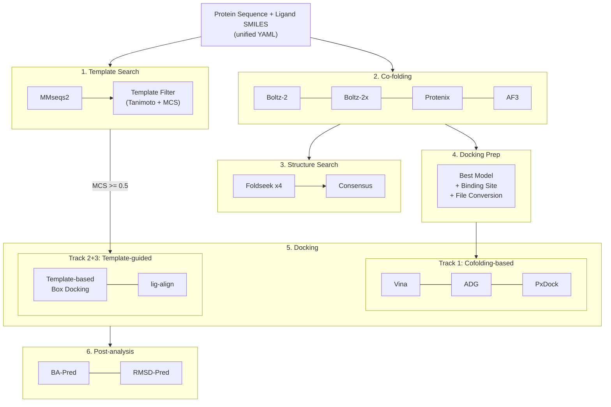

---

## Stage 1: Template Search (Sequence)

단백질 서열로 RCSB PDB에서 유사 구조를 찾고, 리간드 정보를 매칭한다.

### Step 1-1: MMseqs2 Sequence Search

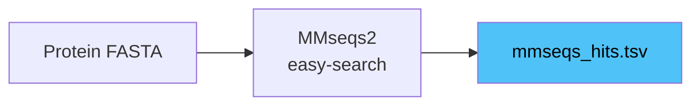

- **Tool**: `mmseqs easy-search` (488k RCSB 서열 DB, preindexed)
- **Parameter**: `min_seq_identity=0.3`, `min_coverage=0.7`, `sensitivity=7.5`, `max_hits=200`
- **Output**: `outputs/template_search_sequence/mmseqs_hits.tsv`
- **소요 시간**: ~3초

### Step 1-2: Template Filter (Ligand + MCS)

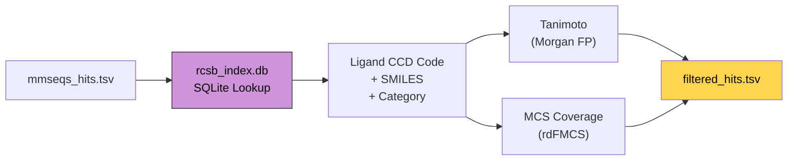

- **Script**: `scripts/run_template_filter.py` (wrapper에서 자동 삽입)
- **Module**: `src/casp17/template_filter.py`
- **Input**: mmseqs_hits.tsv + target ligand SMILES + rcsb_index.db
- **Logic**:
  1. 각 PDB hit에 대해 `rcsb_index.db`에서 리간드 조회 (candidate 리간드만: small_molecule, cofactor, metabolite 등)
  2. Target SMILES와 template 리간드 간 **Tanimoto similarity** 계산 (Morgan FP, radius=2, 2048 bits)
  3. **MCS coverage** 계산 (`rdFMCS.FindMCS`, timeout=5s, `MCS_atoms / min(target, template) heavy atoms`)
  4. 결과를 `best_mcs_coverage → best_tanimoto → pident` 순으로 정렬
- **Output**: `outputs/template_search_sequence/filtered_hits.tsv`
- **핵심 결정**: `best_mcs_coverage >= 0.5`이면 Stage 5에서 Track 2+3 활성화
- CCD 분류 기반으로 drug-like 리간드만 필터링 (ion, 결정화 보조제, 당류 등 제외)

---

## Stage 2: Co-folding

4개 모델이 순차 실행. 동일한 unified YAML 입력을 각 모델 포맷으로 변환 후 GPU 추론.

### Step 2-1: Input Adaptation

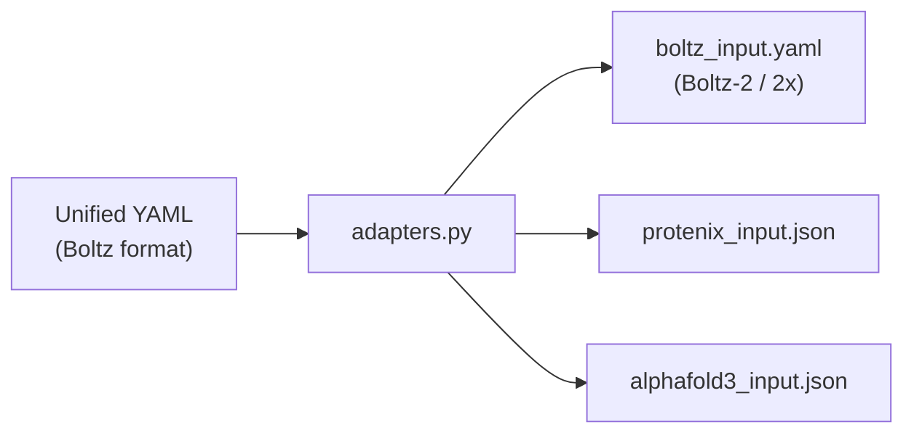

- **Module**: `src/casp17/adapters.py`
- 리간드가 있으면 `properties.affinity` 자동 추가 (Boltz 전용)
- Boltz-2: `use_potentials=false`, Boltz-2x: `use_potentials=true` (별도 run)
- `prepare_boltz()` → `[boltz2, boltz2x]` 리스트 반환

### Step 2-2: Model Inference

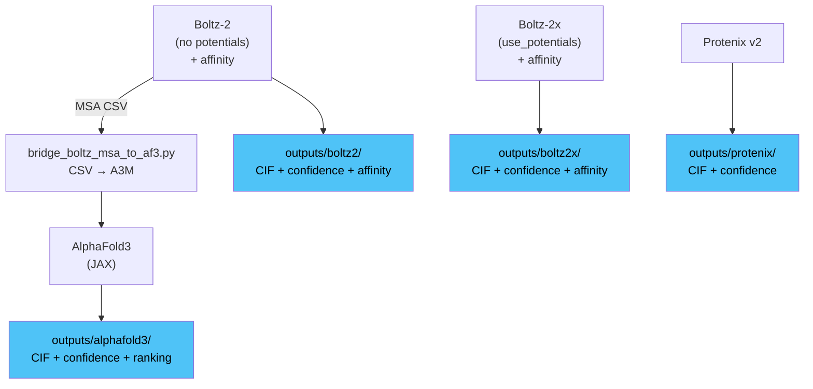

| Model | venv | 소요 시간 | 특징 |
|-------|------|----------|------|
| Boltz-2 | `.venvs/boltz` | ~50-140s | 구조 + confidence + MSA + affinity |
| Boltz-2x | `.venvs/boltz` | ~50-140s | 위와 동일 + potentials (constraint) |
| Protenix v2 | `.venvs/protenix` | ~80-190s | 구조 + confidence |
| AlphaFold3 | `.venvs/alphafold3` | ~110-130s | 구조 + confidence + ranking (JAX) |

**Bridge: Boltz MSA -> AF3**
- Boltz가 생성한 MSA CSV를 AF3 A3M 포맷으로 변환
- AF3 JSON에 `pairedMsa=""`, `templates=[]` 패치
- Script: `scripts/bridge_boltz_msa_to_af3.py`

**Boltz Affinity Output:**
```json
{
  "affinity_pred_value": 2.62,        // log10(IC50) uM — lower = stronger
  "affinity_probability_binary": 0.41  // binder probability [0-1]
}
```

---

## Stage 3: Structure Search (Foldseek Consensus)

각 cofolding 모델의 출력 구조를 RCSB 구조 DB에서 검색하고, 교차 모델 합의로 순위 매김.

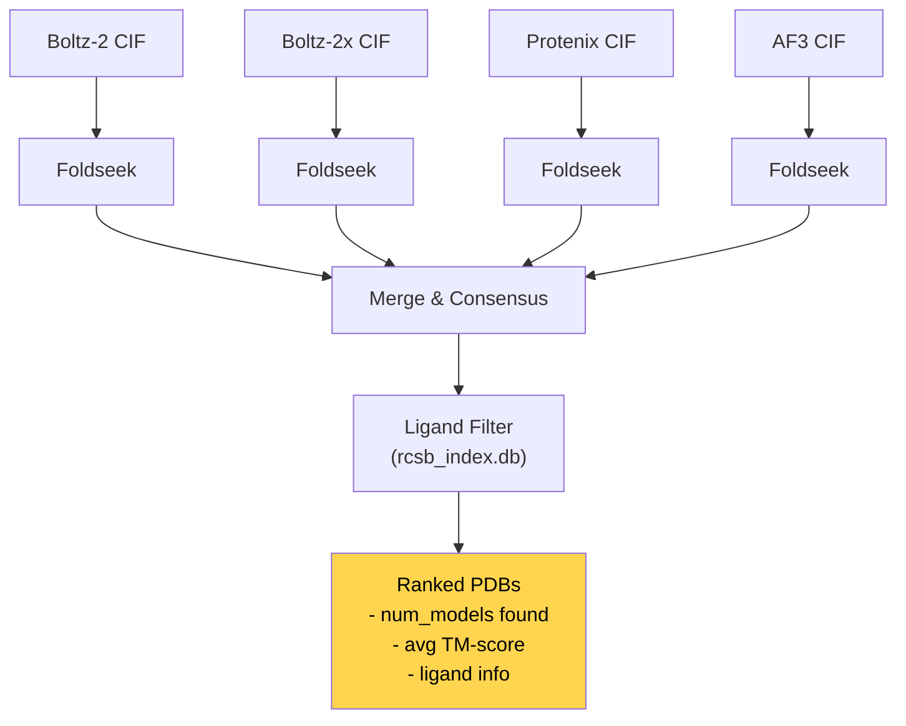

- **Script**: `scripts/run_structure_search.py`
- **Tool**: `foldseek easy-search` (251k RCSB 구조 DB)
- **Logic**:
  1. 4개 모델 각각에서 best CIF 추출
  2. Foldseek으로 RCSB 구조 DB 검색
  3. 교차 모델 합의: 여러 모델에서 공통 발견된 PDB 우선 순위
  4. `rcsb_index.db`로 리간드 보유 여부 필터링
- **Output**: `outputs/structure_search/consensus_summary.json`

---

## Stage 4: Docking Preparation

Cofolding 출력에서 docking 입력 파일을 자동 생성. Wrapper pipeline에서 cofolding → docking 사이에 자동 삽입.

### Step 4-1: Best Model Selection

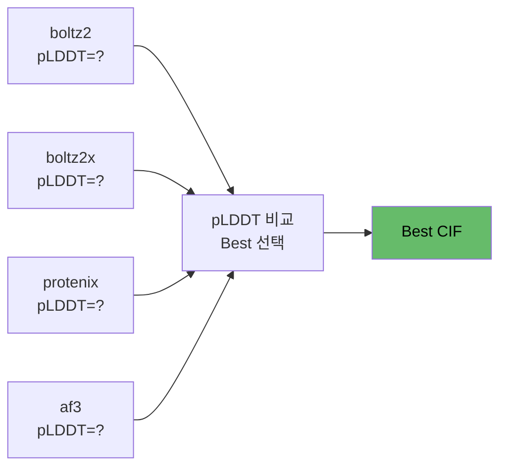

- 각 모델의 confidence score (pLDDT) 비교 → 최고 점수 모델 자동 선택
- Function: `select_best_model()` in `prepare_docking_inputs.py`

### Step 4-2: Receptor Preparation

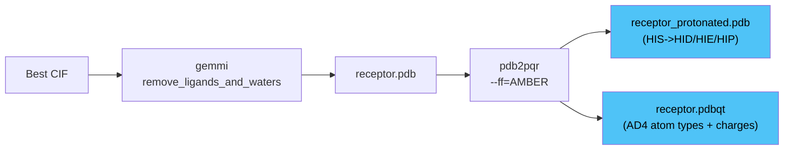

| Step | Tool | Output | 용도 |
|------|------|--------|------|
| CIF -> PDB | gemmi | `receptor.pdb` | 기본 구조 |
| PDB -> PQR | pdb2pqr (AMBER) | 중간 파일 | 수소 추가 + 전하 |
| PQR -> protonated PDB | 자체 변환 | `receptor_protonated.pdb` | Protenix-Dock |
| PQR -> PDBQT | AD4 type mapping | `receptor.pdbqt` | Vina + AutoDock-GPU |

### Step 4-3: Ligand Preparation

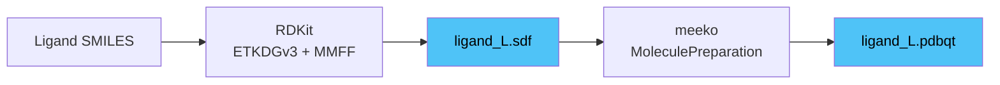

- SMILES -> 3D conformer: `AllChem.EmbedMolecule(mol, ETKDGv3())`
- Force field optimization: `MMFFOptimizeMolecule(mol, maxIters=500)`
- SDF -> PDBQT: meeko `MoleculePreparation`

### Step 4-4: Binding Site Prediction

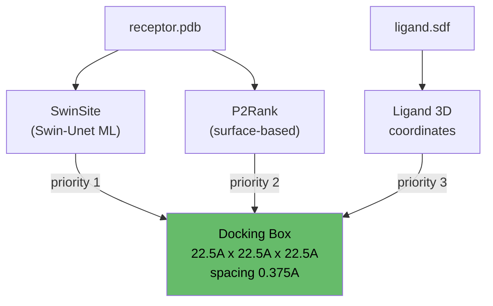

- **우선순위**: SwinSite (ML) > P2Rank (surface) > Ligand coordinates (fallback)
- **Unified box**: 22.5A x 22.5A x 22.5A, grid spacing 0.375A (모든 docking tool 공통)
- **Script**: `scripts/prepare_docking_inputs.py`
- **Output**: `inputs/docking/docking_prep_summary.json` (모든 docking tool이 runtime에 읽음)

---

## Stage 5: Docking (Multi-track)

3개 트랙으로 구성. Track 1은 항상 실행, Track 2+3은 MCS >= threshold일 때 자동 활성화.

### Track 1: Cofolding-based Docking (항상 실행)

Cofolding best model의 구조를 receptor로, SwinSite/P2Rank 예측 위치를 docking box로 사용.

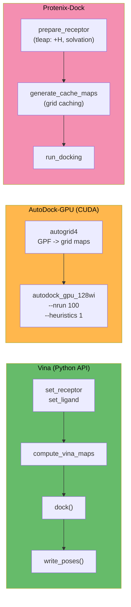

| Tool | Type | 소요 시간 | venv | Output |
|------|------|----------|------|--------|
| Vina | Python API | ~3s | `.venvs/protenix-dock` | `outputs/vina/docked.pdbqt` |
| AutoDock-GPU | CUDA binary | ~10s | `.local/bin/` | `outputs/autodock_gpu/docked.dlg` |
| Protenix-Dock | CPU force field | ~5-30min | `.venvs/protenix-dock` | `outputs/protenix_dock/` |

- 모든 tool은 `docking_prep_summary.json`에서 receptor/ligand/box를 runtime에 읽음
- Protenix-Dock이 전체 시간의 ~77% 차지 (병목)

### Track 2: Template-based Box Docking (MCS >= 0.5)

Template search에서 MCS coverage가 높은 hit의 실험 구조를 receptor로, template 리간드 위치를 docking box로 사용.

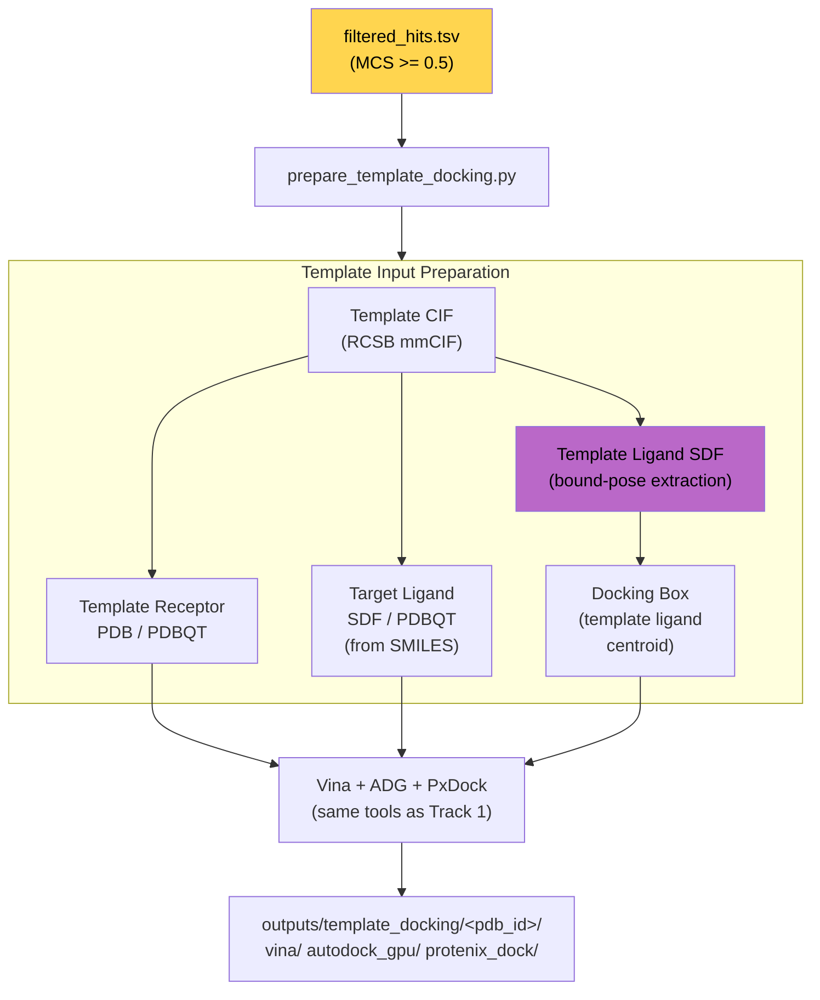

- **Script**: `scripts/prepare_template_docking.py`
- **Logic**:
  1. `filtered_hits.tsv`에서 MCS >= threshold인 상위 3개 template 선택
  2. RCSB CIF 파일에서 receptor PDB/PDBQT 생성 (`gemmi` + `pdb2pqr`)
  3. Template 리간드의 **bound-pose SDF 추출** (`extract_template_ligand_sdf()`)
  4. Template 리간드 좌표 centroid -> docking box center
  5. Target SMILES -> SDF/PDBQT (RDKit + meeko)
  6. 각 template에 대해 Vina + ADG + PxDock 실행
- **장점**: 실험적으로 검증된 리간드 결합 위치를 docking box로 사용 -> 정확도 향상

### Track 3: lig-align (MCS-guided Pose Generation, MCS >= 0.5)

Template 리간드의 결합 포즈를 MCS anchor로 활용해, target 리간드의 3D 포즈를 직접 생성.

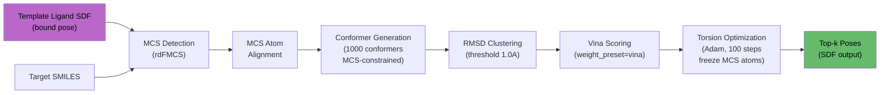

- **Library**: `lig_align.run_pipeline()` (hub venv에 설치됨)
- **Parameters**:
  - `num_confs=1000`: MCS-constrained conformer 수
  - `mcs_mode="auto"`: single/multi/cross MCS 자동 선택
  - `optimize=True`: gradient-based torsion optimization
  - `weight_preset="vina"`: Vina scoring function weights
  - `top_k=10`: 최종 출력 포즈 수
- **Input**: template receptor PDB + template ligand SDF (bound pose) + target SMILES
- **Output**: `outputs/template_docking/<pdb_id>/lig_align/` (ranked SDF poses)
- **장점**: Docking과 달리 scoring function만 사용, MCS anchor 덕분에 정확한 초기 배치

### Multi-track Decision Logic

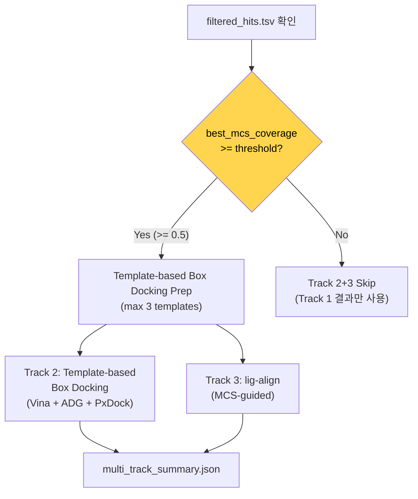

- **Orchestrator**: `scripts/run_multi_track_docking.py`
- **Config**: `template_search_sequence.mcs_threshold` (default: `0.5`)
- Wrapper script에서 Track 1 docking 이후 자동 실행

| Track | Receptor | Box Source | Method | 조건 |
|-------|----------|-----------|--------|------|
| Track 1 | Cofolding best model | SwinSite > P2Rank | Vina + ADG + PxDock | 항상 |
| Track 2 | Template PDB (RCSB) | Template ligand centroid | Vina + ADG + PxDock | MCS >= 0.5 |
| Track 3 | Template PDB (RCSB) | MCS anchor alignment | lig-align | MCS >= 0.5 |

---

## Stage 5.5: Ion/Metal Placement (conditional)

Input YAML에 ion/metal CCD 엔티티 (ZN, MG, CA, FE 등)가 있으면 자동 실행. Cofolding은 metal 위치를 정확히 예측하기 어려우므로, template alignment 기반으로 가능한 위치를 수집.

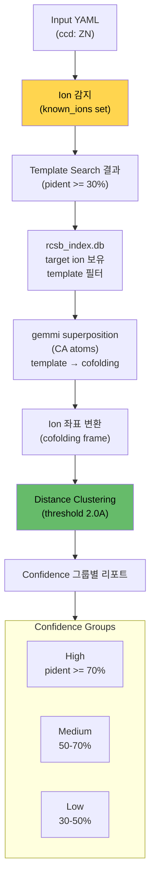

- **Script**: `scripts/collect_template_ions.py`
- **Input**: cofolding best CIF + template search hits + target ion CCD codes
- **Logic**:
  1. Input YAML에서 ion CCD 코드 추출 (ZN, MG, CA, FE 등)
  2. Template search hits 중 해당 ion을 보유한 PDB 필터링 (rcsb_index.db)
  3. 각 template을 cofolding best model에 gemmi CA superposition
  4. Rotation/translation을 ion 좌표에 적용 → cofolding 좌표계로 변환
  5. 거리 기반 클러스터링 (default 2.0A)
  6. Confidence 그룹별 (pident 70%+/50-70%/30-50%) 결과 리포트
- **Output**: `outputs/ion_placement/ion_placement_summary.json`
- **자동 skip**: input에 ion이 없으면 실행하지 않음

**Output example:**
```json
{
  "ions": {
    "ZN": {
      "total_positions": 12,
      "total_templates": 10,
      "clusters": [
        {"centroid": [12.3, 45.6, 78.9], "num_templates": 8, "spread_angstrom": 0.8}
      ],
      "by_confidence": {
        "high": {"pident_range": ">=70%", "num_templates": 3, "clusters": [...]},
        "medium": {"pident_range": "50-70%", "num_templates": 5, "clusters": [...]},
        "low": {"pident_range": "30-50%", "num_templates": 2, "clusters": [...]}
      }
    }
  }
}
```

---

## Stage 6: Post-analysis

모든 docking 결과에 대해 binding affinity와 pose RMSD를 GNN으로 예측.

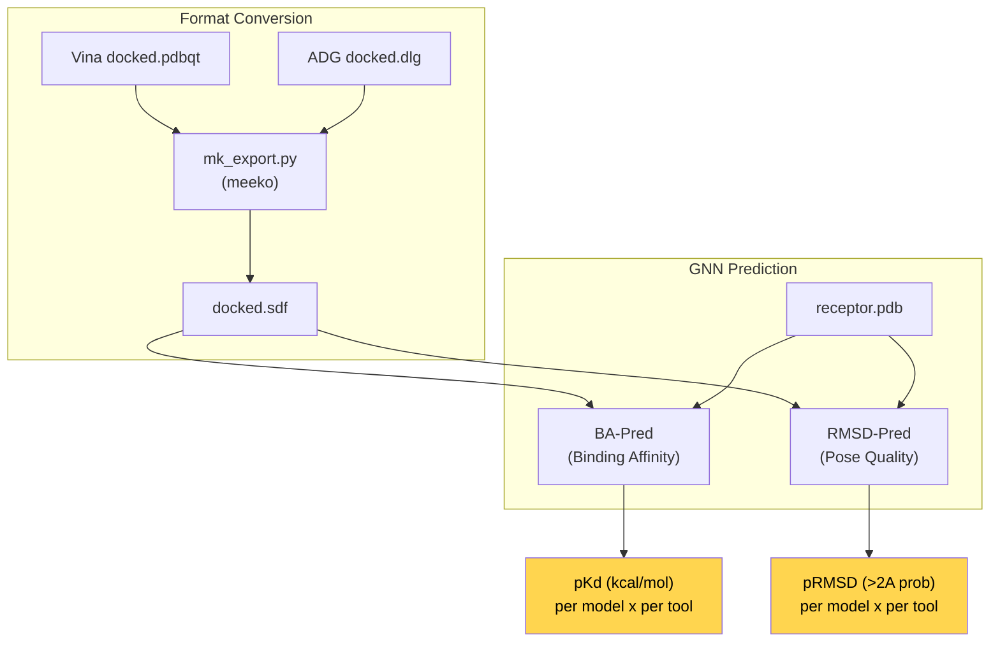

- **Script**: `scripts/run_post_analysis.py` (GPU node에서 실행)
- **venv**: `.venvs/pred` (torch 2.4 + dgl 2.4 + openbabel)
- **Output**:
  - `outputs/analysis/ba_pred_results.tsv` — 각 model x docking tool 조합별 pKd
  - `outputs/analysis/rmsd_pred_results.tsv` — 각 model x docking tool 조합별 pRMSD
  - `outputs/analysis/summary.json` — 최적 조합 선택

---

## Timing (RTX 6000 Ada)

```mermaid
gantt
    title Pipeline Execution Timeline
    dateFormat X
    axisFormat %s

    section Search
    MMseqs2 sequence search     :0, 3
    Template filter (MCS)       :3, 5

    section Co-folding
    Boltz-2 + affinity          :5, 148
    Boltz-2x + affinity         :148, 236
    Protenix v2                 :236, 369
    Boltz MSA -> AF3 bridge     :369, 370
    AlphaFold3                  :370, 499

    section Docking Prep
    Auto-select + SwinSite + P2Rank :499, 509

    section Track 1
    Vina                        :509, 512
    AutoDock-GPU                :512, 522
    Protenix-Dock               :522, 2262

    section Track 2+3 (conditional)
    Template box docking prep   :2262, 2272
    Template Vina + ADG         :2272, 2285
    Template PxDock             :2285, 4025
    lig-align                   :4025, 4035

    section Post-analysis
    BA-Pred + RMSD-Pred         :4035, 4045
```

| Stage | Time | Notes |
|-------|-----:|-------|
| MMseqs2 + template filter | ~5s | sequence search + Tanimoto/MCS scoring |
| Boltz-2 + affinity | ~143s | |
| Boltz-2x + affinity | ~88s | |
| Protenix v2 | ~133s | |
| AlphaFold3 | ~129s | |
| Foldseek x 4 | ~30s | structure search + consensus |
| Docking prep | ~10s | auto-select + SwinSite/P2Rank |
| **Track 1** | **~29min** | cofolding-based (Vina + ADG + PxDock) |
| **Track 2** | **~29min** | template-based box docking (conditional, MCS >= 0.5) |
| **Track 3** | **~10s** | lig-align (conditional, MCS >= 0.5) |
| Post-analysis | ~10s | BA-Pred + RMSD-Pred |
| **Total (Track 1 only)** | **~37min** | |
| **Total (all tracks)** | **~66min** | when template has MCS >= 0.5 |

> Protenix-Dock이 Track 1과 Track 2 모두에서 병목 (~77%).

---

## Bridge Scripts

Wrapper pipeline에서 stage 사이에 자동 삽입되는 bridge step 목록.

| Bridge | 삽입 위치 | Script | 역할 |
|--------|----------|--------|------|
| Boltz MSA -> AF3 | Boltz -> AF3 (cofolding 내부) | `bridge_boltz_msa_to_af3.py` | MSA CSV -> A3M + AF3 JSON 패치 |
| Template Filter | template-search-sequence 직후 | `run_template_filter.py` | Tanimoto + MCS scoring |
| Docking Prep | cofolding -> docking 사이 | `prepare_docking_inputs.py` | 자동 모델 선택 + binding site + 파일 변환 |
| Multi-track Docking | docking 직후 (조건부) | `run_multi_track_docking.py` | Track 2 + Track 3 실행 |
| Ion Placement | multi-track 직후 (조건부) | `collect_template_ions.py` | template alignment → ion 위치 수집 |

---

## Tool Ecosystem

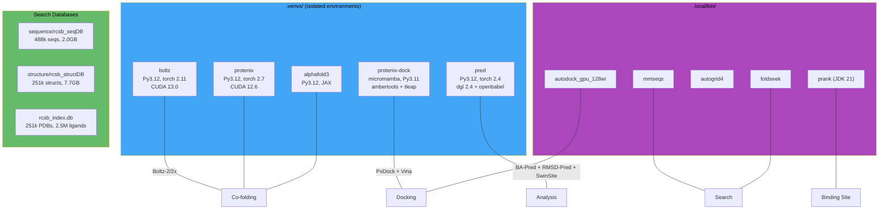

---

## Output Structure

```
experiments/runs/<target>/
├── inputs/
│   ├── boltz_input.yaml                    # Boltz unified YAML (+ affinity)
│   ├── protenix_input.json                 # Protenix JSON
│   ├── alphafold3_input.json               # AF3 JSON (+ MSA from Boltz bridge)
│   ├── docking/                            # Track 1 docking inputs
│   │   ├── docking_prep_summary.json         # receptor/ligand/box paths
│   │   ├── receptor.pdb / .pdbqt
│   │   ├── receptor_protonated.pdb
│   │   ├── ligand_L.sdf / .pdbqt
│   │   ├── p2rank/                           # P2Rank pocket predictions
│   │   └── swinsite/                         # SwinSite pocket predictions
│   └── template_docking/                   # Track 2+3 inputs (if MCS >= 0.5)
│       ├── template_docking_summary.json
│       └── template_<pdb_id>/
│           ├── <pdb_id>.cif                  # extracted template CIF
│           ├── receptor.pdb / .pdbqt         # template receptor
│           ├── template_ligand_<CCD>.sdf     # bound-pose ligand (for lig-align)
│           ├── ligand_L.sdf / .pdbqt         # target ligand (from SMILES)
│           └── docking_prep_summary.json
├── outputs/
│   ├── template_search_sequence/           # Stage 1
│   │   ├── mmseqs_hits.tsv                   # raw hits
│   │   └── filtered_hits.tsv                 # scored + ranked
│   ├── boltz2/                             # Stage 2: CIF + confidence + affinity
│   ├── boltz2x/                            # Stage 2: CIF + confidence + affinity
│   ├── protenix/                           # Stage 2: CIF + confidence
│   ├── alphafold3/                         # Stage 2: CIF + confidence + ranking
│   ├── structure_search/                   # Stage 3: Foldseek consensus
│   ├── vina/                               # Stage 5 Track 1
│   ├── autodock_gpu/                       # Stage 5 Track 1
│   ├── protenix_dock/                      # Stage 5 Track 1
│   ├── template_docking/                   # Stage 5 Track 2+3
│   │   ├── multi_track_summary.json
│   │   └── <pdb_id>/
│   │       ├── vina/
│   │       ├── autodock_gpu/
│   │       ├── protenix_dock/
│   │       └── lig_align/
│   ├── ion_placement/                      # Stage 5.5 (if ion in input)
│   │   └── ion_placement_summary.json        # clustered positions by confidence
│   └── analysis/                           # Stage 6
│       ├── ba_pred_results.tsv
│       ├── rmsd_pred_results.tsv
│       └── summary.json
├── scripts/                                # generated runner scripts
├── run_manifest.json
└── wrapper_manifest.json
```
