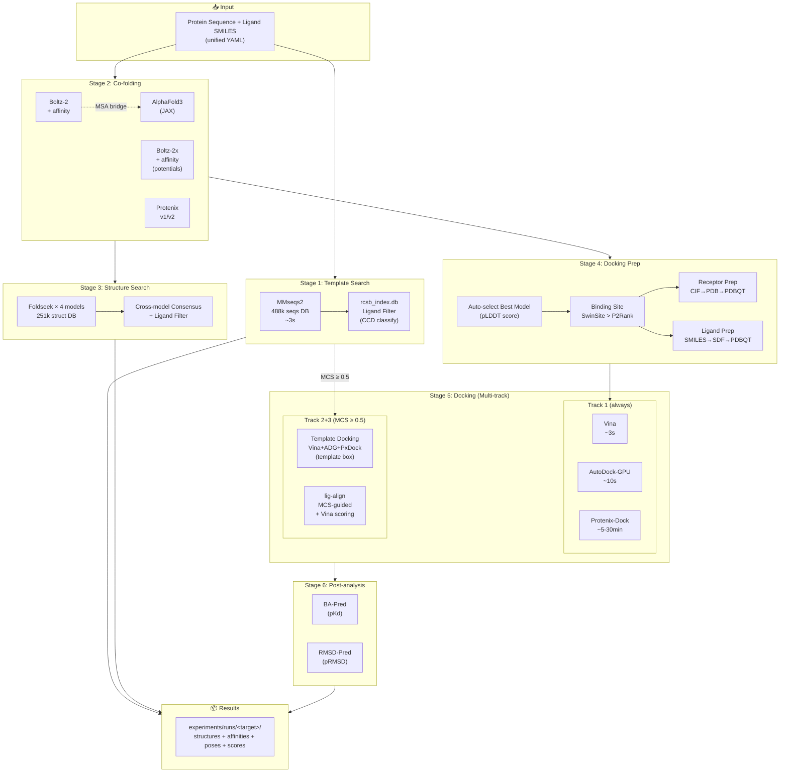
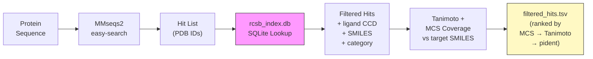
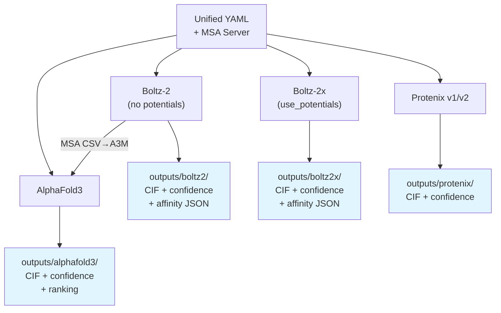
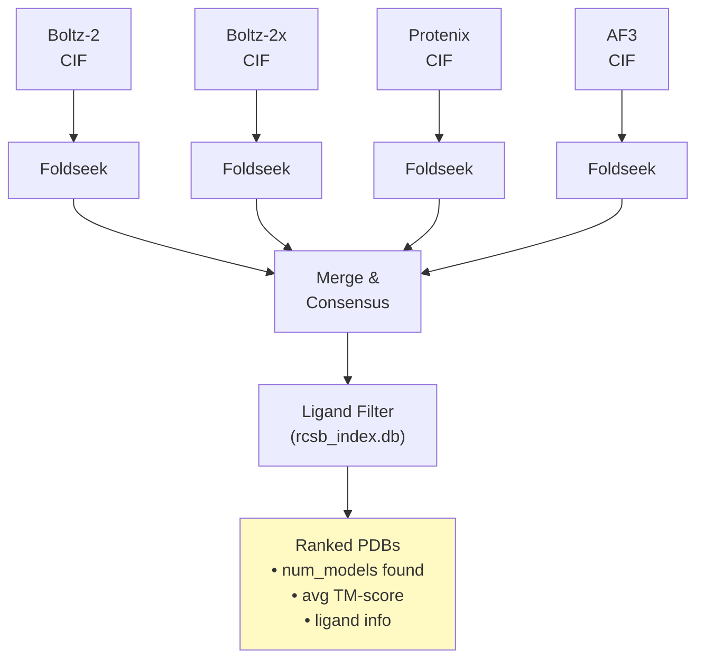
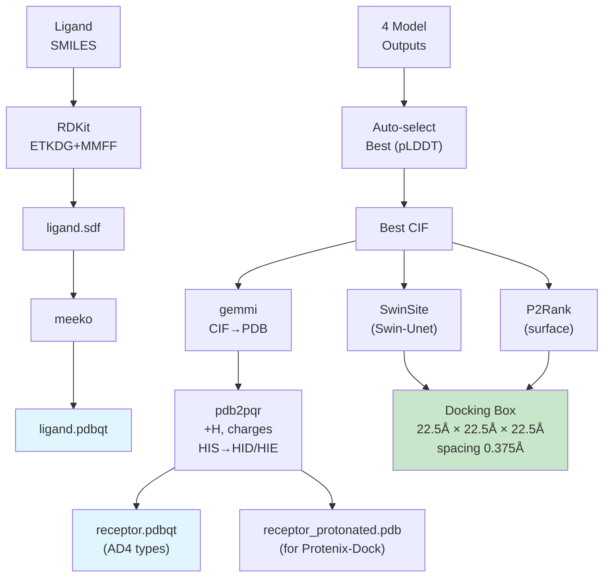
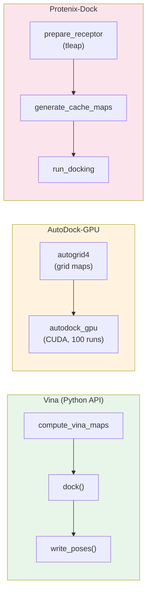
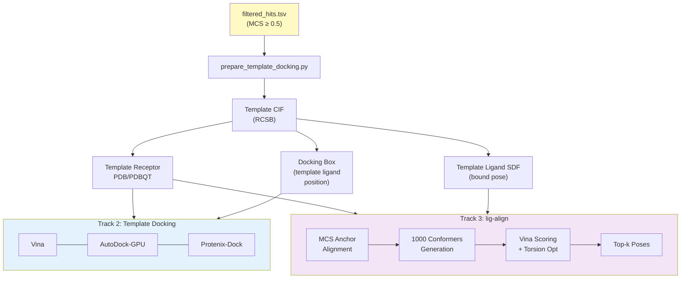
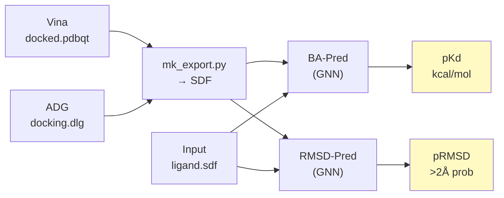
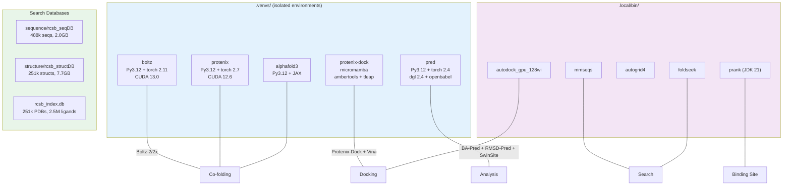

# CASP17 Protein-Ligand Pipeline

## Pipeline Overview



## Stage Details

### Stage 1: Sequence-based Template Search



**Bridge script**: `scripts/run_template_filter.py` — auto-inserted after MMseqs2 in the wrapper

**CCD Classification** (48,965 entries → 10 categories):

| Category | Candidate | Examples |
|----------|:---------:|---------|
| `small_molecule` | ✅ | Drug-like inhibitors |
| `cofactor` | ✅ | ATP, NAD, FAD, HEM |
| `metabolite` | ✅ | Sterols, bile acids |
| `peptide_like` | ✅ | Short peptide inhibitors |
| `nucleotide_like` | ✅ | Nucleoside analogs |
| `ion` | ❌ | ZN, MG, FE, CA |
| `crystallization_aid` | ❌ | GOL, EDO, PEG, SO4 |
| `glycan` | ❌ | NAG, MAN, GAL |
| `membrane_lipid` | ❌ | Phospholipids, detergents |
| `pigment` | ❌ | Carotenoids, chlorophylls |

### Stage 2: Co-folding



**Boltz Affinity Output:**
```json
{
  "affinity_pred_value": 2.62,        // log10(IC50) μM — lower = stronger
  "affinity_probability_binary": 0.41  // binder probability [0-1]
}
```

### Stage 3: Structure Search (Foldseek Consensus)



### Stage 4: Docking Preparation



### Stage 5: Docking (Multi-track)

#### Track 1: Cofolding-based Docking (always)



Uses cofolding best model as receptor, SwinSite/P2Rank binding site for docking box.

#### Track 2 + Track 3: Template-guided (MCS ≥ 0.5)

Auto-activated when template search finds hits with MCS coverage ≥ threshold.



**Configuration**: `template_search_sequence.mcs_threshold` (default: 0.5)

| Track | Receptor | Box Source | Tool |
|-------|----------|-----------|------|
| Track 1 | Cofolding best model | SwinSite > P2Rank | Vina + ADG + PxDock |
| Track 2 | Template PDB (RCSB) | Template ligand position | Vina + ADG + PxDock |
| Track 3 | Template PDB (RCSB) | MCS anchor from template ligand | lig-align |

### Stage 6: Post-analysis



## Timing (RTX 6000 Ada)

```mermaid
gantt
    title Pipeline Execution Timeline
    dateFormat X
    axisFormat %s

    section Search
    MMseqs2 sequence search     :0, 3
    Template filter (MCS)       :3, 5

    section Co-folding
    Boltz-2 + affinity          :5, 148
    Boltz-2x + affinity         :148, 236
    Protenix v1                 :236, 369
    Boltz MSA → AF3 bridge      :369, 370
    AlphaFold3                  :370, 499

    section Docking Prep
    Auto-select + P2Rank + SwinSite :499, 509

    section Track 1 Docking
    Vina                        :509, 512
    AutoDock-GPU                :512, 522
    Protenix-Dock               :522, 2262

    section Track 2+3 (conditional)
    Template docking prep       :2262, 2272
    Template Vina               :2272, 2275
    Template ADG                :2275, 2285
    Template PxDock             :2285, 4025
    lig-align (MCS-guided)      :4025, 4035

    section Post-analysis
    BA-Pred + RMSD-Pred         :4035, 4045
```



| Stage | Time | Notes |
|-------|-----:|-------|
| MMseqs2 + template filter | ~5s | sequence search + Tanimoto/MCS scoring |
| Boltz-2 + affinity | 143s | |
| Boltz-2x + affinity | 88s | |
| Protenix v1 | 133s | |
| AlphaFold3 | 129s | |
| Foldseek × 4 | ~30s | |
| Docking prep | ~10s | auto-select + SwinSite/P2Rank |
| **Track 1: Vina + ADG + PxDock** | **~29min** | cofolding-based |
| **Track 2: Template docking** | **~29min** | conditional (MCS ≥ 0.5) |
| **Track 3: lig-align** | **~10s** | conditional (MCS ≥ 0.5) |
| Post-analysis | ~10s | BA-Pred + RMSD-Pred |
| **Total (Track 1 only)** | **~37min** | |
| **Total (all tracks)** | **~66min** | when template has MCS ≥ 0.5 |

> Track 2+3 only run when template search finds hits with MCS coverage ≥ threshold (default 0.5).
> Protenix-Dock remains the bottleneck in both Track 1 and Track 2.

## Tool Ecosystem


