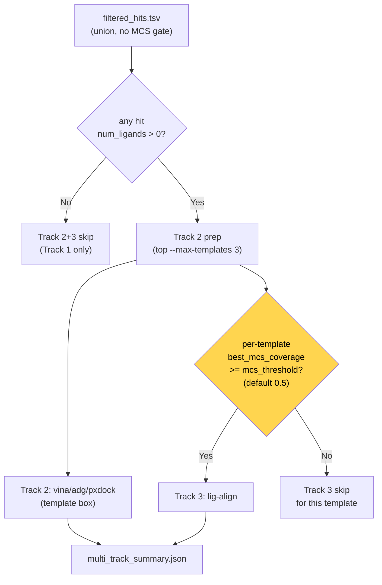
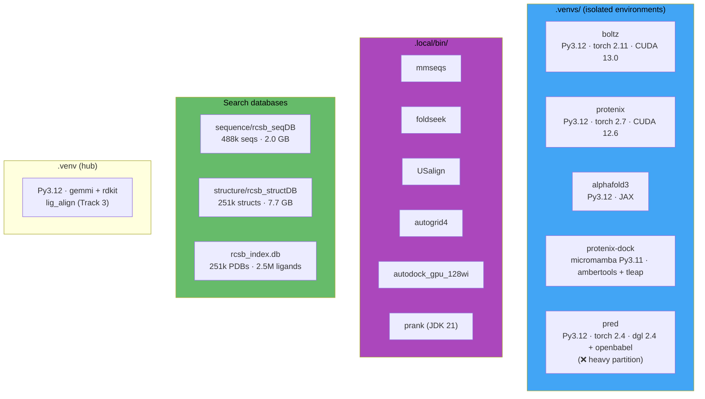

# CASP17 Protein-Ligand Pipeline

End-to-end pipeline: **단백질 서열 + 리간드 SMILES 의 unified YAML 한 장 → CASP17 LG 제출 파일**.
4 개 co-folding 모델, 3 개 docking 도구, 2 개 binding-site predictor + template-consensus pocket,
2 개 post-analysis GNN, mmseqs ∪ foldseek union template search 가 한 번의 SLURM job 으로 완주한다.

---

## 1. Overview


> 위 다이어그램은 main trunk (실행 순서) 만 표시합니다. Track 2/3 은 template bridges (`filtered_hits.tsv`) 와 frame-aligned cofold cif 를 둘 다 읽고, Ion placement 도 마찬가지 (cofold cif + template hits) — 자세한 입력 의존성은 각 stage 본문 참조.

**Wrapper execution order** (`build_wrapper_shell_script` 가 emit):

```
template-search-sequence (mmseqs)
  → co-folding (Boltz-2 → Boltz-2x → Protenix → AF3) with MSA cross-tool reuse
    └── bridge: Boltz MSA → Protenix unpaired / AF3 a3m
  → template-search-structure (foldseek, query = best cofold cif)
    └── bridge: union filter → pocket extraction → pocket clustering
  → bridge: align cofolding outputs (Kabsch to common frame) → *_aligned.cif
  → bridge: docking prep (3 predictor + ≤10 template-consensus = 최대 13 binding-site sources)
  → docking (Track 1: Vina/ADG × ≤13 sources × 5 seeds, PxDock × 1)
  → multi-track docking (Track 2 + Track 3, conditional)
  → ion placement (conditional)
  → post-analysis (BA-Pred + RMSD-Pred, staged poses)
  → CASP17 LG submission (top-5 diverse MODEL)
```

---

## 2. Stages

### Stage 1 — Template search

서열 (mmseqs2) 과 구조 (foldseek) 두 검색을 **둘 다 돌리고** `(pdb_id, chain_id)` 키로 union-merge.
가능한 한 많은 template 을 모은 다음, 각 template 의 bound-ligand 위치를 cofold frame 으로 align 해서
**consensus pocket** 을 만든다. **Tanimoto/MCS 는 metadata only** — gating 은 Track 3 (lig-align) 에서만.

#### 1-1. mmseqs2 sequence search

| | |
|---|---|
| Tool | `mmseqs easy-search` against `data/search_dbs/sequence/rcsb_seqDB` (488k seqs, preindexed) |
| Params | `min_seq_id=0.3`, `min_cov=0.7`, `sens=7.5`, `max_hits=500` |
| Output | `outputs/template_search_sequence/mmseqs_hits.tsv` (14-col) |
| Time | ~3 s |

#### 1-2. foldseek structure search (query = best cofold cif)

| | |
|---|---|
| Tool | `foldseek easy-search` against `data/search_dbs/structure/rcsb_structDB` |
| Query | `query_from_cofolding=true`; priority `[alphafold3, boltz2x, boltz2, protenix]` 로 첫 cif 자동 선택. Stage-dependency validator 가 cofold 이전 실행을 차단 |
| Params | `--alignment-type 1` (3Di+AA), `-s 9.5`, `--max-seqs 2000`, format `query,target,evalue,bits,alntmscore,qtmscore,ttmscore,prob` |
| Output | `outputs/template_search_structure/foldseek_hits.tsv` |
| Time | ~30 s ~ 2 min/타겟 |

> Foldseek 의 `qtmscore` 는 **estimate** 라 pre-filter 의미가 약함 → ordering 힌트로만 사용. 진짜 quality gate 는 다음 단계 (pocket extraction) 에서 USalign 이 결정. `qtmscore_min=0.0` (default, disabled).

#### 1-3. Union filter (mmseqs ∪ foldseek)

- **Script**: `scripts/run_template_filter.py`, module `src/casp17/template_filter.py`
- **Logic**: 두 TSV 를 source 태깅 → `(pdb_id, chain_id)` dedup (한 row 가 양쪽 다 있으면 두 metric 모두 보존, `in_mmseqs=in_foldseek=1`) → `rcsb_index.db` 에서 candidate ligand (`ligand_type ∈ {small_molecule, cofactor, metabolite, nucleotide_like, peptide_like}`) 조회 → Tanimoto (Morgan FP r=2 / 2048 bit) + MCS coverage (`rdFMCS`, 5 s timeout) **저장만** 하고 게이트 안 함
- **Sort key**: `(in_mmseqs+in_foldseek 합 ↓, qtmscore ↓, pident ↓, n_ligands ↓, tanimoto ↓, mcs ↓)`
- **Output**: `filtered_hits.tsv` — 기존 14 컬럼 + `in_mmseqs / in_foldseek / qtmscore / ttmscore / alntmscore / prob` 6 컬럼 append. 옛 consumer 들도 그대로 동작
- **Time-split**: `template_search_sequence.max_deposition_date: "YYYY-MM-DD"` — held-out 벤치 (e.g. novel2025) 에서 leakage 차단

#### 1-4. Template pocket extraction

- **Script**: `scripts/extract_template_pockets.py`
- **Alignment 도구**: `casp17.usalign.run_usalign` (`.local/bin/USalign`). 구조 기반 (TM-align) 이라 foldseek 이 hit 을 찾은 view 와 동일. distant homolog 도 정확히 align — gemmi 는 sequence-anchored 라 같은 fold 라도 sequence 멀면 matched residue <50 으로 떨어져 RMSD 가 폭발 → ligand centroid 가 엉뚱한 위치로 transform 됨
- **Output**: `outputs/template_pockets/template_pockets.json` (flat list — 한 row = 한 ligand-instance pocket point. homotetramer 는 4 record). 필드: `template_pdb_id, template_chain, ligand_ccd, ligand_chain, ligand_n_heavy, centroid_(x|y|z)` (cofold frame) `, alignment_tmscore, alignment_rmsd, in_mmseqs, in_foldseek, pident, qtmscore, best_tanimoto, best_mcs_coverage`
- **Quality gate**: `--min-tmscore 0.4` (default). canonical 0.5 보다 약간 낮춰서 foldseek `qtmscore_min=0.5` 통과 hit 을 이중 penalise 하지 않음
- **Default `--max-templates 2000`** — USalign 실측 ~0.5 s/template (300 aa 기준) × 2000 ≈ 17 min/타겟. foldseek `max_hits=2000` 와 매칭. 보통 단백질에서 TM ≥ 0.5 통과 template 50–300 개라 대부분은 게이트에서 reject — pool 확대해도 cluster 결과 안정적

#### 1-5. Pocket clustering (top-K consensus)

- **Script**: `scripts/cluster_template_pockets.py`
- **Algorithm**: greedy single-link, distance ≤ `--cutoff` (default **5.0 Å**, druglike pocket 직경 ~10–15 Å)
- **Per-pocket weight**: `(in_mmseqs + in_foldseek) + max(alignment_tmscore, qtmscore, pident/100)` — 범위 ≈ [0, 3]. mmseqs-only hit 은 foldseek qtm=0 이어도 USalign actual TM 으로 평가 받음
- **Cluster centroid**: weighted mean (가중치 합 0 fallback 시 unweighted)
- **Cluster `evidence_score`**: `Σ weight`. 정렬 후 top-K (`--top-k 5` default) 보존
- **Per-cluster metadata**: `n_members, n_unique_pdb, evidence_score, spread_angstrom, in_both_sources, in_mmseqs_only, in_foldseek_only, best_alignment_tmscore, best_qtmscore, best_pident, best_tanimoto`
- **Output**: `outputs/template_pockets/template_pocket_clusters.json` — 다음 단계 (`prepare_docking_inputs.py`) 가 읽어 `template_consensus_{1..10}` binding-site source 를 등록

---

### Stage 2 — Co-folding

4 개 모델이 순차 실행. 동일한 unified YAML 입력을 각 모델 포맷으로 변환 후 GPU 추론.
**Multi-seed**: 각 모델을 5 seed × 5 diffusion samples = **25 구조/모델** (총 100 구조).

| Model | venv | 25 structs (single GPU) | 특징 |
|---|---|---:|---|
| Boltz-2 | `.venvs/boltz` | ~10 min | 구조 + confidence + MSA + affinity |
| Boltz-2x | `.venvs/boltz` | ~12 min | + `use_potentials=true` (constraints) |
| Protenix v2 | `.venvs/protenix` | ~8 min | 구조 + confidence |
| AlphaFold3 | `.venvs/alphafold3` | ~6 min | + ranking, native multi-seed (loop 불필요) |

> RTX 6000 Ada 단일 GPU, CASP16 L2001/L2002 기준. `cofolding_seeds=[42,101,202,303,404]`.

#### Input adaptation (`src/casp17/adapters.py`)

- 리간드가 있으면 `properties.affinity` 자동 추가 (Boltz 전용)
- Boltz: `prepare_boltz()` → `[boltz2 (use_potentials=false), boltz2x (use_potentials=true)]` 리스트 반환 → orchestrator 가 `*` 로 unpack
- **AF3 chain id remap**: AF3 schema 가 `^[A-Z]+$` 만 허용. `L2`/`X2` 같은 숫자 포함 id 는 단일 letter 우선 → 미사용 letter (A..Z → AA..ZZ 순) 로 배정. `bondedAtomPairs` 의 chain 참조도 동일 remap. Boltz/Protenix 는 YAML id 그대로

#### MSA 재사용 (cross-seed + cross-model)

- **Cross-seed 캐시**: Boltz 첫 seed 만 MSA 서버 fetch. 이후 seed + Boltz-2x 는 생성된 `boltz_results_*/msa/` 디렉토리를 wrapper 가 `_boltz_msa_cache` 변수로 보관 → 다음 seed 출력 경로로 `cp -r`. MSA 는 서열-결정적 (diffusion seed 와 무관) 이라 한 번의 fetch 가 모든 seed × Boltz-2 + Boltz-2x 커버
- **Boltz → Protenix**: `script_builder` 인라인 heredoc 이 Boltz `uniref.a3m` 을 찾아 Protenix JSON 의 각 `proteinChain` 에 `unpairedMsaPath` 주입 + `pairedMsa=""`. cache miss 시 graceful fallback
- **Boltz → AF3**: `scripts/bridge_boltz_msa_to_af3.py` — MSA CSV → A3M 변환 + AF3 JSON 패치 (`pairedMsa=""`, `templates=[]`)

**Boltz affinity output** (자동, 리간드 있을 때):
```json
{ "affinity_pred_value": 2.62,             // log10(IC50 µM) — lower = stronger
  "affinity_probability_binary": 0.41 }    // binder probability [0-1]
```

---

### Stage 2.5 — Frame alignment (cofolding → common coordinate frame)

각 cofolding 모델은 자체 좌표계에서 출력. 이 bridge 가 모든 CIF 를 단일 reference frame 으로 Kabsch 정렬 →
downstream (docking, post-analysis, submission, reference comparison) 전체가 동일 좌표계에서 동작.

- **Script**: `scripts/align_cofolding_outputs.py`
- **Reference 우선순위**:
  1. **Template CIF** — top-1 template 의 RCSB mmCIF (Track 2/3 와 자연스럽게 동일 프레임)
  2. **Best pLDDT cofold model** — template 없을 때 fallback
- **Algorithm**:
  1. Reference CIF 에서 chain 별 CA + residue name sequence 추출
  2. 각 query CIF 에서 sliding offset 으로 residue name 매칭 (결정학적 번호 차이 허용)
  3. `gemmi.superpose_positions(ref_cas, query_cas)` → rotation + translation
  4. Query 의 **모든 원자** (protein + ligand) 에 동일 rigid transform 적용
  5. `*_aligned.cif` 로 원본 옆에 저장
- **Downstream 참조**: `find_best_cofolding_structure()` (docking prep) 와 `find_best_cofolding_cif()` (submission) 가 `_aligned.cif` 우선

---

### Stage 3 — Docking preparation

Cofolding 출력에서 docking 입력을 자동 생성. `scripts/prepare_docking_inputs.py`.

#### Best model selection

- 각 cofolding 모델의 mean pLDDT 비교 (Boltz npz × 100, Protenix scalar, AF3 `atom_plddts` mean — 모두 [0, 100] 정규화)
- **수정 전 버그**: Boltz [0, 1] 을 AF3 [0, 100] 그대로 비교 → 항상 AF3 픽됨. 정규화 후 pLDDT 가 정상 비교됨

#### Receptor preparation

| Step | Tool | Output | 용도 |
|---|---|---|---|
| CIF → PDB | gemmi (ligand/water 제거) | `receptor.pdb` | 기본 |
| PDB → PQR | pdb2pqr `--ff=AMBER` | (intermediate) | 수소 + 전하 |
| PQR → protonated PDB | 자체 변환 | `receptor_protonated.pdb` | Protenix-Dock |
| PQR → PDBQT | AD4 atom mapping | `receptor.pdbqt` | Vina + AutoDock-GPU |

#### Ligand preparation

- SMILES → 3D conformer: RDKit `EmbedMolecule(ETKDGv3)` + `MMFFOptimizeMolecule(maxIters=500)`
- SDF → PDBQT: meeko `MoleculePreparation`

#### Binding-site sources

Track 1 docking 의 box center 후보를 **predictor (고정 3 개) + template-consensus (조건부 최대 10 개) = 최대 13 개**
로 fan-out. 각 source 는 **독립된 docking variant** 로 실행되어 한 predictor 가 잘못된 pocket 을 잡아도 다른 source 가 backup. 어떤 source 가 winner 인지는 사후 ranker (`compute_submission_scores.py`) 가 판정.

**A. Predictor sources — 항상 시도 (3 개)**

| Source | 기원 | Skip 조건 |
|---|---|---|
| `cofolding` | co-fold 모델이 직접 놓은 ligand 의 heavy-atom centroid | 거의 없음 (cofold 출력에 ligand 가 항상 포함) |
| `swinsite` | Swin-Unet ML pocket predictor (GPU, `.venvs/pred`) | predictor 가 pocket 을 못 찾으면 해당 variant 만 `sys.exit(0)` |
| `p2rank` | Surface-based geometric (JDK 21) | 위와 동일 |

**B. Template-consensus sources — 조건부 (0 ~ 10 개)**

Stage 1-5 에서 만든 `template_pocket_clusters.json` 의 top-K cluster centroid 를 `template_consensus_1..10`
이름으로 등록. 등록 조건은 `prepare_docking_inputs.py::_add_template_consensus_sources`:

- **`n_members ≥ 2`** (= `TEMPLATE_CONSENSUS_MIN_MEMBERS`) — singleton cluster 는 alternate/spurious site 일 가능성이 커서 제외
- **최대 10 개** (= `TEMPLATE_CONSENSUS_TOP_K`) — `evidence_score` desc 정렬 후 상위만
- 실제 등록 수는 타겟별로 다름:
  - Template hit 없거나 모든 cluster 가 singleton → 0 개 → 총 source 3
  - Template hit 풍부 (e.g. 잘 알려진 fold) → 5–10 개 → 총 source 8–13

**Variant fan-out (`src/casp17/adapters.py::_DOCKING_BOX_SOURCES`)**

`prepare_vina` / `prepare_autodock_gpu` 가 위 13-source 튜플을 순회하며 각각 `PreparedModelRun` 을 emit.
각 variant 는 생성 시점에 `BOX_SOURCE='cofolding'|...|'template_consensus_10'` 이 runner script 에 baked-in →
런타임에 `summary['binding_site_predictions'][BOX_SOURCE]['center']` 를 읽어 box 설정.
**해당 source 가 missing 이면 `sys.exit(0)` clean skip** (실패가 아니라 정상 종료) — 그래서 자료 부족한 타겟이라도 파이프라인이 멈추지 않음.

**기타**:
- **Unified box**: 22.5 Å × 22.5 Å × 22.5 Å, grid spacing 0.375 Å (Vina/ADG/PxDock 공통)
- **Fallback box pick** — PxDock 처럼 단일-box 만 받는 도구용 priority: `cofolding > template_consensus_N (n_unique_pdb ≥ 2 인 strong consensus) > swinsite > p2rank > weak consensus`
- **Output**: `inputs/docking/docking_prep_summary.json` 의 `binding_site_predictions` 딕셔너리 (key = source name, value = `{center, size, metadata}`)

> **Design rationale**: 한 binding-site predictor 가 잘못된 pocket 을 잡아도 (e.g. CASP16 L2001 에서 swinsite no-pocket / p2rank 37 Å off / cofold centroid 35 Å off — 같은 fold 의 모든 모델이 동일하게 빗나감) **template-consensus** 가 RCSB 의 실험적으로 검증된 binding pose 좌표를 독립 backup 으로 제공. `n_unique_pdb ≥ 2` 인 multi-template 합의는 단일 predictor 노이즈를 효과적으로 극복.

---

### Stage 4 — Docking (multi-track)

3 개 트랙. Track 1 항상 실행, Track 2 는 template hit 있으면, Track 3 은 MCS ≥ 0.5 일 때.

#### Track 1 — Cofolding-based docking (항상)

Cofolding best model 을 receptor, **위에서 등록된 binding-site source (3 predictor + 0~10 consensus = 최대 13) 각각을 독립 box 로** 사용.
Vina + AutoDock-GPU 가 **최대 13 × 2 = 26 variant** 로 병렬 실행 (실제 수 = 등록된 source 수).
PxDock 은 cache-map 재생성 비용 때문에 **단일 run** (priority-picked fallback box).

| Tool | Variants | Type | Time/seed | Output |
|---|---|---|---:|---|
| Vina | `vina_<source>` × ≤13 | Python API (CPU) | ~3 s | `outputs/vina_<source>/seed_<seed>/docked.pdbqt` |
| AutoDock-GPU | `autodock-gpu_<source>` × ≤13 | CUDA binary | ~10 s | `outputs/autodock_gpu_<source>/seed_<seed>/docked.dlg` |
| Protenix-Dock | (single, no fan-out) | CPU force field | ~5–30 min | `outputs/protenix_dock/poses_*.sdf + *_out.json` |

- 모든 tool 은 `docking_prep_summary.json` 에서 receptor / ligand / box 를 runtime 에 읽음
- AutoDock-GPU 래퍼는 추가로 **런타임에 ligand pdbqt 를 파싱**해서 `ligand_types` + grid map 동적 구성 — F/Cl/Br/P/I/Si 등 비표준 atom 도 자동 대응
- PxDock 이 전체 docking 시간의 ~77 % 차지 (병목)
- **Config**: `docking_seeds=[42,101,202,303,404]`. variant 자동

#### Track 2 — Template-based box docking (any template, no MCS gate)

Template search 가 찾은 hit (candidate ligand 가 하나라도 있는 모든 PDB) 의 실험 구조를 receptor,
template 리간드 위치를 docking box 로. **Template ligand 가 query 와 닮을 필요 없음** — pocket geometry 만 빌리니 어떤 ligand 든 OK.

- **Script**: `scripts/prepare_template_docking.py` + `scripts/run_multi_track_docking.py`
- **Logic**:
  1. `filtered_hits.tsv` 에서 상위 `--max-templates 3` (sort key 가 evidence_breadth × similarity 이라 both-source/높은 qtmscore 우선)
  2. RCSB CIF → receptor PDB/PDBQT (gemmi + pdb2pqr)
  3. **USalign 으로 template → cofold frame transform 행렬 계산** → receptor 에 적용 (`receptor_aligned`)
  4. Template 리간드 bound-pose SDF 추출 (`extract_template_ligand_sdf()`)
  5. Target SMILES → SDF/PDBQT (RDKit + meeko)
  6. Vina + ADG + PxDock 실행
- **MCS 게이트 없음**: `check_template_hits` 는 `num_ligands > 0` 만 검사
- **Frame fix (2026-04)**: 이전엔 docked pose 가 **template frame** 에 머물러 cofold receptor 와 정합 안 됨 → BA-Pred 입력 / 최종 MODEL block 이 mis-aligned. USalign template→cofold transform 으로 receptor 와 box 좌표를 cofold frame 으로 옮겨 dock → 결과 pose 가 cofold receptor 와 같은 좌표계

#### Track 3 — lig-align (MCS ≥ 0.5)

Template 리간드의 결합 포즈를 MCS anchor 로 활용해 target 리간드의 3D 포즈를 직접 생성.

- **Library**: `lig_align.run_pipeline()` — **hub `.venv` 에 설치**. (이전엔 `protenix-dock` venv 에서 import 시도 → silent ImportError 로 모든 lig_align 출력이 비어 있었음. 현재는 `subprocess` 로 hub venv 의 python 호출)
- **Production params**: `num_confs=500`, `mcs_mode="auto"`, `optimize=False`, `weight_preset="vina"`, `top_k=5` — template 당 ~90 s, 3 templates / target 안에서 12 h wrapper cap 잘 들어감 (이전 `num_confs=1000, optimize=True, top_k=10` 은 90+ min/pocket — 실 prod 에서 한번도 완주 못함)
- **Input**: template receptor PDB + template ligand SDF (bound-pose) + target SMILES
- **Output**: `outputs/template_docking/<pdb_id>/lig_align/` (ranked SDF poses)

#### Multi-track decision logic



| Track | Receptor | Box source | Method | Entry |
|---|---|---|---|---|
| 1 | cofold best (`_aligned`) | ≤13 (3 predictor + 0~10 consensus) | Vina + ADG + PxDock | always |
| 2 | template PDB (RCSB, USalign-aligned to cofold frame) | template ligand centroid | Vina + ADG + PxDock | `num_ligands > 0` |
| 3 | template PDB (same as Track 2) | MCS anchor alignment | lig-align | per-template `best_mcs_coverage ≥ mcs_threshold` |

---

### Stage 5 — Ion / metal placement (conditional)

Input YAML 에 ion CCD 엔티티 (ZN/MG/CA/FE 등) 가 있으면 자동 실행. Cofolding 은 metal 위치 부정확 →
template alignment 기반으로 위치 후보 수집.

- **Script**: `scripts/collect_template_ions.py`
- **Logic**: target ion 보유 template (rcsb_index.db) → gemmi CA superposition (template → cofold) → rotation/translation 을 ion 좌표에 적용 → distance clustering (default 2.0 Å) → confidence 그룹별 (high `pident≥70%`, medium 50–70 %, low 30–50 %) 리포트
- **Output**: `outputs/ion_placement/ion_placement_summary.json`
- **Auto skip**: input 에 ion 없으면 미실행

---

### Stage 6 — Post-analysis

모든 docking + cofold 포즈에 대해 binding affinity 와 pose RMSD 를 GNN 으로 예측.

- **Script**: `scripts/run_post_analysis.py` (GPU node)
- **venv**: `.venvs/pred` (torch 2.4 + dgl 2.4 + openbabel + rdkit) — **sm_90/sm_100 (H100, Blackwell 6000pro) kernel 미포함** → `heavy` partition 절대 금지 (`no kernel image` 즉시 종료, task 는 exit 0 처럼 보이지만 TSV 비어있음). `test` / `6000ada` 만 사용
- **Variant-aware 자동 발견**: `find_ligand_files` 가 `outputs/vina_*/seed_*` / `outputs/autodock_gpu_*/seed_*` 를 glob 으로 스캔 → 각 source 별로 독립 tool key 로 staging. TSV 도 `ba_pred_vina_cofolding.tsv` 식으로 분리

#### Pose staging

| 입력 | 처리 | Output stem |
|---|---|---|
| `outputs/vina_*/seed_*/docked.pdbqt` | meeko `mk_export.py` 로 SDF 복제 | `analysis/poses/{tool}_seed_{N}.{pdbqt,sdf}` |
| `outputs/autodock_gpu_*/seed_*/docked.dlg` | meeko `mk_export.py` 로 SDF 복제 | `analysis/poses/{tool}_seed_{N}.{dlg,sdf}` |
| `outputs/protenix_dock/*_out.json` | `_pxdock_json_to_sdf` (RDKit multi-record) — **`|coord| > 200 Å` outlier drop** (PxDock numerical blow-up 방어, novel2025 의 ~1.85 % poses 가 1e7 Å 까지 폭발) | `outputs/protenix_dock/poses_<lid>.sdf` |
| `outputs/{boltz2,boltz2x,protenix,af3}/**/*_aligned.cif` | 리간드 (chain `L` 또는 `LIG*/UNK/UNL` residue) 추출 → 입력 docking ligand SDF 를 템플릿으로 `AssignBondOrdersFromTemplate` (CIF 의 결합차수 정보 소실 보강) | `analysis/poses/cofold_{model}.sdf` |

> **입력 ligand SDF (`inputs/docking/ligand_*.sdf`) 는 post-analysis 제외**. RDKit embedding 좌표가 receptor 와 정렬 안 됨 → BA-Pred 의 "8 Å 이내 단백질 원자 추출" 로직이 빈 mol 반환 → `mol_to_graph` 단계에서 `AttributeError`. Docking + cofold aligned 포즈만 대상.

#### Naming normalization

BA-Pred 와 RMSD-Pred 는 SDF `_Name` 처리 규칙이 다름 (BA 는 raw, RMSD 는 record idx 한 번 더 append).
`compute_submission_scores.aggregate::_canonicalize` 가 pose name 을 part 단위 walk down 하면서 staged 파일 존재하는 최장 prefix 찾아 단일 record-index 형태로 축소 → BA/RMSD TSV 가 canonical key 에서 1-1 join.

#### Output

- `outputs/analysis/poses/` — staged pose 파일 (pdbqt/dlg + sdf 쌍)
- `outputs/analysis/{vina,autodock_gpu}_poses.txt` — per-tool 입력 리스트
- `outputs/analysis/ba_pred_<tool>.tsv` — per-pose pKd
- `outputs/analysis/rmsd_pred_<tool>.tsv` — per-pose pRMSD, P(>2 Å)
- `outputs/analysis/summary.json`

---

### Stage 7 — CASP17 LG submission

#### 7-1. Score aggregation

- **Script**: `scripts/compute_submission_scores.py`
- **LSCORE** (per pose): `1 - P(RMSD > 2 Å)` (RMSD-Pred 직접 출력. 높을수록 native 에 가까울 것으로 예측됨)
- **AFFNTY** (per complex): log-space ensemble of BA-Pred median + Boltz median (filtered by `binder_prob ≥ 0.5`). `10^(avg log10(Kd nM))` 로 변환

#### 7-2. Top-5 diversity-aware pose selection (`select_diverse_top_k`)

CASP LG 포맷은 MODEL 1..5 허용. 단순 top-5 는 매우 유사한 포즈가 반복 → **greedy diversity selection**:

1. **Sort by lscore desc** (lscore 없으면 BA-Pred pKd desc fallback)
2. Top-1 무조건 선택
3. 나머지 walk: 이미 선택된 포즈와의 heavy-atom RMSD ≥ `--diversity-rmsd 2.0` (default) 이면 선택, 아니면 skip
4. k=5 채우거나 후보 소진 시 종료

> **lscore-primary 로 변경된 이유**: novel2025 489-target 풀 ablation (RRF + consensus, cluster-then-pick, cascaded filter 등 다양한 ranker 비교) 에서 단순 lscore 가 가장 좋은 top-1/top-5 SR. pRMSD 는 회귀 값이지만 per-tool family 별 calibration 다름 → cross-family 비교 시 lscore (정규화된 확률) 가 더 안정적. 자세한 ablation 결과는 `docs/pose_ranker_design.md`. `select_best_pose_pRMSD_legacy` 는 호출 가능하게 보존
- **Heavy-atom RMSD**: numpy 직접 계산 (same SMILES different conformer 라 atom ordering 일관 → 2 Å 임계값 대비 sub-Å 노이즈는 무시 가능. RDKit `CalcRMS` 보다 10× 빠름)
- **MDL title**: `pose_to_mdl(file, idx, title=pose.pose_name)` → `mol.SetProp("_Name", title)` 후 `MolToMolBlock`. RDKit 기본 `"     RDKit          3D"` 가 MDL 첫 줄 자리 차지하던 옛 동작 제거 → LG 파일에 `vina_p2rank_seed_202_5` / `cofold_protenix_17` 식으로 source 그대로 기록 (evaluator 호환)
- **Pose pool**: `vina_<13src>`, `autodock_gpu_<13src>`, `protenix_dock`, `template`, `lig_align`, `cofold_{boltz2,boltz2x,protenix,af3}` — 타겟당 200–400 pose 정도

#### 7-3. LG format assembly

- **Script**: `scripts/make_casp_submission.py`
- **Spec**: `docs/casp17_lg_format.md`
- **Multi-MODEL 규칙**: 각 MODEL 은 한 complete snapshot — receptor + 모든 ligand 의 LIGAND block + per-ligand LSCORE + MDL body + per-MODEL AFFNTY. **multi-ligand 타겟이라도 한 MODEL 에 모든 ligand 가 다 들어감**. MODEL 1 = primary (best aggregate LSCORE)
- **Diversity**: 각 ligand 별로 5 MODEL 의 포즈가 heavy-atom RMSD ≥ 2 Å (per-ligand)
- **Cofold-ligand fallback**: 어떤 ligand 가 docking 에서 0 pose 면 `extract_cofolded_ligand_mdl` 이 cofold CIF 에서 직접 MDL 추출 → 빈 LIGAND block 방지

```
PFRMAT LG
TARGET <id>
AUTHOR <casp-code>
METHOD <description>
METHOD ----
MODEL 1
REMARK <protein_model + pose_sources>
PARENT <template_pdb_or_N/A>
ATOM ... (receptor, B-factor = pLDDT)
TER
LIGAND 001 <name>
LSCORE 0.994
<MDL V2000 block ending in M  END>
LIGAND 002 <name>          # 같은 MODEL 안의 다른 ligand
LSCORE 0.882
<MDL block>
M  END
AFFNTY 362.000 aa          # per-MODEL, optional
MODEL 2
...
END
```

#### Usage

```bash
python scripts/make_casp_submission.py \
    --run-dir experiments/runs/L2001_input \
    --target-id L2001 \
    --ligand-name 761 \
    --author <casp-code> \
    --method "Boltz-2x + Vina/ADG ensemble" \
    --include-affinity \
    --top-k 5 \
    --diversity-rmsd 2.0 \
    --output experiments/submissions/L2001.lg
```

CLI knobs: `--top-k 5`, `--diversity-rmsd 2.0`, `--pose-source auto|vina|autodock_gpu|protenix_dock|template|lig_align`, `--include-affinity`, `--lscore N` / `--affinity-nM N` (manual override, MODEL 1 만).

#### Wrapper config

```yaml
post_analysis:
  enabled: true             # default on
  device: cuda

submission:
  enabled: true             # default off; set true to auto-generate .lg
  author: "XXXX-XXXX-XXXX"
  method: "Boltz-2x + ensemble ..."
  include_affinity: true    # default on (PA tasks like L1000); false for pose-only P tasks (L2000)
  parent: "N/A"
  ligand_number: 1
```

**GPU allocation stamp** — wrapper 시작 직후 자동 출력 (CUDA kernel 호환 디버깅용):

```bash
echo "--- GPU allocation ---"
echo "SLURM_NODELIST=${SLURM_NODELIST}  SLURM_JOB_ID=${SLURM_JOB_ID}"
nvidia-smi --query-gpu=name,compute_cap,driver_version,memory.total --format=csv,noheader
echo "----------------------"
```

---

## 3. Reference

### 3-1. Bridges (auto-inserted between stages)

| Bridge | 위치 | Script | 역할 |
|---|---|---|---|
| Boltz MSA cross-seed | Boltz seed 1 → 이후 seed + Boltz-2x | `script_builder.py` (인라인) | seed 1 의 `msa/` 디렉토리 재사용 |
| Boltz MSA → Protenix | Boltz → Protenix | `script_builder.py` (heredoc) | `uniref.a3m` → Protenix `unpairedMsaPath` 주입 |
| Boltz MSA → AF3 | Boltz → AF3 | `bridge_boltz_msa_to_af3.py` | CSV → A3M + JSON 패치 (`pairedMsa=""`, `templates=[]`) |
| **Template filter (union)** | mmseqs + foldseek 끝난 후 | **`run_template_filter.py`** | mmseqs ∪ foldseek by `(pdb_id, chain_id)` |
| **Template pocket extraction** | filter 직후 | **`extract_template_pockets.py`** | USalign per hit → bound-ligand centroid → cofold frame |
| **Template pocket clustering** | extraction 직후 | **`cluster_template_pockets.py`** | single-link 5 Å, top-K → `template_consensus_*` source |
| **Frame alignment** | cofolding 끝, docking 직전 | **`align_cofolding_outputs.py`** | Kabsch CA → `*_aligned.cif` |
| Docking prep | alignment → docking | `prepare_docking_inputs.py` | 모델 자동 선택 + 최대 13 binding-site source (3 predictor + ≤10 consensus) 등록 + 파일 변환 |
| Multi-track docking | docking 직후 (조건부) | `run_multi_track_docking.py` | Track 2 (any template) + Track 3 (MCS ≥ 0.5). Multi-char chain id 단일 letter 정규화 |
| Ion placement | multi-track 직후 (조건부) | `collect_template_ions.py` | template alignment → ion 위치 cluster |
| Score aggregation | post-analysis 후 | `compute_submission_scores.py` | BA/RMSD/Boltz 집계 + diversity-aware top-5 |
| CASP submission | 최종 | `make_casp_submission.py` | LG format `.lg` (MODEL 1..5) |
| Reference analysis | post-hoc (manual) | `analyze_reference.py` | 정답 crystal vs predicted poses RMSD |

### 3-2. Tool ecosystem



### 3-3. Timing — CASP16 L2001/L2002 (single RTX 6000 Ada)


| Stage | L2001 | L2002 | 비고 |
|---|---:|---:|---|
| Template search (mmseqs + filter) | 13 s | 3 s | foldseek 추가 시 +30 s ~ 2 min |
| Boltz-2 (25 structs) | 622 s | 600 s | + affinity |
| Boltz-2x (25 structs) | 740 s | 680 s | + affinity + potentials |
| Protenix v2 (25 structs) | 492 s | 484 s | |
| AlphaFold3 (25 structs) | 353 s | 393 s | |
| Docking prep bridge | <5 s | <5 s | |
| Vina (5 seeds × N variants) | 254 s | 130 s | |
| AutoDock-GPU (5 seeds × N variants) | 42 s | 42 s | runtime GPF |
| Protenix-Dock (single) | 459 s | 513 s | docking 시간의 ~77 % |
| Track 2/3, ion placement | skip | skip | (이 타겟들은 미발화) |
| BA-Pred + RMSD-Pred | ~1–2 min | ~1–2 min | |
| Score aggregation + LG | <10 s | <10 s | |
| **Total** | **53:26** | **52:08** | Track 2/3 + ion 모두 활성 시 +8–20 min 추가 |

> Cofolding 합산 36 분 ≈ 전체 ~67 %. Track 1 docking ~13 분 ≈ ~25 %.
> Source fan-out (최대 13 개) 의 wall-clock 영향은 작음 — Vina 3 s × 13 src × 5 seed ≈ 200 s, ADG 10 s × 13 × 5 ≈ 650 s. 전체 docking 시간은 PxDock 이 결정.

### 3-4. Shared utility modules

여러 스크립트에 중복되던 helper 들을 정리한 공통 모듈.

| Module | API | 용도 |
|---|---|---|
| `src/casp17/geometry.py` | `parse_ca`, `kabsch`, `transform_mol`, `reassign_bonds`, `mol_from_mdl_body`, `pose_rmsd` (symmetry-aware RDKit `CalcRMS`) | 포즈 align / RMSD |
| `src/casp17/lg_format.py` | `parse_lg` (multi-MODEL LG 파서 — ATOM/HETATM/TER + MDL body + `LSCORE`/`AFFNTY`/`LIGAND` 분리) | LG 파일 read 측 |
| `src/casp17/template_filter.py` | `parse_mmseqs_hits`, `parse_foldseek_hits`, `filter_hits_with_ligands` | template union filter |
| `src/casp17/usalign.py` | `run_usalign` (`.local/bin/USalign` 래퍼) | template / receptor align |

### 3-5. Held-out benchmarks

| Dir | 타겟 수 | 용도 | Time-split |
|---|---:|---|---|
| `experiments/novel2025_test/` | 499 (RCSB 2025-01-01 이후 non-redundant) | 시간 분할 held-out 벤치 | `template_search_sequence.max_deposition_date: "2025-01-01"` |

`evaluate.py` 가 최종 `.lg` 파일과 ground-truth 결정구조를 매칭해 ligand RMSD / pKd 오차 집계.
입력 컬럼 매핑 / ligand 선정 규칙 / cluster-aware SR 분석은 `experiments/novel2025_test/README.md` 참조.

**Build-time SMILES 파서 주의점** (`build_inputs.py::_smart_split_smiles`): RCSB index TSV 가 `|` 를
(a) 다중-ligand separator, (b) HEM 같은 분자 내 segment separator (`[Fe]5|6|...`) 둘 다로 씀.
naive `split("|")` 시 HEM-carrying 타겟 16 개가 깨진 SMILES 로 채워져 AF3 가 죽음 → helper 가 `|` 로 쪼갠 후
RDKit `MolFromSmiles` 로 chunk validate → invalid chunk 를 greedy-concat 으로 재조립.
CCD 개수를 ground truth 로 써서 불일치 시 naive split fallback.

**Partition 제약**: `heavy` (gpu1, H100 + Blackwell 6000pro) 사용 금지. 이유는 위 Stage 6 (Post-analysis)
에 적힘 — `.venvs/pred` 의 dgl 2.4 / torch 2.4 빌드가 sm_90/sm_100 kernel 미포함. `novel2025_config.yaml::slurm.partition`
및 `run_array.sbatch.sh` 의 `#SBATCH --partition` 은 **`6000ada` 로만 고정**.

### 3-6. Output tree

```
experiments/runs/<target>/
├── inputs/
│   ├── boltz_input.yaml                            # Boltz unified YAML (+ affinity)
│   ├── protenix_input.json                         # Protenix JSON
│   ├── alphafold3_input.json                       # AF3 JSON (+ MSA from Boltz bridge)
│   ├── docking/
│   │   ├── docking_prep_summary.json                 # receptor / ligand / box paths + binding_site_predictions (≤13 sources)
│   │   ├── receptor.pdb / .pdbqt / receptor_protonated.pdb
│   │   ├── ligand_L.sdf / .pdbqt
│   │   ├── p2rank/                                   # P2Rank pocket predictions
│   │   └── swinsite/                                 # SwinSite pocket predictions
│   └── template_docking/                           # Track 2 inputs (any template, no MCS gate)
│       ├── template_docking_summary.json
│       └── template_<pdb_id>/
│           ├── <pdb_id>.cif                          # extracted template CIF
│           ├── receptor_aligned.pdb / .pdbqt         # USalign-transformed to cofold frame
│           ├── template_ligand_<CCD>.sdf             # bound-pose ligand (for Track 3)
│           ├── ligand_L.sdf / .pdbqt                 # target ligand (from SMILES)
│           └── docking_prep_summary.json
├── outputs/
│   ├── template_search_sequence/                   # Stage 1-1
│   │   ├── mmseqs_hits.tsv                           # raw mmseqs
│   │   └── filtered_hits.tsv                         # union (mmseqs ∪ foldseek), scored
│   ├── template_search_structure/                  # Stage 1-2
│   │   └── foldseek_hits.tsv                         # raw foldseek
│   ├── template_pockets/                           # Stage 1-4/1-5
│   │   ├── template_pockets.json                     # per-instance pocket centers
│   │   ├── template_pocket_clusters.json             # top-K consensus centroids
│   │   └── _extract_work/                            # extracted CIFs cache
│   ├── boltz2/ boltz2x/ protenix/ alphafold3/      # Stage 2: 25 structs/model
│   │   └── seed_42/ seed_101/ ...                    # per-seed (AF3 는 native multi-seed)
│   ├── vina_<source>/                              # Stage 4 Track 1: ≤13 variants × 5 seeds (registered sources only)
│   │   └── seed_42/ ... ligand_L/docked.pdbqt
│   ├── autodock_gpu_<source>/                      # Stage 4 Track 1: ≤13 variants × 5 seeds
│   │   └── seed_42/ ... ligand_L/docked.dlg
│   ├── protenix_dock/                              # Stage 4 Track 1: single, priority-picked
│   │   ├── poses_<lid>.sdf                           # multi-pose SDF
│   │   └── *_out.json                                # raw atom-mapped output
│   ├── template_docking/                           # Stage 4 Track 2+3
│   │   ├── multi_track_summary.json
│   │   └── <pdb_id>/{vina,autodock_gpu,protenix_dock,lig_align}/
│   ├── ion_placement/                              # Stage 5 (if ion in input)
│   │   └── ion_placement_summary.json                # clustered positions by confidence
│   ├── analysis/                                   # Stage 6
│   │   ├── poses/                                    # staged pose files (pdbqt/dlg + sdf)
│   │   ├── ba_pred_<tool>.tsv                        # per-pose pKd
│   │   ├── rmsd_pred_<tool>.tsv                      # per-pose pRMSD, P(>2 Å)
│   │   └── summary.json
│   └── submission_scores.json                      # Stage 7: aggregated + ensemble
├── scripts/                                        # generated runner scripts
├── run_manifest.json
└── wrapper_manifest.json

experiments/submissions/                            # Stage 7 output (separate dir)
├── <target>.lg                                      # CASP17 LG format (MODEL 1..5)
└── ...
```
