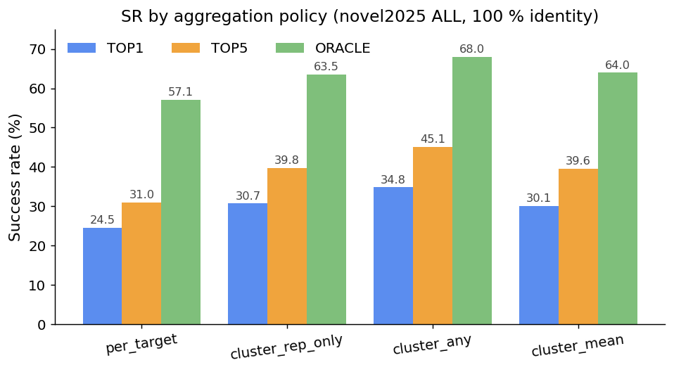
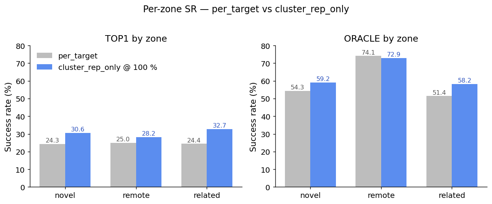
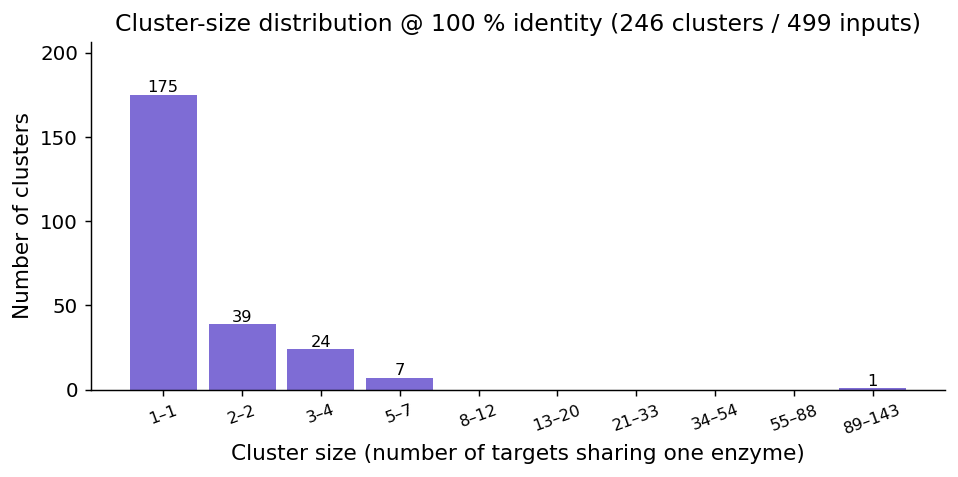
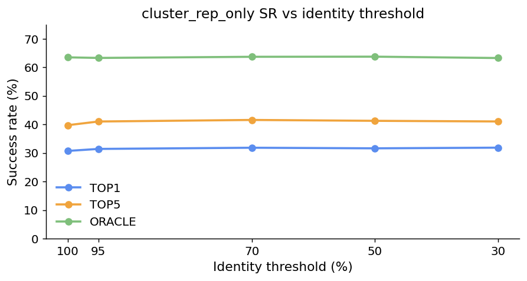
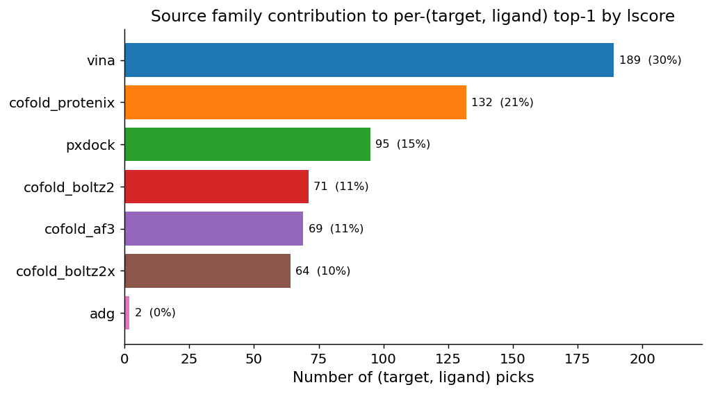
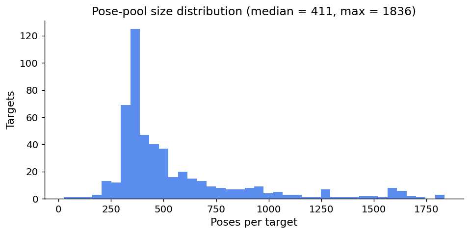
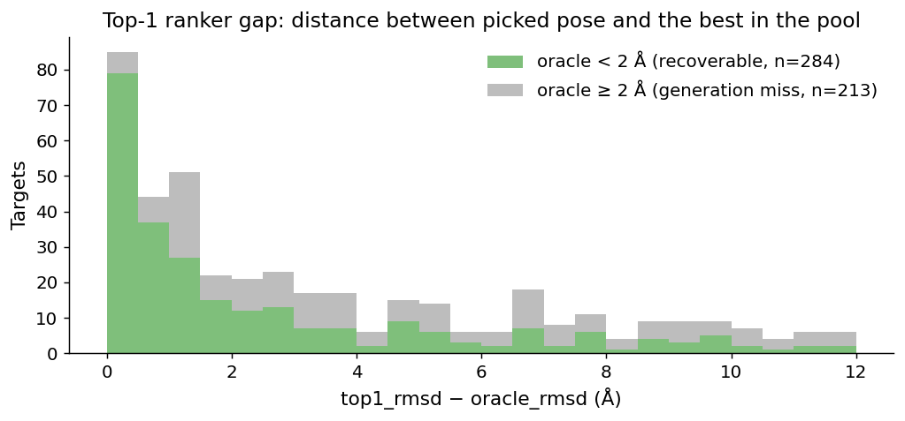
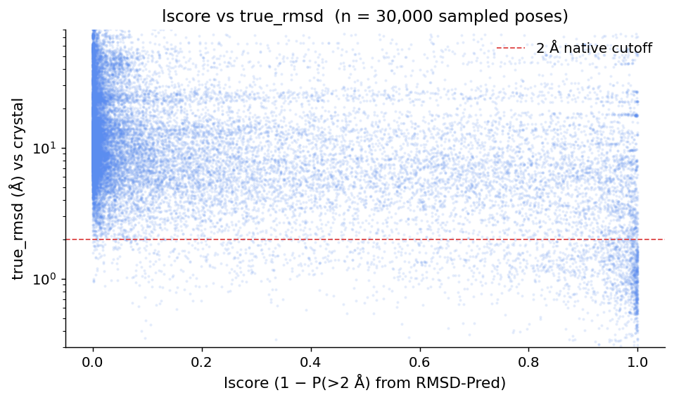

# novel2025 — pose-pool analysis

`scripts/generate_novel2025_report.py` regenerates this file from the
canonical CSV artefacts. Re-run after refreshing
`per_pose_scores.csv`, `sr_per_target.csv`, `sr_by_cluster.csv`, the
cluster targets files, or `experiments/poses_unified/_summary.csv`.

## Dataset shape

- Pipeline inputs: **499 targets** (`pipeline/*_input.yaml`)
- Targets with crystal-bound `true_rmsd`: **497** (the rest
  failed at the post-analysis stage and have no per-pose RMSD)
- Unique enzymes after sequence clustering @ 100 % identity:
  **246** (175 singletons; biggest cluster
  130 members on rep `9s4h_input`)
- Pose pool collected by `collect_unified_poses.py`:
  **281,600 poses** across 513 targets

## Headline SR (ALL zones, 100 % identity threshold)

| policy | n | Top-1 | Top-5 | Oracle |
|---|---:|---:|---:|---:|
| `per_target` | 497 | 24.5 % | 31.0 % | 57.1 % |
| `cluster_rep_only` | 244 | 30.7 % | 39.8 % | 63.5 % |
| `cluster_any` | 244 | 34.8 % | 45.1 % | 68.0 % |
| `cluster_mean` | 244 | 30.1 % | 39.6 % | 64.0 % |

The XChem 130-member super-cluster pulls the per-target average down
~6–8 pp because fragment-screen ligands have below-average SR. The
`cluster_rep_only @ 100 %` numbers are the less-biased headline.

The Top-1 ↔ Oracle gap stays ≈ 33 pp regardless of aggregation —
that's the actual ranker bottleneck. The right pose is in the pool
~63 % of the time but the scorer picks it ~31 % of the time.

## Per-zone breakdown

- **novel** (no homolog in PDB): Oracle ~59 % — small template
  signal, hardest set
- **remote** (0.3–0.5 max id): Oracle **~73 %** — best Oracle, most
  template-coverage
- **related** (> 0.5 max id): Oracle ~58 % — surprisingly slightly
  worse than novel because the existing pool fishes alternate poses
  that ColabFold MSA biases the cofold toward

The Top-1 SR is flat across zones (~28–33 %) — scoring fails uniformly.
This is consistent with the "ranker is the bottleneck" framing: the
template-coverage signal moves Oracle but not Top-1.

## Sequence redundancy

`mmseqs easy-cluster --min-seq-id 1.0 -c 0.9` on the first protein
chain of every input collapses **499 → 246** unique enzymes. One
cluster (rep `9s4h_input`, members `7hqq…7hr*`) holds 130 entries
(an XChem fragment screen). Threshold sensitivity is small:

100 % → 30 % only loses 39 clusters (244 → 207), so the multi-member
clusters are nearly always tight homologs of the same enzyme rather
than distant homologs. **100 % identity dedup is enough** for this
dataset.

## Source-family contributions (per-(target, ligand) top-1 by lscore)

Top-8 family share of per-(target, ligand) winners:

  - `vina`: 189 (30.4%)
  - `cofold_protenix`: 132 (21.2%)
  - `pxdock`: 95 (15.3%)
  - `cofold_boltz2`: 71 (11.4%)
  - `cofold_af3`: 69 (11.1%)
  - `cofold_boltz2x`: 64 (10.3%)
  - `adg`: 2 (0.3%)

## Pose-pool size

Median pool ≈ 411 poses /
target; tail goes up to 1,836
on the largest XChem fragment chains. Heavy fragments inflate
post-analysis (BA-Pred + RMSD-Pred GNN cost) but help oracle SR by
adding coverage variants.

## Top-1 ↔ Oracle gap

For targets where the **oracle is < 2 Å (recoverable)**, the median
``top1_rmsd − oracle_rmsd`` is **1.44 Å**. Those
are the targets the ranker fails on — the right pose IS in the pool.
For the remaining ~37 % of targets (oracle ≥ 2 Å), no scoring change
can help; they need better generation (more cofold seeds, wider
template pool, MSA depth).

## lscore vs true_rmsd

The signal is real but noisy: high lscore (right edge) skews towards
sub-2 Å but misses are common; many low-rmsd poses (bottom edge)
carry low lscore. That spread = the ranker bottleneck visualised.

## Where the SR ceilings sit (current pipeline)

| metric                          | value     |
|---------------------------------|-----------|
| Top-1 SR (cluster_rep_only)     | ≈ 31 %   |
| Top-5 SR                        | ≈ 40 %   |
| Oracle SR (= pool ceiling)      | ≈ 64 %   |
| Top-1 ↔ Oracle gap (scoring)    | ≈ 33 pp  |
| Oracle ↔ 100 % gap (generation) | ≈ 36 pp  |

Two independent ceilings to push:

1. **Generation ceiling (Oracle)**: improve template-pocket coverage
   (this session shipped: union mmseqs+foldseek, USalign-aligned
   consensus pockets, 10-source vina/adg fan-out) and cofold quality
   (in flight: unified MSA pipeline so all three cofolders see the
   same homologs).
2. **Ranker ceiling (Top-1 / Oracle gap)**: scoring problem; needs a
   learned ranker, ensemble of independent scorers, or both. Held
   off for the next sprint.

## Generated artefacts

- `figures/*.png` — every chart embedded above
- `sr_per_target.csv` — per-target {top1, top5, oracle}_rmsd + native bool + zone
- `sr_by_cluster.csv` — long-format SR table (192 rows: policy × zone × threshold × metric)
- `cluster_targets_{030,050,070,095,100}.csv` — target → cluster_rep + cluster_size
- `experiments/poses_unified/_summary.csv` — 281 k pose rows, 26 columns

Re-run the report::

    .venv/bin/python scripts/generate_novel2025_report.py

Refresh upstream data first if it changed::

    .venv/bin/python scripts/cluster_novel2025_targets.py
    .venv/bin/python scripts/analyze_sr_by_cluster.py
    .venv/bin/python scripts/collect_unified_poses.py --runs-dir experiments/runs/ \
        --output-root experiments/poses_unified --rcsb-dir ~/DB/RCSB/raw/mmCIF_data
