# novel2025 — pose-pool analysis

`scripts/generate_novel2025_report.py` regenerates this file from the
canonical CSV artefacts. Re-run after refreshing
`per_pose_scores.csv`, `sr_per_target.csv`, `sr_by_cluster.csv`, the
cluster targets files, or `experiments/poses_unified/_summary.csv`.

## Dataset shape

- Pipeline inputs: **499 targets** (`pipeline/*_input.yaml`)
- Targets with crystal-bound `true_rmsd`: **497** (the rest
  failed at the post-analysis stage and have no per-pose RMSD)
- Unique enzymes after sequence clustering @ 100 % identity:
  **246** (175 singletons; biggest cluster
  130 members on rep `9s4h_input`)
- Pose pool collected by `collect_unified_poses.py`:
  **281,600 poses** across 513 targets

## Headline SR (ALL zones, 100 % identity threshold)

| policy | n | Top-1 | Top-5 | Oracle |
|---|---:|---:|---:|---:|
| `per_target` | 497 | 24.5 % | 31.0 % | 57.1 % |
| `cluster_rep_only` | 244 | 30.7 % | 39.8 % | 63.5 % |

The XChem 130-member super-cluster (see [Sequence redundancy](#sequence-redundancy))
pulls the per-target average down ~6–8 pp because fragment-screen ligands have
below-average SR. The `cluster_rep_only @ 100 %` numbers are the less-biased
headline.

The Top-1 ↔ Oracle gap stays ≈ 33 pp regardless of aggregation —
that's the actual ranker bottleneck. The right pose is in the pool
~63 % of the time but the scorer picks it ~31 % of the time.

### Zone facet

- **novel** (no homolog in PDB): Oracle ~59 % — small template
  signal, hardest set
- **remote** (0.3–0.5 max id): Oracle **~73 %** — best Oracle, most
  template-coverage
- **related** (> 0.5 max id): Oracle ~58 % — surprisingly slightly
  worse than novel because the existing pool fishes alternate poses
  that ColabFold MSA biases the cofold toward

The Top-1 SR is flat across zones (~28–33 %) — scoring fails uniformly.
This is consistent with the "ranker is the bottleneck" framing: the
template-coverage signal moves Oracle but not Top-1.

## Sequence redundancy

`mmseqs easy-cluster --min-seq-id 1.0 -c 0.9` on the first protein
chain of every input collapses **499 → 246** unique enzymes. One
cluster (rep `9s4h_input`, members `7hqq…7hr*`) holds 130 entries
(an XChem fragment screen).

100 → 30 % identity threshold only collapses 244 → 207 clusters (39 cluster
loss); 100 % dedup is enough for this dataset.

## Source-family contributions (per-(target, ligand) top-1 by lscore)

Top-8 family share of per-(target, ligand) winners:

  - `vina`: 189 (30.4%)
  - `cofold_protenix`: 132 (21.2%)
  - `pxdock`: 95 (15.3%)
  - `cofold_boltz2`: 71 (11.4%)
  - `cofold_af3`: 69 (11.1%)
  - `cofold_boltz2x`: 64 (10.3%)
  - `adg`: 2 (0.3%)

Read-outs (zone facet): the novel zone leans more heavily on cofold families
(fewer template hints → cofold is often the only competitive source), while
the related zone has a somewhat larger docking-family share as template pockets
better define the binding site. The overall pattern is stable across zones.

## Pose-pool size

Median pool ≈ 411 poses /
target. Read-outs (zone facet): the XChem cluster (see Sequence redundancy)
inflates the related-zone right tail, but median counts are comparable across
zones.

## Top-1 ↔ Oracle gap

For targets where the **oracle is < 2 Å (recoverable)**, the median
``top1_rmsd − oracle_rmsd`` is **1.44 Å**. Those
are the targets the ranker fails on — the right pose IS in the pool.
For the remaining ~37 % of targets (oracle ≥ 2 Å), no scoring change
can help; they need better generation (more cofold seeds, wider
template pool, MSA depth).

Read-outs (zone facet): the gap distribution shape is similar across zones;
the novel zone has slightly more "generation miss" (unrecoverable) targets as
expected.

## Scorer ranking power vs `true_rmsd`

Per-target Spearman ρ between each scorer and `true_rmsd`, sign-flipped
so "higher bar = better ranker for picking low-rmsd poses". Whiskers
show the IQR over targets — a scorer with a tall bar AND a tight
whisker is reliable; a tall bar with a wide whisker means it works on
some targets but not others.

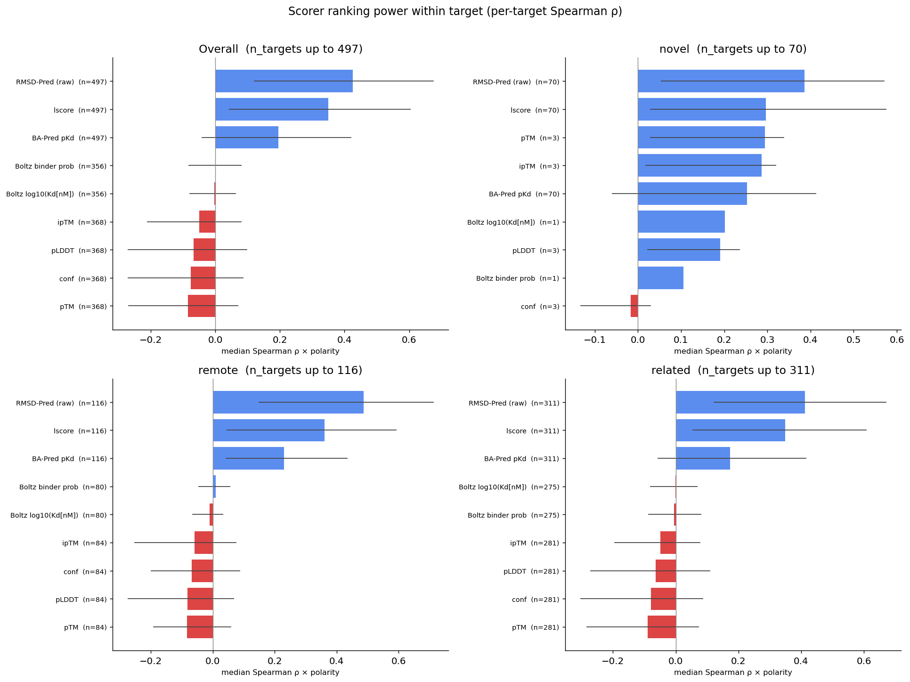

Read-outs:

- **RMSD-Pred (raw) is the single best ranker**: median ρ ≈ +0.42.
  `lscore` (= `1 − P(>2 Å)` on the same model) sits just below at
  ≈ +0.35 — same signal, transformed.
- **BA-Pred pKd** shows useful but weaker ranking (≈ +0.20).
- **Cofold confidence (pLDDT / conf / ipTM / pTM) ranks slightly
  *negatively***. Within a single target the cofold confidence does
  not predict whether *that* sample's ligand is correctly placed.
- Boltz affinity outputs ≈ 0 ρ — affinity-trained scorers don't help
  rank poses on the same target.
- Read-outs (zone facet): all zones show the same scorer ranking;
  the novel zone has slightly wider IQR whiskers indicating more
  per-target variability, consistent with having fewer template hints
  to anchor the scoring.

The same story in top-K form:

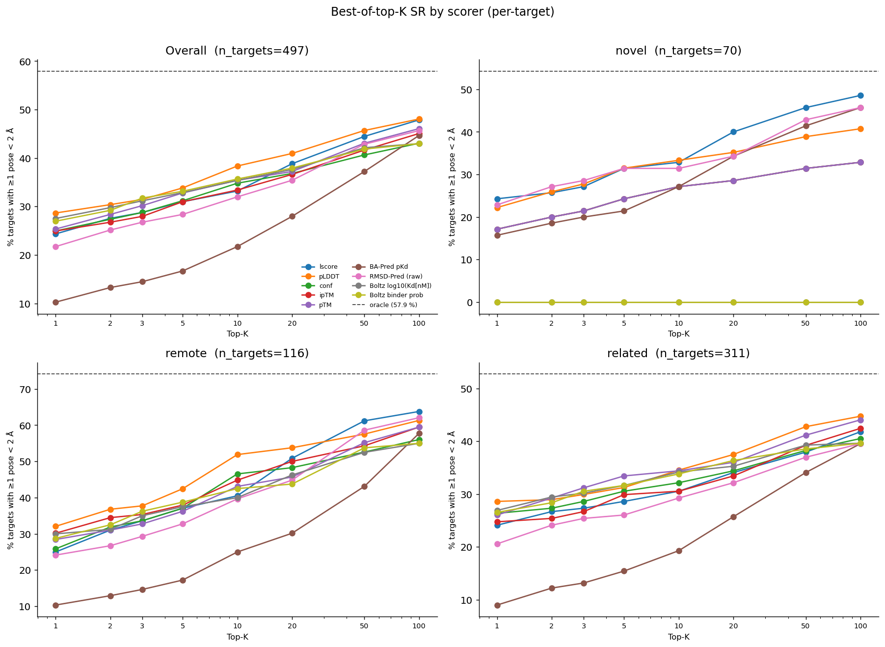

- All scorers leave a ≈ 10 pp gap to the oracle ceiling even at K=100.
- pLDDT is competitive at low K via family-bias, not within-family ranking.
- BA-Pred pKd is the worst at K=1 (~10 %).

Score distributions split by native vs non-native (4 per-zone PNGs):

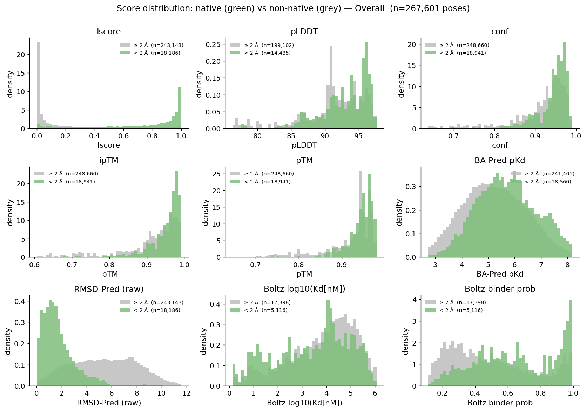

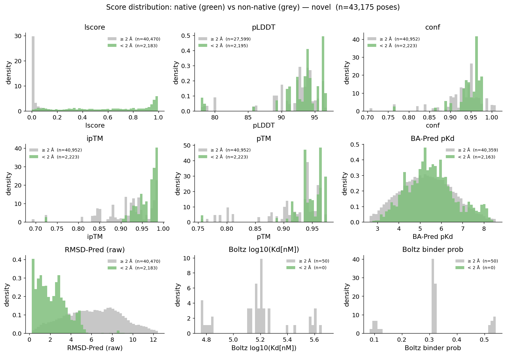

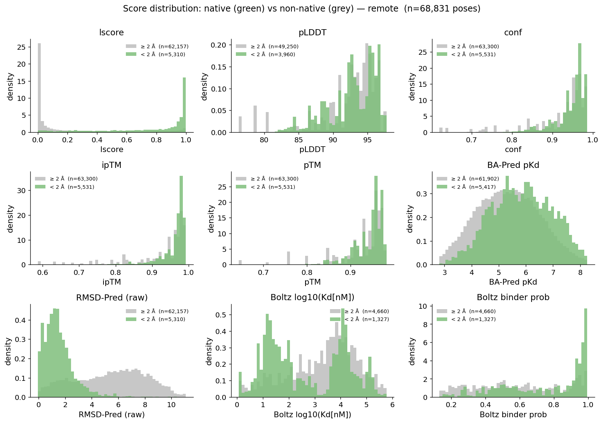

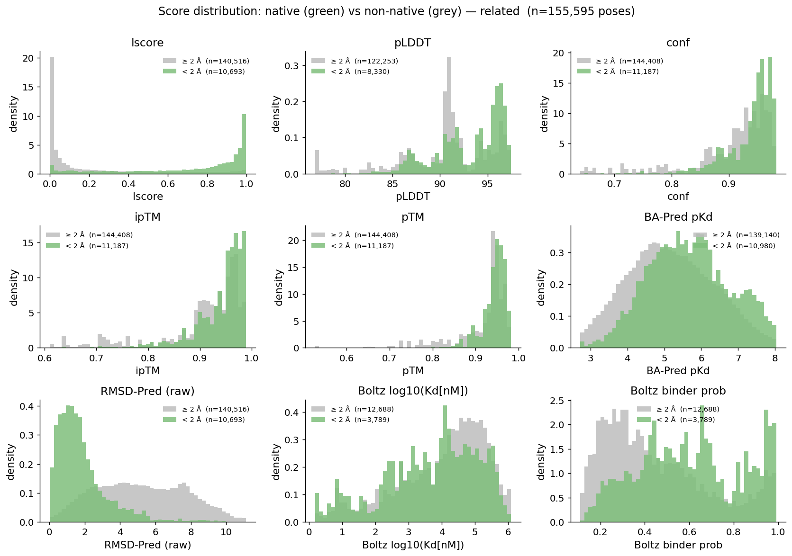

- **RMSD-Pred (raw)** has the cleanest separation.
- **lscore** is bimodal (peaks at 0 and 1) with native near 1.
- **pLDDT / ipTM / pTM** overlap heavily across native/non-native.
- **Boltz binder prob** has clear separation but only for cofold-Boltz poses.

## Per-source-family analysis

> **Note:** `template_*_vina` (Track 2) shows ~0 % native and a 18-23 Å mode in
> this report — the data was generated **before** the chain-pick + cofold-frame
> fix in commit c027e8e. A re-run is pending; treat Track-2-family numbers as
> pre-fix.

Native rate per family (% poses with `true_rmsd < 2 Å`). Independent of
scoring — measures how often each family **generates** a native pose:

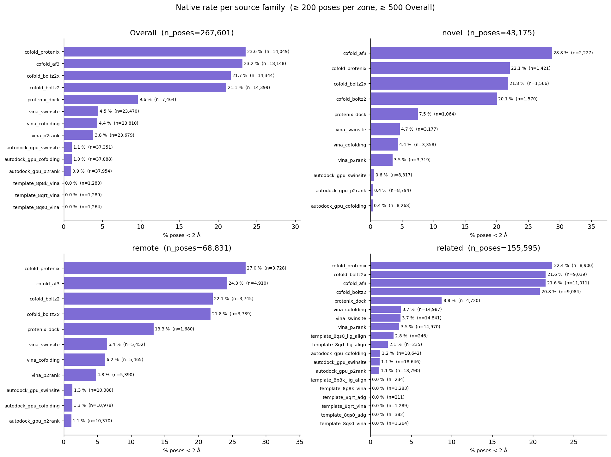

- **Cofold poses dominate generation quality** (21-24 % native rate), 4-5 × better
  than the best docking family.
- **PxDock (9.6 %) >> Vina (~4.4 %) >> ADG (~1 %)** — among docking tools.
- **`autodock_gpu_*` is the largest pose family but produces only ~1 % native**.
- Read-outs (zone facet): the family hierarchy is preserved across all three zones;
  per-zone thresholds are lowered to ≥ 200 poses so smaller families are visible.

Same picture split by **difficulty zone** (1×3 facet):

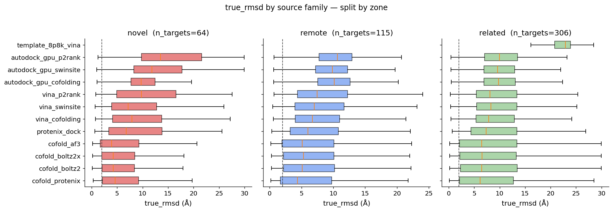

Read-outs:

- **Family hierarchy is preserved across zones.**
- **`remote` zone has the tightest distributions overall** — cofold IQR ends ≈ 10 Å
  vs ≈ 12-13 Å for novel/related.
- **`related` zone is wider than expected** — XChem fragment cluster (see Sequence
  redundancy) dominates the right tail.

Pose-level density of `true_rmsd` per zone:

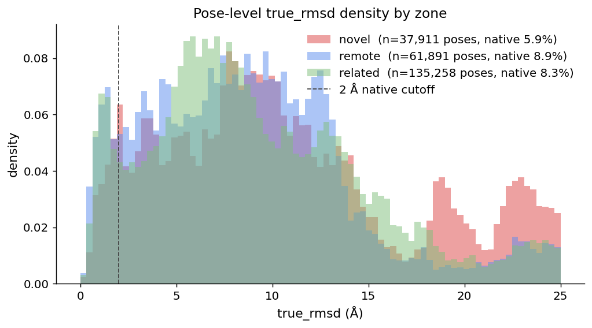

Read-outs:

- **Per-pose native rate**: novel 5.9 % < related 8.3 % ≈ remote 8.9 %.
- **All three zones share the same primary peak around 5-8 Å** dominated by docking
  poses.
- **`cofold_protenix`** is the only family whose box overlaps the 2 Å line.

Per-zone share of top-1 picks (by lscore) across families:

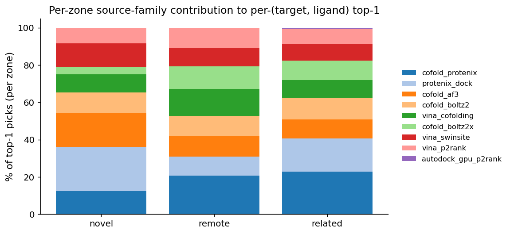

- **`cofold_protenix` + `protenix_dock` carries 36-44 % of the top-1 picks** across
  every zone; novel leans more heavily on Protenix (54 % combined).
- **Vina combined ≈ 25-35 %.**
- **AutoDock-GPU is invisible** at top-1 across all zones.

## Deeper diagnostics

### Top-1 → Top-5 gain

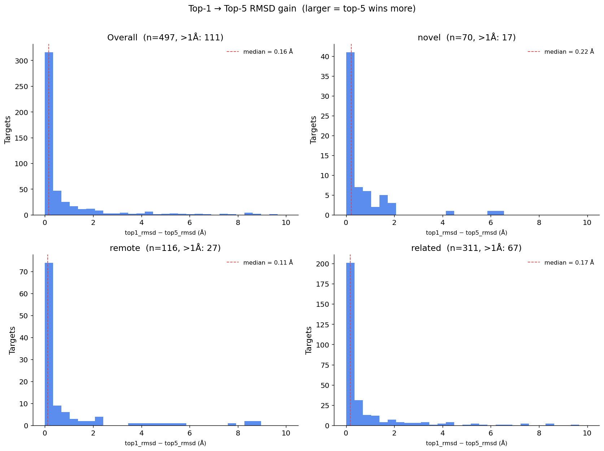

Read-outs:

- **Median improvement is only 0.16 Å** for the bulk of targets.
- **≈ 22 % of targets gain > 1 Å** by going from top-1 to top-5.
- Read-outs (zone facet): the novel zone shows the highest fraction of targets
  with > 1 Å gain (cofold diversity is doing more work when templates are scarce).

### Cofold-only generation ceiling

Independent of any docking / scoring step: per target, what is the
*best* RMSD among all cofold (Boltz/Boltz2x/Protenix/AF3) ligand
samples?

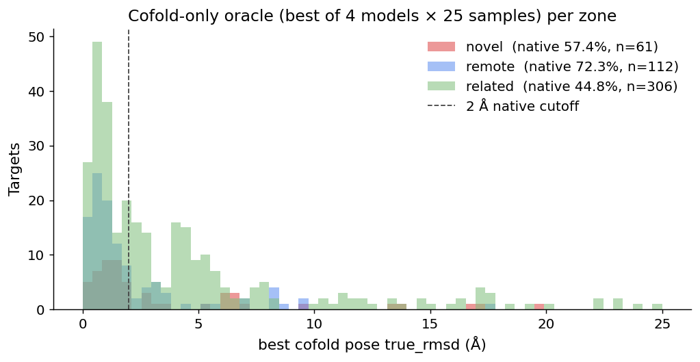

Read-outs:

- **Cofold-only oracle: novel 57.4 %, remote 72.3 %, related 44.8 %.**
  The related zone is the worst — the XChem fragment cluster (see Sequence
  redundancy) dominates and fragments are intrinsically hard for cofold.
- The union pipeline's full oracle (≈ 64 % cluster_rep_only) is ≈ 14 pp above
  the cofold-only oracle, attributable to docking + template tracks.

### Intra-family RMSD spread

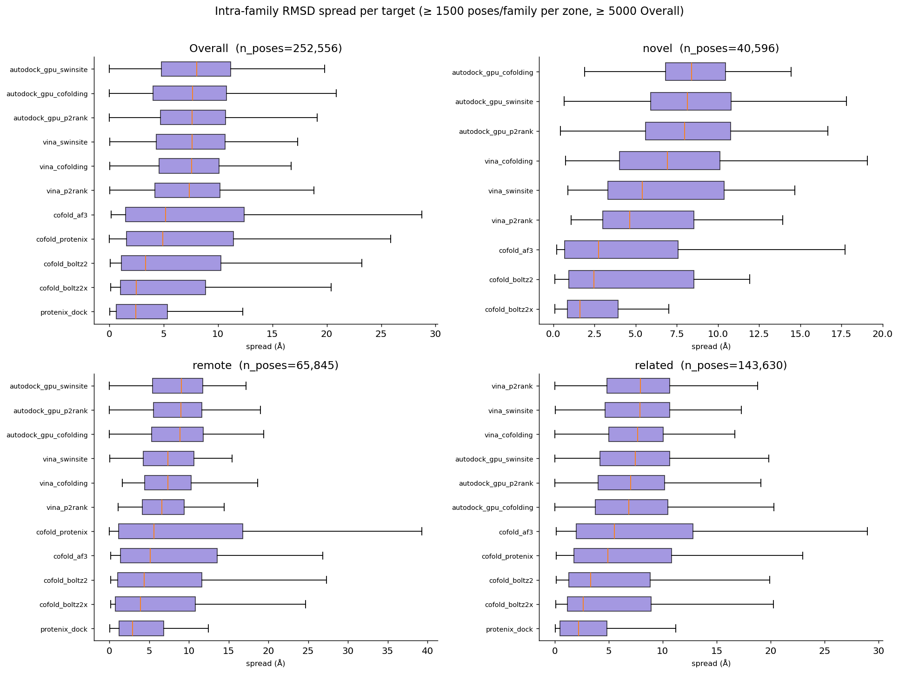

Read-outs:

- **PxDock has the tightest spread (median ≈ 2-3 Å)** — consistent with its high
  native rate and narrow-search grid potentials.
- **Cofold families spread 3-5 Å** — multi-seed diversity does its job.
- **Vina + ADG spread 7-8 Å** — ADG generates diverse poses that just don't
  land near native. The right action is down-weighting ADG, not adding diversity.
- Read-outs (zone facet): the novel zone shows slightly wider spread across all
  families (harder targets → more exploration before convergence).

### Pose-pool size vs oracle

Does throwing more poses at a target raise its oracle ceiling?

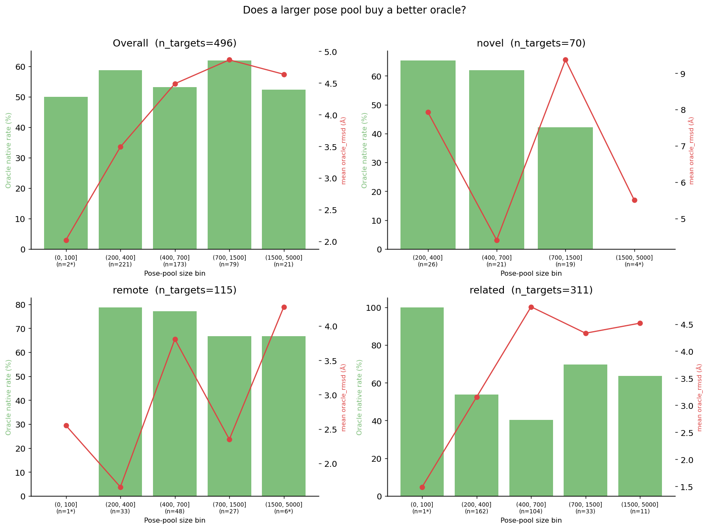

Read-outs:

- The (700, 1500] bin tops out at **62 % oracle native** — sweet spot.
- The (1500, 5000] bin (n=21* low-n caveat — XChem cluster + similar mega-pools)
  drops back to **52.5 %**. More poses help up to a point, then noise dominates.
- The (200, 400] bin (the novel2025 majority, n=221) sits at **58.8 %** —
  already most of the oracle gain achievable with current pose generators.
- Bins marked `*` have fewer than 10 targets; interpret with caution.

### Naive multi-scorer baseline

If a pose ranker is the actual SR bottleneck, even a naive combination of two
scorers should already lift Top-K SR. Rank-sum of (lscore, ipTM) per target vs
lscore alone:

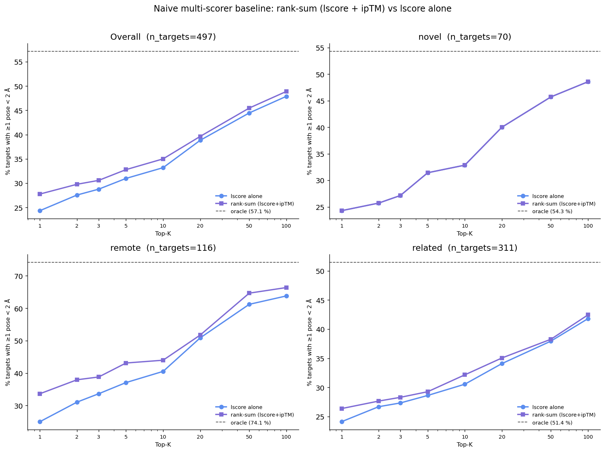

Read-outs:

- **Rank-sum (lscore + ipTM) beats lscore alone at every K** — K=1: ~+3 pp.
- The gain shrinks as K grows.
- **First data-driven evidence that a learned ranker has real headroom.**
- Read-outs (zone facet): the rank-sum lift is consistent across all three zones
  (roughly equal benefit), suggesting the ipTM signal is not zone-specific.

## Where the SR ceilings sit (current pipeline)

| metric                          | value     |
|---------------------------------|-----------|
| Top-1 SR (cluster_rep_only)     | ≈ 31 %   |
| Top-5 SR                        | ≈ 40 %   |
| Oracle SR (= pool ceiling)      | ≈ 64 %   |
| Top-1 ↔ Oracle gap (scoring)    | ≈ 33 pp  |
| Oracle ↔ 100 % gap (generation) | ≈ 36 pp  |

Two independent ceilings to push:

1. **Generation ceiling (Oracle)**: improve template-pocket coverage and cofold
   quality.
2. **Ranker ceiling (Top-1 / Oracle gap)**: scoring problem; needs a learned
   ranker, ensemble of independent scorers, or both.

## Generated artefacts

- `figures/*.png` — every chart embedded above
- `figures/score_split_native_overall.png`, `_novel.png`, `_remote.png`, `_related.png`
  — per-zone score-separation panels
- `sr_per_target.csv` — per-target {top1, top5, oracle}_rmsd + native bool + zone
- `sr_by_cluster.csv` — long-format SR table (policy × zone × threshold × metric)
- `cluster_targets_{030,050,070,095,100}.csv` — target → cluster_rep + cluster_size
- `experiments/poses_unified/_summary.csv` — pose rows

Re-run the report::

    .venv/bin/python scripts/generate_novel2025_report.py

Refresh upstream data first if it changed::

    .venv/bin/python scripts/cluster_novel2025_targets.py
    .venv/bin/python scripts/analyze_sr_by_cluster.py
    .venv/bin/python scripts/collect_unified_poses.py --runs-dir experiments/runs/ \
        --output-root experiments/poses_unified --rcsb-dir ~/DB/RCSB/raw/mmCIF_data
